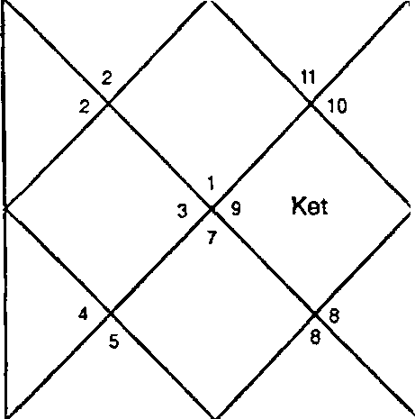
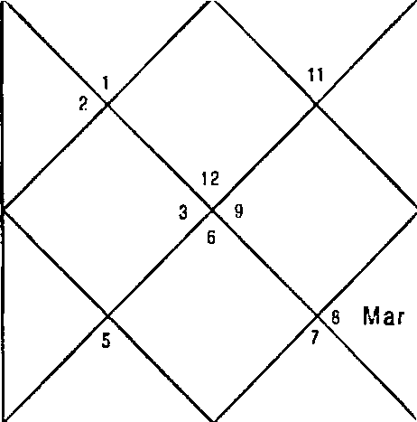
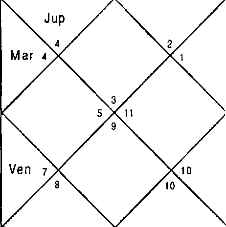
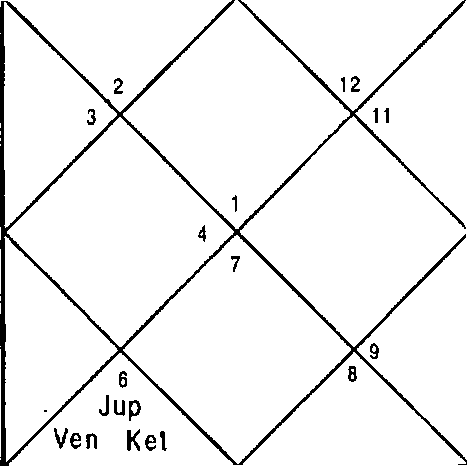
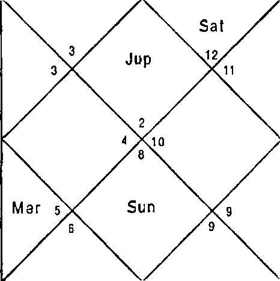
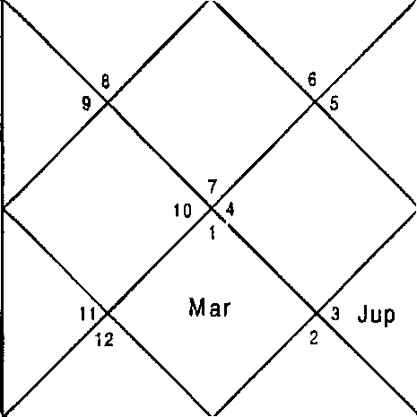
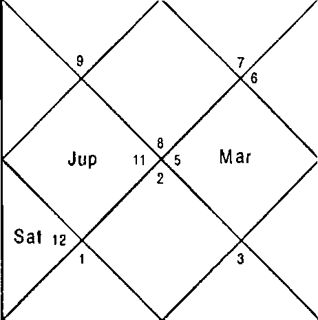
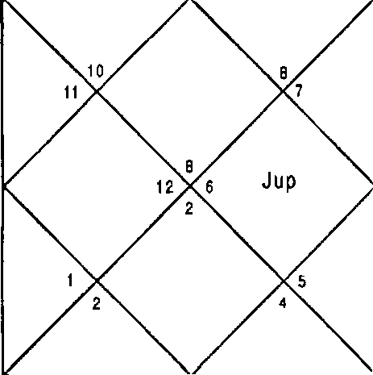

> AI-readable reference copy derived from the supplied DOCX. Native tables and embedded figures are retained where available. Verify chart placements, degrees, and OCR-sensitive wording against the source document.

# Prashna Nadi Astrology

NADI ASTROLOGY

Prasana

# A Contemporary

Treatise

### U M A N G T A N E J A

###### LATE Sh. MADAN GOPAL TANEJA

Sh. Madan Gopal Taneja (1st March 1942 —28 October 2006) was born in Kulachi, Dera Ismail Khan, Pakistan to Late Sh. Jugal Das Taneja and Late Smt. Jamna Devi. A brilliant student of science, he completed B.Sc. Physics from Delhi University and B.Ed.(Panjab University) with gold medals. He was among the first five Indian students selected by University of Moscow for M.Tech. (Design Engg.) on scholarship in the year 1962. He travelled nearly all countries of Europe and served Indian Embassy as freelance translator of Russian language.

He got married to Dr. Pushp Lata Taneja (Director, Kendriya Hindi Nideshalya) in 1972 and was blessed with two sons. He served as Design Engineer for HMT India and designed many farm equipments in early 70’s. He left HMT, Bangalore in 1974. ”In 1973, he designed 1he body of Maruti Car for Late Sh. Sanjay Gandhi. However, the car never hit the roads. Many of his research papers were published in leading science journals and newspapers.

After coming to Delhi, he worked in M/s Thermadyne Private Ltd., Faridabad for ten years and then joined Carl Zeiss. He was working as General Manager with M/s York Scientific Industries Pvt. Ltd., Delhi.

His thirst for knowledge never diminished as he studied throughout his life. He did M.B.A. and L.L.B. from Delhi University. He was the most God fearing and down to earth person I have ever known. He served his father, mother, mother

— in — law in their old ages.

His elder son, Dr. Bhupesh Taneja and daughter - in - law, Dr. Vibha Taneja are leading scientists in Chicago, U.S. His younger son, Sh. Rajat Taneja is a Manager in UTI Bank, Mumbai.

INDEX

Property & Vehicle - Purchase of property, Houses, Planets, Combination & Timing of purchase of property, Purchase through Loan, Purchase in Installments, Location & Status of property, Commercial property, Construction of property, Rental income, Loss of property, Partition of property, Sale of property, Change of residence.

Purchase of Vehicles - Houses, Facilitator House, Planet, Combination & Timing of purchase of vehicles, Purchase through loan, Gift of vehicle, Colour of vehicle, Luxury vehicle, Condition of vehicle, Commercial vehicle, Theft of vehicle, Non repayment of loan & Loss of vehicle, Sale of Vehicle, Transits, Illustrations.

Chapter—5 SO

Travels - Houses, Combinations, Timing, Condition & Place of Travel, ”Transits, Settling Abroad, Coming back to the Motherland, Combination & Timing of Return, Getting a Visa, Purpose of Travel, Reasons of not returning, Illustrations.

Chapter—6 1fX)

Career & Financial Prospects - Combinalions, Houses, Planets, No job or obstacles in career, Houses, Combinations & Timing, Interviews & written tests, Change in job/business, Houses, Planets, Combination & Timing the change of job, Nature of Next job/ business & vice versa, Change from Job to business, Break in career, Suspension, Promotions, Transfer, Partnership, Getting lost property or Money, illustrations.

Chapter—7 142

Marriage and Relationships - Houses, Combination & Timing of Marriage, Planel, Love affairs & Sexual relationships, Combinations and Timings, Nature of planets, Love Marriage, Marriage in known circle, Marriage in Foreign Land or with a Foreigner, Dowry, Divorce, Houses, Planets, Combinations & Timing of Divorce, Marriage proposals & breaking of engagements, Horoscope matching, No marriage, Remarriage, Illustrations.

Chapter—8 177

Children - Houses, Planet, Combinations, Timing the birth of child, No child, Number of Children, Pregnancy periods & Miscarriages, Abortion, Sex of the child, Birth of Twins Illusirations.

Chapter—9 187

Health and Longevity - Houses, Combinaiions, Timing ot disease, Regaining the Heal,h, Accidents , Longevity, Houses, Planets, Illustrations.

Chapter — 10 210

Miscellaneous — Theft, Political Questions, News and Rumours, Mundane Questions, Illustrations.

Chapter — 11

Ruling planets - Ruling Planels, Illustrations.

ANNEXURE

254

##### INTRODUCTION

My long cherished desire has been fulfilled when I am completed this book on Horary Astrology in Spain. This is second book authored by me in Sitges, Spain and fifth till date. Sitges, Spain has become my preferred destination for writing because of its quite, calm atmosphere and the Mediterranean. Book on Horary was overdue for many years as we had book on elementary Astrology “The Text Book of Astrology”, book on Nadi Astrology, “Accurate Predictive Methodology” but not on Horary.

An Astrologer has lot of responsibility on his shoulders while predicting an event because many a times whole life of the native depends on it. Challenge to a budding Astrologer is to check accuracy of his predictions. It may take years together to know the accuracy of your predictions till they come correct, which implies that after studying you will have to experience the application of science for the benefit of people at large. Nadi Astrology has been taught to me by my teacher Revered Late Sh. J.C. Luthra in 1995. Now the challenge was to know the accuracy of the system I with my friend Mr. P.K. Sarna took a stall In Diwali Mela to check the accuracy of Nadi Astrology through “Horary”. Two days in the Mela boosted our confidence to a great extent as we could read past, present and future through Horary very well. The experience of seeing so many horoscopes was exhilarating.

We were the first to use Horary Astrology on Television. In the years 2000 to 2001 T used Horary Astrology on Satellite

T.V. I n Nadi H ora ry Astrology answers can be give spontaneously with accuracy. Within half an hour of live program 20 - 25 answers were given i.e. one minute per answer, which included listening the question on phone, calculating the answer and answering it.

All my students during these years have given me statistics of answers to frequently asked questions by people. This book includes chapters according to all the nine events of life in a native viz. Education, Litigation, Property and Vehicle Purchase, Career and Financial Prospects, Travel, Marriage, Children, Health and Longevity.

A chapter on uncommon questions has also been included which contains Horary questions related to Plundane events, Politics and also questions which concern day to day life of some natives but are not directly involved in the nine events discussed above. In the chapter of Ruling Planets it is explained with illustrations how the answer to questions are given of the events, which are expected to happen within a day.

In all the chapters numerous illustrations have been given and have been discussed in detail so that readers may be able to understand and practically apply Horary system of Nadi Astrology. All the illustrations are successful predictions of the author and his students. Some illustrations are from the work by group of my students who worked during Diwali Mela of 1998. A record of these Horary questions was compiled, their results were analyzed and they finally are included in this book. Some of the illustrations are from the

T.V. programs and certain others are from my students.

In certain illustrations I have showed Natal Horoscope and Horary Horoscope to prove that we get same answer from Natal Horoscope and Horary Horoscope. In certain cases it becomes essential to use the Horary Horoscope even if the natal Horoscope is present to verify the predictions for example the Natal Horoscope of a girl signifies no marriage and she is too young. In this case we will like to see whether her Horoscope is correct or not before giving such an adverse prediction. Tf she is too young then the evenEs may not be too much to rectify Horoscope in such a case astrologer resorts to Horary Horoscope and the answer coming from the Horary Horoscope should be relied upon. In case of any difference of answer between the Horary Horoscope and Natal Horoscope then the Horary Horoscope should be given more importance because the Time of birth of Horary Horoscope is accurate.

Sometimes native may ask same question again after some time due to curiosity. )n such a case it is observed that the answer of the question does not change. However care should be taken that the second time again the native is serious to ask the question. It has also been observed that sometimes the native has asked a question and after an interval his relative or friend has asked the same question for the native. In all such cases same answers have been arrived at.

In my lectures of “Horary Astrology” a common question is asked about the “I'4ook Prasna”. I'4ook Prasna implies that native want to get answer of a question, which he does not want to ask. In 11 years of practice of Astrology and hundreds of my students who are practicing all over we have got 3 - 4 such questions out of the thousands of questions answered so far. A native will not ask question when he is feeling shy or have fear to ask the questions. These were all scandalous and after the answers given to the natives they opened up fully and explained the situation and the question in detail. In the chapter of “Career and Financial Prospects” I have included one of such questions. Native did not put question correctly and by the answer coming out from Horary it was found that the native was trapped by one of his partners.

At what time the Astrologer should predict? In which direction should Astrologer face and the querist should face at the time of asking the question? These are also some of the questions, which are asked for. The answer is it doesn't make any difference when a question should be asked or answered and in what direction any body faces. It is only essential that the querist is serious and curious about the question.

Experience in “Horary Astrology” has shown that if its principles are strictly followed the system gives accurate results because the time of asking the question is correct.

People commonly ask if the Horary Astrology is extremely correct why the Astrologers do not become a billionaire by indulging in speculation trade? In Horary Astrology or Prasna Chart the querist should be serious only then one gets

accurate answer. In case if a native is really sick of some shares or commodity he has kept for long and wants to ask question regarding that the answer is surely going to come correct. Similarly in case of any match in sports between two teams if question is which team will win, then answer will surely come correct when queerest is emotionally attached to a team and wants his team should win or get the championship. If the answers to the speculative questions will start coming correct then that will overrule the native's Horoscope, which is not possible.

This book is a unique book of Horary Astrology because it covers all the nine events of life and more with about 150 illustrations with their true results. This book is well researched and carries the data, illustrations and experiences of many astrologers who have been working on this science for years together.

In this book the principles of “Nadi Astrology” have been followed. Readers should have the knowledge of elementary Astrology to appreciate the book. However Astrologer having the knowledge of Nadi Astrology will understand the book easily. Readers are advised to go through “Accurate predictive Methodology” which will help them understand the book better.

I will request my readers and astrologers to critically analyze any Horoscope after studying time, place and conditions after giving due consideration to caste, creed, religion and community.

Research is an ongoing process and scope of improvement is always there. I appeal to all readers to write to me for any suggestions, improvements so that I incorporate the same in next edition of this book.

Umang Taneja

Roc Florit 20, 2 Las Mimosas, Sitges, Catalunya, Spain

CHARACTERISTICS OF PLANETS, SIGNS & HOUSES

For the benefit of the readers, it is essential to write in brief the characteristics of Planets, Signs & Houses from the point of view of “Nadi Astrology” to be used in the book.

###### Planets

Lordship of the Planets: All the planets are lords of Signs except Rahu & Ketu. They are as follows:

###### Planets

Sun Moon Mars Mercury Jupiter Saturn Venus Uranus Neptune Pluto

###### Signs

Leo Cancer

Aries, Scorpio Gemini, Virgo Sagittarius, Pisces Capricorn, Aquarius Taurus, Libra Capricorn

Pisces Scorpio

Aspects: All the planets Aspect various Signs from their Natal position in a Natal horoscope & in Transits. Following are the aspects of different planets:

- S-

| Planets | Aspects on various Signs |
| --- | --- |
| Sun | 7 |
| Moon | 7 |
| Mercury | 7 |
| Venus | 7 |
| Pluto | 7 |
| Uranus | 7 |
| Neptune | 7 |
| bars | 7,4,8 |
| Jupiter | 7,5,9 |
| Saturn | 7,3,10 |
| Rahu | 5,9 |
| Ketu | 5,9 |

Natural Malefic: Natural malefic planets are Rahu, Ketu, Saturn, liars, Uranus, Neptune & Pluto.

Natural Benefic: Natural benefic planets are Jupiter, Venus, Mercury, Moon & Sun. I1oo n is always a benefic while decreasing & increasing. It should be considered a benefic during “Amavasya” also. In other words Noon is always a benefic. Similarly there should not be any confusion about Mercury. It is also a benefic always. Sun should also be considered a benefic since it signifies medicine, government & father etc.

Separative planets: Separative tendencies are signified by Sun, Saturn, Rahu & Ketu.

Natural Strength: Rahu, Ketu, Saturn & Mars are strong planets. They signify the events predominantly in their DBA & Transits than Sun, Moon, Mercury, Venus & Jupiter. Uranus, Neptune, & Pluto are also very strong. They do not have any role in any DBA but their presence is felt certainly in Transits & behaviour of the native.

Friendship & Enmity: There is no Friendship or Enmity

-6-

between any of the planets. All planets work in the manner explained in the book.

In India most of the Astrologers are not using Uranus, Neptune & Pluto because Ancient Savants of Astrology have not written anything on it. It is a well known fact that all the three planets have been discovered recently. But since all of them are heavenly bodies & that too within our “Solar system”, they must have been affecting the life on “Earth”. Therefore I find it essential to write a few words on these planets. All of them do not take part in the DBA therefore they largely do not affect the occurring & the timing of the event. Their presence is felt in Transits & on the behaviour of the Native.Uranus, Neptune and Pluto are transpersonal planets used much in Western Astrology. According to Western Astrology if these planets aspect Sun, Moon, mercury, Venus and I‘4ars then the native is very dynamic and intelligent.

Uranus: Uranus signifies revolutions, rebellions, anarchy, ri- oting i.e. sudden blows & events in a Native's life. It rules Capricorn Sign. Uranus shares lordship with Saturn. Accord- ing to Western Astrology Uranus is lord of Aquarius whereas according to Indian Astrology Uranus is lord of Capricorn. Uranus represents revolutions hence is also associated to freedom. The change in the life of a native will be unex- pected, drastic and not wished for. The new change will be like the other side of the coin. It also rules intuition, cre- ativity, independent ideas and leadership qualities.

Neptune: Neptune is psychic in behaviour. It develops confusions in the mind of Native. It signifies cheats, de- ceivers, forgers, kidnapping etc. According to both Indian and western Astrology Neptune is lord of Pisces. It repre- sents sacrifices, love, sacrifice for love and fusing with others. It also rules confusions and victims of the situation however it is in our hand to overpower and weaken others. It also creates addiction to tobacco or alcohol and the reason can be result misunderstanding in love. It also

rules spiriLualism and mysticism.

Pluto: Pluto is a kin of Mars but it signifies group activity. It signifies dacoits, massacres, gangsters, mass tragedies, racketeers etc. Pluto rules Scorpio according to both

western and Indian Astrology. It signifies death like transformation. Sometimes beloved people separate from our lives and the cause of seperation can be death.

Sometimes they will come back to us but the relations will not be the same again as they have transformed. It also gives us the opportunity to modify ourselves. Many fears are experienced in this path and in the end it is total liberation from the responsibilities.

Dasa: Only Vimshottari Dasa is correct Dasa, which will be used in the book for timing the events of life of native.

DBA: Term DBA will be used throughout in the book, which implies Dasa, Bhukti and Antar native will be undergoing at the time specified. Some astrologer also take it as Maha Dasa, Antar Dasa and Pratayantar Dasa also Main Period, Sub period and Sub - sub period.

Ayanamsa: The first and foremost important factor before casting a horoscope is to take the correct “Ayanamsa”. Ayanamsa is the rate at which the point of intersection of the Ecliptic & the celestial equator moves in retrograde motion. The correct Ayanamsa is given by the figure 50.2388475". Reader should know that the fixed zodiac & the Sayana zodiac were in the same degree in the year 291A.D.

The astrologer should proceed now to cast the horoscope of the native by using the correct Ayanamsa. For casting the horoscope help can be taken from the K.P. Ephemeris or by Lahiri Ephemeris. Astrologers can take the help of correct software too available in the market. It is worth noting that

K.P. & Lahiri Ephemeris are taking the same A\‘anamsa but Lahiri had taken 285 A.D. as the year of coinciding of both the zodiacs. Astrologers should add 6' to Ascendant. & all the positions of the planets in case they are using Lahiri Ayanamsa or Chitrapaksha Ayanamsa.

###### Houses of Relatives from the Ascendant

Father - 9, When native is dependent on the father

- 10, when native is not dependent on father

###### Nother 4

Immediate elder 11

Sister / brother

Immediate younger 3

Sister / brother

Friends 11

###### First child 5

Second Child 7

###### Third child 9

###### Neighbour 3

Naternal uncle 6

Paternal uncle 12

Partner 7

Associates 11

Spouse 7

In case of multiple marriages also the spouse will be seen from 7” house.

In case of number of brothers & sisters the houses should be seen in the manner explained below:

In case of immediate elder sister/brother house is 11 Next elder sister/brother house is 9

Next elder/brother house is 7 & so on

In case of immediate younger sister/brother house is 3 Next younger sister/brother house is 5

Next younger sister/brother house is 7 & so on

In case of distant relations and other people countries/ institutions etc. Ascendant will remain the same.

Solfi:ware used in this Boofi‹:

“Horosoft Professional Edition 4.0”

software was used in this book for casting Horoscopes and Transits.

###### CHAPTER - 1

#### RULES OF HORARY

ASTROLOGY

Answers to the questions of native can be given on the basis of Natal & Horary Astrology (Prasna Chart). In Natal Astrology the Horoscope of the native is cast by knowing the Date, Time & Place of birth. An Astrologer on the basis of the, Natal Horoscope cast on this basis can predict all events of life.

In Horary Astrology, Horoscope is cast at the time when the native asks question and answer to that question is given by Iookin9 at the planetary position at that time. It should be noted that in Natal astrology answers to all events of life can be given on the basis of Natal Horoscope but in case of Horary Astrology answer to only that particular question is given which is asked by the Native.

Horary Astrology can answer all the events of life exhaustively, which can be predicted by Natal Astrology. The events are Education, Litigation, Property and Vehicle, Travel, Career, Marriage, Children, Health and Longevity.

Why Horary Astrology is needed?

In Natal Astrolo9y purchase of property, vehicle, marria9e and all other events of life can be predicted but answer to a precise question, can be easily predicted in Horary Astrology e.g.

Which girl I will marry out of the two?

Will I be able to purchase a particular property?

Will I go to U.S.A.*

In all these questions Native is very particular about the question. In question No.1 he wants to marry out of two options. From Natal Horoscope Astrologer can time the marriage but cannot tell which of the two girl's he will marry.

Similarly in the second question the question is about purchasing a particular property. If in the Horary Horoscope the answer of second question is negative, native's desires will not be realized. In the second question the natal Horoscopes may show purchase of property but property purchased will be any property other than the property he desired to purchase. Similarly in third question native desired to go to U.S.A. and the Prasna Chart negates it then in case natal Horoscope signifies long travel then the native will not go to U.S.A. but the native may travel to some other country.

The conclusion is that Horary Astrology can answer precise questions which may not be possible to answer in Natal Astrology.

Natal Astrology is confined only to the events of life of a native but Horary Astrology answers to Mundane questions and also questions related to politics:

Who will win the match?

Will candidate of Congress party win fro m this constituency?

From Horary Astrology we can also answer questions, which relate to environment we live in but may not relate to our Horoscope such as:

When will the road of our colony build up?

e Will the municipality department put a lamppost in the park?

By the help of Horary Astrology an astrologer can also answer those questions of the events, which are expected to happen within hours.

When X will reach the destination?

When will electricity come?

Horary Astrology is also useful to all those people who's Natal Horoscope cannot be cast because their Date, Time & Place of birth are not known.

PRASNA OR THE QUESTION

]t is clear that Horary Horoscope is cast at the time when the native asks question. Basis of Horary astrology is that there must be a genuine question of native for a genuine answer. Now question arises as to what this genuine question is?

Everybody born on earth has to undergo ups & downs in life. Whenever a problem arises, native tries to solve it with possible efforts within his reach. In case of failure or continuous trouble time comes when planets & stars compel him to visit an astrologer to know when his sufferings will be over.

In other words problem haunts him to visit astrologer. This is the time when he visits / contacts astrologer and asks the question regarding his problem. At this point of time when he asks a question he 9ets accurate answer from the cosmos. To conclude astrologer should consider only that question in Horary in which native is involved and is curious to know the answer of the question. To cast a Horary Horoscope or Prasna Chart there must be a question or Prasna.

Native can ask question either related to him or related to his relative or friends. It is advised to avoid questions asked by people casually in part/es, get together etc. Irrelevant and non-serious questions shoU/d not J?e taken from the natives as they result into incorrect dnswers d6maging the image of astrologer & asLro/ogy. They are also of no use to the querist/ native.

###### When a native visits an Astrologer he has one burning question in mind about the current problem e.g. he is not doing well in business or he is not comfortable with job or his daughter is not getting married and so on. He can have two separate questions also about the profession and marriage of his daughter etc. then the astrologer should take question by Horary one by one depending upon the priority of the question told by the native. Preferably astrologer should take only one question from the native at a time and maximum second after answering the first question.

In case of leading question of one problem astrologer should refer to same horary Horoscope e.g. native asks when marriage of his daughter will take place? After the prediction by astrologer if the native asks about the married life of the daughter then the same Horoscope has to be referred to for the prediction about the married life of his daughter.

An obvious question is that whether Astrologer can ask question for himself or not? An Astrologer is a person who has to go through the life as any other person and has to face similar problems. If even Astrologer is serious to ask a question he can ask the question for himself following the principles of Horary Astrology.

###### ESSENTIALS OF HORARY HOROSCOPE

Accuracy of Time: Astrologer should be very particular about the precision of time.

Understanding question of Native: Astrologer should listen to the question of the Native with patience and try to understand his question carefully. Native is coming to the astrologer at the time of difficulty and at this time it is natural that he may not be in sufficient mental health and may utter unimportant things. He can be facilitated to come on concrete question and when he comes on the concrete question naturally is the time astrologer should take into consideration.

Taking “Seed” from Native: As you know there are 243 Sub lords in a Zodiac. Six sub lords spill over to the next sign. Therefore six other sensitive points in the zodiac result giving rise to 249 sensitive points in total.

A diary is prepared having 125 pages amounting to 250 when pages are counted from front to back. This diary in hand is supposed to be Zodiac. After listening to the question of the native he is asked to open any page of the diary. Note down the page he has opened. See the Starting de9ree of the number in the Table I from the Annexure and consider it as the Ascendant degree or Cuspal degree of the Ascendant. The number noted is also called “Seed” of the question since from this Ascendant is arrived at and Horoscope will be cast

to know the answer. With this method, he is asked to point to the answer to his own question in the Zodiac.

###### Relevance, of taking seed:

###### Prime organ governing our body is the brain. Astrologically, planets & stars guide the brain. Our Nerves end in the palms of the hands and all the thinking of our brain is reflected through hands, which are guided by the brain through nervous system. Therefore taking the seed becomes relevant. In case of emergency if the native cannot come to the Astrologer in person then he can be asked to tell any number at random in between 1 to 249 by any means of communication.

If Horary Horoscope is cast taking Ascendant from the time native has asked a question. This system collapses when two or more persons ask same question at one given time. Horary Astrology of Nadi system was applied on predicting marks to about 100 students in an hour's time (same Ascendant at that time) with success in 1997 whereas traditional system may not have answered in such case.

Time of Birth of Question or Time of sowing of Seed: After knowing the degree of the Ascendant from the seed Horary Horoscope should be cast taking current time into consideration.

In case the question is asked from the Astrologer & Astrologer is not in a position to cast the Horoscope at that time and cast the horoscope afterwards to know the answer then that time should be taken when Astrologer actually starts working on the question.

In case Horoscope is to be cast by hand then when he takes the pen in hand to work upon, that time is to be taken & in case when he starts doing work by Computer then that time is to be taken when he switches on his computer. The seed should be used within two days. If Astrologer is not able to work after getting the seed within two days he should ask for another seed from the native for the question.

It is not the time of asking the question that is important. It

-24-

###### is important as to when the seed has been sown for calculating the answer.

Place of Birth of question or Place of sowing of seed: For casting the Horary Horoscope latitude & longitude of place is taken where Astrologer works upon the question.

Analyzing Horary Horoscopes After casting the Horary Horoscope answer should be given by analyzing the Planets in the Horoscope, DBA and Transits.

Before going to the detail as to how a Horary Horoscope is seen let me explain you by an example how a Horary Horoscope is cast.

###### CA5T1NG A HORARY HOROSCOPE

Step I

Note down the

Seed

Date & Time

Place of casting Horary Horoscope

Let us take a practical example where

Seed is 135

Date is 16/11/2000 & Time 20 hrs. & 15 minutes.

Place - Delhi Latitude 28°40’ N Longitude 77°13’S

Step 2

Now note down the degree of the Ascendant of Horary Horoscope from the seed.

Since the seed is 135, the Ascendant is Libra 15° 13’ 20” (from the Annexure).

step 3

Cast the horoscope by placing the planets in the horoscope from ephemeris and calculate Dasa, Bhukti & Antar from the longitude of Moon.

Step 4

Cast Nirayana Bhav Chalit from Raphael Table. Step 5

Pen down the lordship Nakshatra Sublord of the planets from Table from the Annexure:

Casting Nirayana Bhav Chalit Chart

Step 1

The first step is to check time, date & place of birth of the native. The place of birth of the native is Delhi i.e. latitude 28°40’ N. Lefs open the page for Delhi in the "Raphael's Tables of Houses’.

Step 2

Find out the Ayanamsa of 2000. The ayanamsa for the year is 23degrees and 55minutes.

Add the ayanamsa to the Ascendent degree of the native.The Ascendent degree is Libra 15° 13’ 20". Adding ayanamsa to the Asc.= 23°55“

+ Libra 15° 13’ 20” = Scorpio 9° 8’20" .

Step 3

Now we'll see the nearest degree of the Ascendent available in the Raphael's Table of Houses which we find to be Scorpio 9° 38’ . Now pen down the cuspal degrees of the various houses available in the table.

Cuspal degree of the 2nd house 9° Sagittarius

| " | ' | " " | 3rd house | 10°Capricom |
| --- | --- | --- | --- | --- |
| " |  | " ‘ | 10th house | 13° Leo |
| • | ” | ” | 11th house | 15° Scorpio |
| " | ' | " ” | 1Zth house | 15° Libra |

Step 4

Deduct Ayanamsa from the cuspal degrees so obtained. Cuspal degrees of

| 2nd house | = 9° Sagittarius | - 23°55“ = 15° 05“ Scorpio |
| --- | --- | --- |
| 3rd house | = 10°Capricorn | - " = 16° 05 Sagittarius |
| 10th house | = 13° Leo | - " = 19° 05 Cancer |
| 11th house | = 15° Scorpio | - ” = 21° 05“ Leo |
| 12th house Step 5 | = 15° Libra | - " =21° 05“ Virgo |

The Cuspal degrees of all the 12 houses are as follows :

| Houses | Deg. | Min. | Sign |
| --- | --- | --- | --- |
| 1st | 15 | 13 | Libra |
| 2nd | \5 | 05 | Scorpio |
| 3/d | 16 | 05 | Sagittarius |
| 4th | 19 | 05 | Capricorn |
| Sth | 21 | 05 | Aquarius |
| 6th | 21 | 05 | Pisces |
| 7th | 15 | 13 | Aries |
| 8th | 15 | 05 | Taurus |
| 9th | 16 | 05 | Gemini |
| 1Qh | 19 | 05 | Cancer |
| 11th | 21 | 05 | Leo |
| 1Zth | 21 | 05 | Virgo |

The starting degree & ending degree of the 12 houses are:

Houses

StartlngDegree

Ending Degree

| 1st | Libra 15 13 | Scorpio | 1S | 05 |
| --- | --- | --- | --- | --- |
|  | Scorpio 15 05 | Sagittarius | 16 | 05 |
| 3nJ | Sagittarius16 05 | Capricorn | 19 | 05 |
| 4th | Capñcom 19 05 | Aquarius | 21 | 05 |
| Sth | Aquarius 21 05 | Pisces | 21 | 05 |
| 6th | Pisces 2105 | Aries | 15 | 13 |
| 7th | Aries 15 13 | Taurus | ]5 | 05 |
| 8th | Taurus 15 05 | Gemini | 16 | 05 |
| 9th | Gemini 16 05 | Cancer | 19 | 05 |
| 10th | Cancer 19 05 | Leo | 21 | 05 |
| \1th | Leo 21 05 | Virgo | 21 | 05 |
| 12th | Virgo 21 05 | Libra | 15 | 13 |

Now I'll place the planets in the houses in the “Nirayana Bhava Chalit“ as under:

| Planets | Sign | Degrees | House |
| --- | --- | --- | --- |
| Sun | Scorpio | 00 47 | 1st |
| Moon | Cancer | 04 46 | 9th |
| Mars | Virgo | 13 56 | 11th |
| RahU | Gemini | 23 00 | 9th |
| Jupiter | Taurus | 13 55 | 7th |

| Saturn | Taurus | 03 57 | 7th |
| --- | --- | --- | --- |
| Mercury | Libra | 11 39 | 12th |
| Ketu | Sagittarius | 23 00 | 36 |
| Venus | Sagittarius | 10 27 | 2nd |

We have calculated the cuspal degrees of the various houses & position of the planets. Now proceed to draw the Nirayana Bhav Chalit chart as under :

LAGNA NIRAYANA BHAVA CHALIT

| Sun | 0:47 | Mon 4:6 | Mar 13:56 |
| --- | --- | --- | --- |
| Mer | 11 :39 | Jup 13:55 | Ven l0: 27 |
| Sat | 3:57 | Rah 23:0 | Ket 23:0 |
| Ura | 23:19 | Nep 10:18 | Plu 18: 17 |

Lordship and Position of Planets

Lordship and position of planets are taken from the “Nirayana Bhav Chalif'.

Lordship & the position of all the Planets are as follows :

| Planet | Pos'nlon | Lordship |
| --- | --- | --- |
| Sun: | 1 | 11 |
| Moon: | 10 | 9 |
| Mars: | 11 | 2,7 |
| Mercury: | 12 | 9,12 |
| Jupiter: | 3 | 3,6 |
| Saturn: | 7 | 4,5 |
| Venus: | 2 | 18 |

For taking out the houses signified ( coordinates of ) by Rahu & Ketu different method is followed. Rahu & Ketu do not have Lordships. Rahu & Ketu give the results as follows :

They give the results of the planets they are conjunct with.

They also give the results of the planets they are aspected by.

They also give the results of the planet in whose sign they are posited.

The Rahu in the horoscope will give the results as under & in the same above sequence

None

2) Venus - 1,2,8

3) Mercury - 9,12

In addition to the above three conditions We'll also write the position of the Rahu which is 9

So all the Houses signified by Rahu are : Rahu : 1,2,8,9,12 Similarly for Ketu we'll follow the same steps

1) Venus - 1,2,8

2) Mars - 2,7, 11

3) Jupiter - 3,6

The position of the Ketu is in the 3.

So all the Houses signified by Ketu are : Ketu : 1,2,3,6,7,8,11

Lordship Nakshatra Sublord of the planets are as under:

Ket 1,2,3,6,7,8,11 Mon 9,10

3up 3,6,7

Balance Dasa of : Sat 17Y 10M 22D

ANALYSING A HORARY HOROSCOPE

A Horary Horoscope is analyzed in the similar manner as a Natal Horoscope is analyzed.

While analyzing any Planet we should observe that Sub lord

is stronger than Nakshatra and the Nakshatra is stronger than the Planet.

For any event to happen Dasa should be given the maximum weight age. If Dasa allows an event, the event can happen in the Dasa. If it does not allow the event we should check the ”next Dasa and so on. Once the Dasa allows the event we should go to see the current Bhukti and if this Bhukti allows the event we should check the nearest Antra and then the Transits, which will tell the day of the happening of the event. However if current Bhukti does not allow the event we should check the nearest Bhukti, which allows the event to happen and see the Antras in the Bhukti and then the Transits.

Readers who have knowledge of Nadi Astrology know that there are formulations of events of life and these formulations are to be seen in the Dasa Bhukti Antar or the DBA. All the formulations for happening of different events are given in different chapters of the book.

For the events, which cannot change the status of a native, its Dasa may not be required to be seen. For example the question is Rs.100/- have been lost as to whether I will be able to recover it or not? Rs.100/- for a native who is a millionaire is a meager amount and if a millionaire ask such a question even Bhukti should not be seen just the Antra is enough to be seen. However, Dasa should be seen if a poor man asks this question.

After seeing the DBA to pin point the day of happening of an event Transits should be seen in the following manner:

Transits

Any of the three planets which signify the event may / may not be from the DBA should either

Conjoin in one house

Or aspect each other

Or transit the significator houses

Or aspect them

Or transit over their natal positions

After one of the above conditions is fulfilled the event can take place at any given moment.

For example Jupiter, Stars and Sun signify any event in any horoscope. In Transit Jupiter and Mars are conjunct and Sun joins both of them then this condition of conjunction of Nars, Sun and Jupiter all conjunct together will remain there for from a number of days to a month. We desire to calculate the day of the event. Hence after any of the above condition is fulfilled it is desirable to arrive at the day of the event. For that we proceed as follows.

Event will take place on the day when

A transiting planet signifying event, either transit exactly over Natal degree of planet signifying the event.

Or two planets signifying the event transiting in a sign conjunct with in a degree.

Or any planet signifying the event transits exactly over Cuspal degree of significator Houses.

Or Moon conjoining three planets signifying event. Note that Moon should also signify the event otherwise its Transit is not desirable to be seen.

Or the transit of the Antar lord in the favourable Naksh atra. Favourable Nakshatra here also means Nakshatra of a Planet that signifies event.

Please note that event takes place when there is disturbance in the cosmos within a degree or the sensitive degrees of Horoscope. Sensitive degrees of Horoscope are degrees of the Natal planets and the Cuspal degrees of the Houses. For example in case of marriage, degrees of Planets signifying marriage and the Cuspal degrees of 2,7,11 Houses become important for pin pointing event. Also fast moving planets Sun, Mars, Mercury and Venus are be helpful in pin pointing the day of event since the others take a number of days to cover a degree whereas Moon is too fast to draw any confusion.

During Transits any Planet signifying the event can take part or it finally precipitates the event. We have normally three planets taking part in DBA and three planets in Transits involvements of which will finally make the event happen. It implies for a major event to happen in life minimum three planets are required. Fast moving planets finally play the role to time the date of event. In other words Transit of slow moving planets Saturn, Jupiter, Rahu or Ketu cannot finalize an event.

###### CUSPAL SUB LORD

Starting degree of the House is called the Cusp or the Cuspal degree of the house in “Nadi Astrology”. The Sub lord at the Cuspal degree is called the “Cuspal Sub lord”. Cuspal Sub lord is important. The strength of the house is drawn from the strength of the Cuspal Sub lord. If the Cuspal sub lord signifies the combinations connected with the House the House is strong. The concerned events will take place in the concerned DBA. If the Cuspal Sub lord negates the event the event may not take place even in the DBA promising the event strongly. For example, if the Cuspal Sub lord of the 4t’ House signifies 4 or 11 or good houses 2,9 in this regard the individual in the DBA of 4,11,12 will purchase the property. On the other hand if Cuspal Sub lord signifies houses 3,5,6,8,12 the DBA of 4,11 will be ineffective.

Readers who know Nadi Astrology are aware that it is difficult to handle the Cuspal degree of Houses in Natal Horoscope. This is because it is practically very difficult to correct the degree of Ascendant of a native to minutes. In case of Horary Astrology the deg ree of Ascendant is accurate therefore Astrologer can use the Cuspal Sub lord of all the Houses. For predictions Cuspal Sub lord of only the prime house is important. For example in case of marriage Cuspal Sub lord of 7” House and for property Cuspal Sub lord of 4” House carries importance.

## CHAPTER - 2

## EDUCATION

Education means acquiring information & knowledge through parents, teachers & gurus. This information & knowledge is available in books, texts, periodicals & scriptures & is taught through schools, colleges & educational institutions.

The information & knowledge so acquired when applied in various fields of life becomes the wisdom. Wisdom is application of information & knowledge at appropriate time place & conditions.

###### Houses

Astrologically, Houses which signify information & knowledge acquired in schools, colleges & educational institutions are:

House 2 House 2 signifies the knowledge acquired.

House 4 House 4 is the prime house of education & it also signifies primary education.

House 9 House 9 signifies higher education. House 11 House 11 signifies gain in education.

In addition to the above houses of education there are also certain facilitator houses, they are:

House S House 5 signifies inte lligence & the comprehension of the native.

House 3 House 3 is the prime house of written work, communication & printing.

11 House in astrology signifies gain when it gets connected with the relevant houses of education it combines to give gain of the relevant house. In such cases it also enhances the significance of house to heights.

Combinations

The system of education is regulated through the examination system where the appraisal of the native's performance is carried out by allocation of the grades & percentage of marks so obtained. In line with the modern day education the following combinations in the DBA planets give the respective grades & percentage of marks.

4,9,11 "A" grade or maximum marks. 4,11 "B" grade or above average.

5,11 little lower than above combination. 4,9 "C" grade or average.

2,5,9 "D" grade or low.

Scattered 2,5,9 "E" grade or just passing marks. 6,8,12 Failures & obstacles

When 6,8,12 gets connected with any of the combinations mentioned above except 4,9,11 or 4,11 or 5,11 will result into compartment in the particular subject held during the relevant DBA.

No inclination for Education: We also come across natives in peculiar circumstances when the native belongs to well to do family where native is provided with all the means of education but the native has no inclination for education. For such cases the combination 3,6,8 is profound in the horoscope.

Foreign Education: In the modern world where education is desired by all, sometimes due to compelling circumstances of parents, lack of facility in the native‘s place, transfer or otherwise the native has to leave his home for having his education. Since education away from native's place has inherent foreign travel which is signified by the combination 3,9,12.”

Scholarships: To promote healthy competition amongst the students the concept of scholarship to the meritorious candidates is prevalent in our educational institutions. It gives a sense of pride to the student, parents & other relatives.

In astrology scholarship is signified by House 6 & for gaining the scholarship House 11 must get connected therefore getting the scholarship 6 & 11 houses in a native's F.oroscope should get profound in the DBA periods.

Success in Competitive Examinations & Interviews : Admission to good course or prestigious institutions is regulated through competitive examinations, for success in such competitive examinations are ach.eved by the native when the DBA planets signify houses 6,11 or 4,9,1 1. In few cases where the seats available are more then the combinations of 4,11 or 5,11 in present DBA also results into success.

Furthermore, the competitive written examinations are followed by interviews or group discussions or both. The interview or group discussion requires a person to have good communication & vocal skills which in astrology are signified by the 3 House. A native having combination of 3,11 or 3,6,11 in present DBA gets through interviews & group discussions.

Prizes or Awards: Combination 6,11 in the DBA of Jupiter or Venus signifies Prize whereas combination 10,1 1 in the DBA of Jupiter or Venus signifies award.

###### Illustration No. - 1

What shall be the performance of my first child in studies?

Date - 12 /09 /2001 Time - 2o:47 hrs.

Place - Delhi Seed - 8

-zs-

LAGNA NIR AYANA BHAVA CHALIT

Sun 26:8 i4on 19:33 far 8:15

Mer 21:51 3up 17:58 Ven 25:57

Sat 21 :0 Rah 9:19 Ket 9:19

Ura 28:1 Nep 12:32 Plu 18:52

Question is asked for the first child therefore we will revolve the Horoscope from Sth House which signifies first child.

LAGNA NIRAYANA BHAVA GHALlT

| Sun Mer Sat Ura | 26:8 21 : 51 21:0 28: 1 | Eton 3up Rah Nep | 19:33 17:58 9:19 12:32 | Mar Ven Ket Plu | 8:15 25:57 9: 19 18:52 |
| --- | --- | --- | --- | --- | --- |
| Ket | 1,5,6,9,1 0,1 1 | Mon | 1,11 | 3up | 6,9,11 |
| Ket | 1,5,6,9,1 0,11 | Rah | 1,3,5,6,9,10,11,12 | Rah | 1,3,5,6,9,10,11,12 |
| Cup | 6,9,1 1 | far | 5,10 | Sun | 2 |
| Ven | 1,4,1 1 | Mar | 5,1 0 | Sat | 7,8,1 0 |
| Mer | 3,12 | Ket | 1,5,6,9,10, 1 1 | Mon | 1,1 1 |
| Rah | 1,3,5,6,9,10,11,12 | 3up | 6,9,11 | Ven | 1,4,1 1 |

Sun 2 Rah 1,3,5,6,9,10,11,12 Mer 3,12

Ven 1,4,11 Rah 1,3,5,6,9,10,11,t2 Mon 1,11

Ket 1,5,6,9,10,11 Jup 6,9,11 Ven 1,4,11

Balance Dasa of : Rah OY 7M 3D

To see the performance of a student in studies for whole life we will have to see the approxlmate age left for studies. In this case the child was 7 years old and he has approxi- mately 14-17 years left for studies and for that we will have to have a look on all the Planets because all the Planets period will rotate in these years. Saturn, Sun and Mercury in the Horoscope are signifying 4,11 whereas Ketu, Sun and Mars signify 5,9,11. Saturn, Sun, Ketu, Nars also signify 10, 11 ; 6,11 which implies winning prizes and awards. Venus, Moon, Jupiter and Rahu also signify the same combinations but they additionally slgnify 3,6,12 which implies no inclina- tion for education. Since 3,6,12 is slgnified with better com- binations like 5,11;9,11 repeating again 3,6,12 will not be able to over power the combinations 5,11;9,11 and 12 will additionally signifies research oriented mind.

This concludes that the child will be brilliant in studies. He will oftenly win prizes and awards. He will be successful In clearing competitive examlnations also. Since 5,11 is signified in most of the planets he will be very creative also.

illustration No. - 2

WIII I be able to do my computer course successfully7 Date - 8/11/2000

Time - 23/55 hrs. Place - Delhi

Seed - 1

LAGNA NIRAYANA BHAVA CHALIT

| Ra | h a   t0  Mer | h a   t0  Mer | h a   t0  Mer | h a   t0  Mer | Jup g g Sat    Rah  Mer | Jup g g Sat    Rah  Mer | Jup g g Sat    Rah  Mer |
| --- | --- | --- | --- | --- | --- | --- | --- |
|  |  | Sun |  | Ven |  | Sun | Ven |
|  |  |  |  | Kel |  |  |  |
|  |  |  |  |  | Mar |  |  |
| Sun | 22:53 |  | Non | 13:27 |  | Mar | 9:7 |
| Ner | 6:13 |  | 3up | 14:54 |  | Ven | 1: 2 |
| Sat | 4:35 |  | Rah | 23:48 |  | Ket | 23.48 |
| Ura | 23:12 |  | Nep | 10:11 |  | Plu | 17:59 |
| Set | 1,2,3,6,7,8,9,10don | 1,2,3,6,7,8,9,10don | 1,2,3,6,7,8,9,10don | 5,12 | Jup | Jup | 2,10 |
| Ven | 2,3,7,9 | Sat | Sat | 2,11,12 | 2,11,12 | Non | 5,12 |
| Sat | 2,11,12 | Rah | Rah | 2,3,4,7,9 | 2,3,4,7,9 | Jup | 2,10 |
| Ven | 2,3,7,9 | Mar | Mar | 1,6,8,9 | 1,6,8,9 | Sat | 2,11,12 |
| Ket Ven | 1,2,3,6,7, 2,3,7,9 | 8,9,10Sun Ven | 8,9,10Sun Ven | 6,7 2,3,7,9 | 6,7 2,3,7,9 | Sun Sat | 6,7 2,11,12 |
| Sun | 6,7 | Rah | Rah | 2,3,4,7,9 | 2,3,4,7,9 | Ner | 4,7 |
| Cup | 2,10 | Jup | Jup | 2,10 | 2,10 | Mar | 1,6,8,9 |
| Sat | 2,11,12 | Sat | Sat | 2,11,12 | 2,11,12 | hon | 5,12 |

Balance Dasa of : Sat 4Y 6M 25D

Astrologer should know the duration of the course and Dasa period of the duration have to be seen to know whether the native will be able to do the course successfully or not. The period in this case was a year and a half i.e. up to April 2002. At the time of asking the question Saturn - Rahu - Saturn period was in operation. Saturn signifies 2,11,12 in Planet and Sub lord and 6,7 in the Nakshatra. 6 in Nakshatra and 1 2 from Planet and Su b lord indicates hurdles in doing the course whereas 2,11 combination is positive. Rahu signifies 2,4,9, 11,3 Houses which are extremely positive. This implies that Saturn - Rahu — Saturn period is going to give little hurdles. Saturn and Rahu being natural malefics may give illusions but since Houses signified are good not much problem is indicated. Next Antra is of Mercury which signifies 6,8,1 2

and if during this period if examinations are held the native may fail in a subject or two. Next Antras up to April 2002 are of Ketu and Venus. Ketu signifies 3,6,8 in Planet whereas the Nakshatra and Sub lord are fairly good. Last Antra of Venus also has combination 3,6,8 in Sub lord in which the final examination will take place. This implies he may have to repeat in a subject in next Antra which is of Sun and Sun signifies 2,11 in sub lord. 12 in Sub lord is also signified will not harm much and the native will clear the subject in the second attempt.

Illustration No. - 3

###### Shall I be able to clear examinations of Company Secretary in Aug.2001?

Date - 2 / 7/ 2001 Time - 13:10 hrs. Place - Delhi

Seed - 125

LAGNA NIRAYANA BHAVA CHALIT

| Sun Mer Sat Ura | 16:43 28:9 15:19 0:37 | Mon 3up Rah Nep | 8:36 3:49 12:36 14:20 | Mar Ven Ket Plu | 23: 27 2:35 12:36 19:26 |
| --- | --- | --- | --- | --- | --- |
| Ket | 3,6,9,11 | Mon | 2,10 | Jup | 6,9 |
| Ket | 3,6,9,11 | Sat | 4,5,8 | Mar | 2,3,7,8 |
| Mer | 8,12 | ven | 1,2,8,9 | Ven | 1,2,8,9 |
| Ven | 1,2,8,9 | f'4ar | 2,3,7,8 | Sat | 4,5,8 |
| Sun | 9,11 | Mer | 8,12 | Mon | 2,10 |
| Jup | 6,9 | Mar | 2,3,7,8 | Jup | 6,9 |

Sun 9,1 1 Rah 2,3,6,7,8,9, 11,12 Mer 8,12

Rah 2,3,6,7,8,9,11,12Rah 2,3,6,7,8,9, 11,12 Mar 2,3,7,8

Ven 1,2,8,9 Mer 8,12 Sat 4,S,8

Balance Dasa of : Sat 11Y SU 24D

Company Secretary examinations are highly competitive examinations and the DBA in the Horoscope should clearly signify excellent combinations. In this Horoscope at the time of examination DBA of Saturn — Venus - I‘4oon was running. Saturn signifies 4,5,8;2, 10;6,9 in Planet, Nakshatra and Sub lord respectively. The Houses signified are not good enough for clearing the competitive examination. Bhukti lord Venus is better since it signifies 9,11 in Nakshatra. Antra lord Moon signifies 2,10; 4,5,8 ; 1,2,8,9 in Planet, Nakshatra and Sub lord respectively. Hence the native will not be able to clear the examination in this attempt. Native did the C.S. in next attempt.

illustration No. - 4

Shall I be able to learn Astrology?

Date - 23/12/2001 Time - 21:36:13 hrs. Place - Delhi

Seed - 210

LAGNA NIRAYANA BHAVA CHALIT

| Sun 8:7 | hon | 16:S2 | Mar | 17:0 |
| --- | --- | --- | --- | --- |
| Ner 18:39 | Jup | 18:0 | Ven | 2:54 |
| Sat 16:6 | Rah | 3:21 | Ket | 3:21 |
| Ura 28:18 | Nep | 13:23 | Plu | 21:57 |

| Ket | 2,4,5,7,8,9,10,11 Non | 2,6 | Cup | 2,5,1 1 |
| --- | --- | --- | --- | --- |
| Ket | 2,4,5,7,8,9,10,11 Ner | 5,8,1 1 | Rah | 2,4,5,7,8,9,10,11 |
| Sun | 7,11 Ner | 5,8,1 1 | Sun | 7,1 1 |
| Ven | 4,9,10 liar | 1,3,10 | Sat | 1,4,1 2 |
| Ket | 2,4,5,7,8,9,10,11 Rah | 2,4,5,7,8,9, 10,1 1 | Non | 2,6 |
| Ven | 4,9,10 Ven | 4,9,10 | Sat | 1,4,1 2 |
| Sun | 7,11 Rah | 2,4,5,7,8,9,10,11 | Mer | 5,8,11 |
| Ket | 2,4,5,7,8,9,10,11 f•far | 1,3,10 | Ven | 4,9,10 |
| Jup | 2,5,11 Ven | 4,9,10 | Rah | 2,4,5,7,8,9,10,11 |

Balance Dasa of : I'4er 16Y 8I•I 29D

###### Houses 8,12 should be signified with the Houses of education then the native can learn occult science including Astrology. In this Horoscope nearly all the Planets signify 4,9,11 and 8 Houses hence native will learn Astrology very well and the native is now a practicing Astrol 92f"

Illustration No. - 5

Can 1 make educational Institute in Mauritius? Date - 1-9-06

Time - 13:45:33 hrs. Place - Delhi

Seed - 174

LAG NA NIRAYANA BHAVA CHALIT

| Sun | 14:55 | Non 19:31 | I'lar 1 :45 |
| --- | --- | --- | --- |
| Ner | 15:3 | Jup 19:36 | Ven 0:4 |
| Sat | 24:8 | Rah 1:37 | Ket 1:37 |
| Ura | 19:3 | Nep 24:0 | Pu 0:13 |

| Ket | 2,3,5,7,8,9,10,12 | hon | 8,12 | 3up | 1,4,10 |
| --- | --- | --- | --- | --- | --- |
| Sun | 8 9 | f4er | 7,8,10 | Rah | 1,3,4,5,9,10,12 |
| Jup | 1,4,10 | Ven | 6,8,11 | Nar | 5,9,12 |
| Ven | 6,8,11 | Nar | 5,9,1 2 | Sat | 2,3,8 |
| Ket | 2,3,5,7,8,9,10,12 | Sun | 8,9 | Ner | 7,8,10 |
| Ket | 2,3,5,7,8,9,10,12 | Cup | 1,4,10 | Rah | 1,3,4,5,9,10,12 |
| Sun | 8,9 | Rah | 1,3,4,5,9,10,12 | Ner | 7,8,10 |
| Ven | 6,8,11 | Cup | 1,4,10 | Ven | 6,8,11 |
| Ven | 6,8,11 | Rah | 1,3,4,5,9,10,12 | Ven | 6,8,11 |

Balance Dasa of : Pier 13Y 4M 9D

Natural significator of an Institute or social organization are Venus and Jupiter. For educational Institute Houses of education should also appear with the Houses of construction of property which are 4,11,12. Since the Institute is to be made in foreign the Houses for foreign 3,9,12 should also appear.

Dasa lord Mercury signifies 7,8,10 ; 6,8,11 ; 6,8, 11 in Planet, Nakshatra and Sub lord respectively. Since 10,11 is being signified the institute is possible but 6,8 are suggesting more expenditure and loan than expected. Bhukti lord Venus signifies 2,3,5, 7,8,9,1 0, 12 in Nakshatra and Sub lord. 2,3,5,9,10 are good Houses for education whereas House 8 signifies hurdles. Concluding in the Venus period difficulties will be faced by the querenE. Antra of Rahu is good since it signifies 3,4,5,9,10 Houses. This is the time when some work of Institute should start. Next Bhukti of Sun will start from April 2009 which signifies 6,8,11 in Nakshatra and Sub lord. This is the period when government will help for the institute and Institute in real sense should start specially in the Antra of Rahu. However being 6,8 Houses are together the work vvil| noC be easy. FuGher success will be achieved in 2013 in the Bhukti of Rahu which signifies all positive Houses 1,3,4,5,9, 10,12. Please note that Mercury is conjunct with Venus. Cuspal Sub lord of 4" House is also Rahu.

Illustration No. - 6

###### Shall 7 be able to get admission in desired line whose examinations will be held in January - February 2DD2.

Date - 19/11/ 2001 Time - 19:19:46 hrs. Place - Delhi

Seed - Seed 5

LAGNA NIRAYANA BHAVA CHALIT

| Sun Mer Sat Ura | 3:14 15:25 0:57 16:57 | Mon Jup Rah Nep | 17:49 5:7 29:34 23:18 | Mar Ven Ket Plu | 24:31 8:57 29:34 1 : 38 |
| --- | --- | --- | --- | --- | --- |
| Ket | 5,6,7,11,12 | Mon | 5,7 | 3up | 7,9,10 |
| Sun | 6,7 | Rah | 5,11,12 | Sat | 5,11,12 |
| Rah | 5,11,12 | Sun | 6,7 | Sat | 5,11,12 |
| Ven | 2,7,8 | Mar | 1,7,B | Sat | 5,11,12 |
| Sat | 5,11,12 | 3up | 7,9,10 | Ket | 5,6,7,1 1,12 |
| Ven | 2,7,8 | Mer | 3,4,7 | Ven | 2,7,8 |
| Sun | 6,7 | Rah | 5,11,12 | Mer | 3,4,7 |
| cup | 7,9,10 | Jup | 7,9,10 | Rah | 5,11,12 |
| Rah | 5, 1 1, 12 | Mon | 5,7 | Ven | 2,7,8 |

Balance Dasa of : Rah 2Y 11fif 6D

DBA of Venus — Ketu — Venus was in operation at the time of examination. Venus signifies 2,7 ;3,9,10 ; 2,7 in Planet, Nakshatra and Sub lord respectively whereas Ketu signifies 3,5,9,10 ; 3,5,9,10 ; 6,7 in Planet, Nakshatra and Sub lord respectively. Since all the Houses are positive the possibility is strong. Native achieved success.

Illustration No. - 7

When shall 1 be able to clear exam of cost accountancy?

Date - 5/9/2001 Time - 14:49 hrs. Place - Delhi Seed - 20

LAGNA NIR AYANA BHAVA CHALIT

| Sun Ner Sat Ura | 19:6 12:28 20:46 28:16 | Non 3up Rah Nep | 16:26 16:52 9:48 12:41 | Nar Ven Ket Plu | 4:32 17:13 9:48 18:48 |
| --- | --- | --- | --- | --- | --- |
| Ket | 1,2,8,9,12 | Non | 4,11 | 3up | 2,9,12 |
| Ket | 1,2,8,9,12 | Sat | 1,10,11 | Rah | 1,2,3,5,6,8,9,12 |
| Sat | 1,10,11 | 3up | 2,9,12 | Ven | 2,4,7 |
| Ven | 2,4,7 | Mar | 1,8 | Sat | 1,10,11 |
| Ner | 3,5,6 | Ket | 1,2,8,9, 12 | Non | 4,11 |
| Ner | 3,5,6 | hon | 4,11 | Ven | 2,4,7 |
| Sun | S | Rah | 1,2,3,5,6,8,9,12 | Ner | 3,5,6 |
| Ven | 2,4,7 | Rah | 1,2,3,5,6,8,9,12 | Mon | 4,11 |
| Rah | 1,2,3,5,6,8,9,12 | 3up | 2,9,12 | Rah | 1,2,3,5,6,8,9,12 |

Balance Dasa of : Sat 0Y 3I•t 3OD

The competitive examinations were to be held on December 2001 and at that time DBA of Saturn — Jupiter - Rahu was in operation. Saturn is extremely positive as it signifies 4,11 in Nakshatra also Sub lord is positive. Bhukti Lord Jupiter and Antar Lord Rahu both signify 6,8,12 with no enough supporting Houses of education therefore the result expected was negative and it also happened so.

Illustration No. - 8

###### Shall 1 be able to clear examination, which will be held in March 1999?

Date - 10/10/1998 Time - 22:35:30 hrs. Place - Delhi

Seed - 62

LAGNA NIRAYANA BHAVA CHALIT

| Sun Ner Sat Ura | 23:27 4:2 7:27 1S:6 | Non Jup Rah Nep | 1:10 26:17 6:38 5:38 | Nar Ven Ket Plu | 8:12 18:ZS 6:38 12:23 |
| --- | --- | --- | --- | --- | --- |
| Ket | 2,6,7,8,9,10,11 | Non | 2,12 | Jup | 7,9,10 |
| Nar | 2,6,11 | Mar | 2,6,11 | Jup | 7,9,10 |
| Non | 2,12 | Ner | 1,4 | Ket | 2,6,7,8,9,10,11 |
| Ven | 3,5,12 | Nar | 2,6,11 | Sat | 8,9,10 |
| Non | 2,12 | Ket | 2,6,7,8,9,10,11 | Ket | 2,6,7,8,9,10,11 |
| Ner | 1,4 | cup | 7,9,10 | Rah | 2,3,4,6,7,9, 10,11 |
| Sun | 3,4 | Rah | 2,3,4,6,7,9,10,11 | Ner | 1,4 |
| Nar | 2,6,11 | Ket | 2,6,7,8,9,10,11 | Nar | 2,6,11 |
| Nar | 2,6,11 | Rah | 2,3,4,6,7,9,10,11 | Ven | 3,5,12 |

Balance Dasa of : rtar 2Y 1O?'t 18D

###### DBA in March is of Mars-Ket-Venus. All The three planets signify combination of 3,6,8 ; 3,8,12 i.e. no inclination of education. These planets also signify houses 2,4,9, 11 therefore native will be successful examination.

-3 S-

## CHAPTER - 3

## LITIGATION

These days man has become such an egoist, corrupt, manipulative & embroiled in various controversies that you hardly come across any person who has not faced litigation whether by initiating himself or somebody else initiating against him including the government & other agencies. Litigation as commonly understood means any dispute or difference or disagreement over anything, which results into the native approaching the courts, tribunal or any other competent authority.

Houses

House 6: In astrology House 6 is prime house of litigation by the native or against the native.

House B: House 8 plays significant role in litigation as it signifies tensions, obstacles, failures & insults.

House 12: Similarly House 12 involves upon expenses in litigation, payment of penalties, dues or taxes & loss of sleep, imprisonment & secret plots of enemies. It is also prime house of loss.

Planets

Natural malefic Rahu, Ketu, Saturn promote litigations by the native or against the native. They also promote disputes, tensions, conviction by the court, imprisonment, kidnapping, insults, impositions of penalties, dues or taxes etc. Litigation is not possible without the participation of these Planets in DBA.

###### Combinations & Timing of Litigation

Astrologically if all or any of the 6,8,12 houses are signified

in the DBA of natural malefic Rahu, Ketu, Saturn native is involved in litigation. Kindly note that any of the 6, 8 or 12 House alone in the Planet, Nakshatra or Sub lord of DBA planets doesn't result into litigation. It is only when any two or all of the above houses get connected in the Planet, Nakshatra or the Sub lord of DBA of natural malefic there is danger of litigation, damages & penalties to the native. If any of the 6, 8 or 12 are repeated in the Planet & Nakshatra or Nakshatra & the Sub lord in DBA of the natural malefic then also p°naIties are imposed on the native.

In all such cases if Sun or Moon also get involved in the DBA the native suffers at the hands of the state government, central government, Municipal corporation & other government authorities.

Imprisonment: If a native is convicted and sent by the court for imprisonment then the combination of 2,3,8,12 is repeated in the DBA of natural malefic Rahu or Ketu. Since

House 12: 12th house is the main house of imprisonment & loss.

House 8: It signifies tensions, insults, obstacles & failures. House 3: It signifies away from home.

House 2: As it signifies sufferings & the concern of the

The period of the conviction can be known by the continuity of the above combination in the subsequent DBA. Same combination is for the arrest by police on account of any case registered against the native.

Going Underground: In certain cases for avoiding the trial of the case & conviction thereafter some persons go underground to avoid the I rial & imp risonment. The combination in such a case is 3,4,B,12.

Kidnapping: Prosperity has its own pitfalls & these days kidnapping for ransom of the members of the rich families is a common phenomenon. The combination of kidnapping for ransom or otherwise is 2,3,4,8,2 2 in the DBA of the natural malefic Rahu or Ketu. If in Horary Horoscope combination of

-3T-

###### 2,4,11 appear in DBA the native returns home. In the Horary Horoscope we have to see combination of coming back or no return. Many a times the kidnapped person is murdered by the kidnappers and for that murder and longevity has to be seen. For taking an idea about the condition of the kidnapped person in captivity the Planets of DBA have to be seen. If they are natural benefic the native is in 9ood shape and if the DBA is of natural malefic he is kept in filthy place and is being manhandled also. For the direction of the kidnapped person we will have to see the DBA lords and their directions.

Sun - East

###### Saturn - West

Mars - South

Mercury - North

Jupiter - North East

Venus - North West

Moon - South East

Rah/Ket - South West

Winning in litigation: When the combination of 6,11 appears in the relevant DBA subsequently then the native wins in the litigation. The native also wins the case if 10,11 or 6,10 or 1,6 are signified in subsequent DBA. All the combinations are stronger in the ascending order i.e.6,11 is stronger than 10,1 1 whereas 10,11 is stronger than 6,10 & 6,10 is stronger

than 1,6. Since

House 1: signifies self effort.

House 6: is 12* House of the opposition or loss of the opposition.

House 10: signifies name, fame & authority. House 11: signifies gain or win.

Bail: Native gets bail in the DBA of 10,11 or 6,11 or 6,10.

Outside Court Compromise/Settlement: Justice delay results into loss of time & more expenses. This position compels the litigants to compromise the case outside the court. The combination of compromise outside the court is the 5 and 9 Houses signified in DBA of natural benefic Moon, Mercury, Jupiter & Venus.

Illustration - 1

Will FIR be lodged against me? Date - 17/10/2001

Time - 22:02 hrs. Place - Delhi Seed - 158

LAGN A NIRAYANA BHAVA CHALIT

| Sun Mer Sat Ura | 0:35 23:1 20:48 27:12 | Non Jup Rah Nep | 12:34 21:29 5:31 12:13 | Nar Ven Ket Plu | 29:28 8:57 5:31 19:34 |
| --- | --- | --- | --- | --- | --- |
| Ket | 1,2,5,6,8 | Mon | 9,11 | Jup | 2,5,8 |
| Ket | 1,2,5,6,8 | Rah | 1,2,5,6,7,8,10,11 | Jup | 2,5,8 |
| Mar | 1,2,6 | Mer | 8,10,11 | Jup | 2,5,8 |
| Ven | 7,10,12 | Mar | 1,2,6 | Sat | 3,4,7 |
| Sun | 10,11 | Sun | 10,11 | Mon | 9,11 |
| Ven | 7,10,12 | Rah | 1,2,5,6,7,8,10,11 | Ven | 7,10,12 |
| Sun | 10,1 1 | Rah | 1,2,5,6,7,8,10,11 | Ner | 8,10,11 |
| Mar | 1,2,6 | I'4ar | 1,2,6 | Non | 9,11 |
| Mer | 8,10,11 | Sun | 10,11 | Sun | 10,11 |

Balance Dasa of : Rah 10Y OF'f 11D

Dasa — Bhukti - Antar of Rahu — Mercury - Mercury was is in operation at the time of asking the question. Mercury signifies 8,10,11; 9,11; 10,11 in Planet, Nakshatra and Sub lord. Hence Mercury implies that there is no possibility of any litigation at all. Dasa lord Rahu in the Planet signifies 6,8 Houses with

5,10,11 and its Sub lord signifies 10,11 hence there is no question of any FIR to be lodged against the native. Cuspal Sub lord of 6 and 11 Houses are also Saturn and Sun and are positive.

Illustration - 2

Will I be arrested in the case lodged by my wife? Date - 24/1/2001

Time - 19:40 hrs.

Place - Delhi Seed - 7

LAG NA

NIRAYANA BHAVA CHALIT

Ven

Sat

Sun

M 0n

1 o M8r

| Sun Mer Sat Ura | 10:53 28:33 0:17 26:8 | Mon 3up Rah Nep | 11 : 22 7:25 21 :46 1 2:26 | Mar Ven Ket Plu | 24:41 27:47 21:46 20:45 |
| --- | --- | --- | --- | --- | --- |
| Ket | 1,9,10 | Mon | 5,1 0 | Cup | 1,9,10 |
| Ven | 2,7,12 | Non | 5,10 | Sun | 6,10 |
| cup | 1,9,10 | Mar | 1, 7,8 | Ket | 1,9,10 |
| Ven | 2,7,\2 | Mar | 1,7,8 | Sat | 1,11,12 |
| 3up | 1,9,1d | 3up | 1,9,1 0 | Sun | 6,10 |
| Ven | 2,7,12 | Mer | 3,4,1 1 | Rah | 3,4,1 1 |
| Sun | 6,10 | Rah | 3,4,11 | Mer | 3,4,1 1 |
| Mon | 5,10 | 3up | 1,9,10 | Mar | 1,7,8 |
| Mon | 5,10 | 3up | 1,9,10 | Sat | 1,11,12 |

Balance Dasa of : Ion BY 11I•l 23D

In the Horary Horoscope Dasa — Bhukti of Moon — Mars was in operation. Moon signifies 5,10; 5,10; 1,7,8 in the Planet, Nakshatra and Sub lord whereas Mars signifies 1,7,8; 1,9,10; 3,4,11 in the Planet, Nakshatra and Sub lord. Not a single planet including Rahu and Ketu signify combinations of arrest hence native cannot be arrested. Native's natal Horoscope is given below, which confirms the prediction by the Horary system.

Natal Horoscope

Date of birth - 21/7/ 1978

Time of Birth - 7:27hrs.

Place of Birth - Ludhiana

LAGNA NIRAYANA BHAVA CHALIT

| Sun | 4:30 | Mon | 18:8 | Mar | 27:49 |
| --- | --- | --- | --- | --- | --- |
| Mer | 1:24 | Jup | 26:45 | Ven | 16:42 |
| Sat | 5:54 | Rah | 5:4 | Ket | 5:4 |
| Ura | 18:51 | Nep | 22: 27 | Plu | 20:38 |
| Ket | 2,5,6,8,9,10,t1 | Mon | 1,6 | Cup | 6,9,11 |
| Sat | 1,7,8 | Mon | 1,6 | Jup | 6,9,11 |
| Sat | 1,7,8 | her | 1,3,12 | Ven | 1,4,11 |
| Ven | 1,4,1 1 | Mar | 2,5,10 | Sat | 1,7,8 |
| Ven | 1,4,11 | Sun | 2,1 2 | Ket | 2,5,6,8,9,10,11 |
| Mon | 1,6 | Mon | 1,6 | Rah | 1,2,3,1 2 |
| Sun | 2,12 | Rah | 1,2,3, 12 | Mer | 1,3,12 |
| Sat | 1,7,d | Sun | 2,1 2 | Ket | 2,5,6,8,9,10, 1 1 |
| Sat | 1,7,8 | Sat | 1,7,8 | Ven | 1,4,1 1 |

Balance Dasa of : Mon 3Y 10f'4 13D

Rahu in the Natal Horoscope is extremely bad for litigation. Ketu Bhukti in Rahu Dasa had been up to December 2000. Ketu signifies 1, 6,10, 8 Houses which confirms litigation regarding marital problem. All other Planets also signify combination of divorce. He will get divorce but at the time of asking the question Bhukti and Antar of Venus was in operation for eight months which signifies combination 6,11

i.e. trail, hence he will get bail and will not be arrested.

###### Illustration - 3

When will my husband get bail?

Date - 9/10/1999 Time - 18:40: 46 hrs. Place - Delhi

Seed - 246

LAGNA NIRAYANA BHAVA CHALIT

| Jup Sat 10 Ket      Rah Sun M on Ven | Jup Sat 10 Ket      Rah Sun M on Ven | Jup Sat 10 Ket      Rah Sun M on Ven | Jup Sat 10 Ket      Rah Sun M on Ven | R ah 4 Mer Ven S n | R ah 4 Mer Ven S n | R ah 4 Mer Ven S n |
| --- | --- | --- | --- | --- | --- | --- |
|  |  |  |  | M on |  |  |
| Sun | 22:2 | Non | 22:49 |  | Mar | 0:52 |
| Ner | 12:27 | Jup | 8:3 |  | Ven | 7:38 |
| Sat | 22:3 | Rah | 17:5 |  | Ket | 17:5 |
| Ura | 19:11 | Nep | 7:50 |  | Plu | 14:42 |

Question is asked for the husband therefore we will revolve the Horoscope from 7th House which signifies husband.

LAGNA NIRAYANA BHAVA GHALIT

Sun 22:2 Mon 22:49 Mar 0:52

Mer 12:27 Jup 8:3 Ven 7:38

Sat 22:3 Rah 17:5 Ket 17:S

Ura 19:11 Nep 7:50 Plu 14:42

Ket 4,5,6,8 Non 11,1 2 Jup 4,7

Mon 11,12 Mon 11,12 Ket 4,5,6,8

Sat 5,6,8 Sun 12 Jup 4,7

Ven 2,9,1 1 Nar 3,8 Sat 5,6,8

Ket 4,5,6,8 Ket 4,5,6,8 Ven 2,9,11

Jup 4,7 Ven 2,9,11 Sat 5,6,8

Sun 12 Rah 3,8,10,11,12 Mer 1,10

Mon 11,12 Ner 1,10 Rah 3,8,10,1 1,12

Ven 2,9,1 1 Ner 1,10 Sat 5,6,8

Balance Dasa of : I Ion 0Y 4M 16D

Present Dasa is of Moon which signifies 12 in the Sub lord therefore the Native will not get bail in the Dasa of Moon. Next Dasa is of f1ars which signifies 3,8,; 4,5,6,8; 9,11,12 in the Planet, Nakshatra & Sub lord respectively. Since 11 is signified in the sublord & 6,11 is signified when Nakshatra & Sublord are clubbed together bail can be granted in the Mars Dasa. Mars is however weak to grant bail since its Nakshatra is negative. It requires excellent Bhukti for bail. Rahu is extremely good hence in its Bhukti bail is possible. Lady applied for bail of her husband in the DBA of Mars — Rahu - Saturn and her husband got conditional bail in November 2000.

Illustration - 4

Whether Mr. X is behind the threatening calls?

| Date | - 18/1/06 |
| --- | --- |
| Time | - 20.04.56 |
| Place | - Delhi |
| Seed | - 126 |

LAGNA NIRAYANA BHAVA CHALIT

| Sun | 4:31 | Mon | 20:18 | Mar | 22:45 |
| --- | --- | --- | --- | --- | --- |
| her | 29: 10 | 3up | 22:0 | Ven | 27:3 |
| Sat | 14:47 | Rah | 12:47 | Ket | 12:47 |
| Ura | 14:37 | Nep | 22:44 | Plu | 1:39 |
| Ket | 3,4,5,9,10,12 | Mon | 10,11 | Jup | 1,3,6 |
| hon | 10,11 | Ven | 1,3,8 | Jup | 1,3,6 |
| Rah | 1,3,6 | Jup | 1,3,6 | Sat | 4,5,10 |
| Ven | 1,3,8 | Mar | 2,7 | Sat | 4,5,10 |
| Sun | 4,11 | Ven | 1,3,8 | Sat | 4,5,10 |
| Sun | 4,11 | Sat | 4,5,10 | Rah | 1,3,6 |
| Sun | 4,1 1 | Rah | 1,3,6 | Mer | 3,9,12 |
| Sun | 4,11 | Sat | 4,5,10 | Sun | 4,11 |
| Sat | 4,5,1 0 | Mar | 2,7 | Mar | 2,7 |

Balance Dasa of : Ven 9Y 6M 20D

Native used to receive threatening calls from someone and the culprit was revealed. Culprit was unrelated to the native. He had doubt on one of his distant relative therefore he wanted to confirm by the help of Astrology aS to whether the relative was the person behind the scene.

To know whether a news or a message etc. is correct or not 3,11 should appear in DBA. Houses 6,10 will be helpful too. Cuspal Sub lord of House 3 and Dasa Lord is Venus signifies 3,4,8,11 whereas Jupiter, Bhukti and Antar lord signifies 3,6,4,5,10 which confirms the involvement of the relative. The relative confessed this in front of police after few days during police investigation.

Illustration - 5

###### Will my husband come out of the Litigation?

Date - 21/ 9/ 2001 Time - 17:17 hrs. Place - Delhi

Seed - 101

LAG NA NIR AYANA BHAVA CHALIT

| Sun | 4: 47 | Mon | 29:52 | Nar 13:9 |
| --- | --- | --- | --- | --- |
| Mer | l:0 | Jup | 19:9 | Ven 6:42 |
| Sat | 21: 10 | Rah | 8:12 | Ket 8:12 |
| Ura | 27:44 | Nep | 12:24 | Plu 18:59 |

Question is asked for the husband therefore we will revolve the Horoscope from 7th House which signifies husband.

LAGNA NIRAYANA BHAVA CHALIT

Sun 4:47 Non 29:52 Nar 13:9

Mer 1:0 Jup 19:9 Ven 6:42

Sat 21:10 Rah 8:12 Ket B:12

Ura 27:44 Nep 12:24 Plu 18:59

Ket 2,4,9,10,11 Mon 6,8 Jup 4,11

Ket 2,4,9,10,11 3up 4,11 Rah 2,4,5,7,9,10,11

3up 4,11 Mon 6,8 Mon 6,8

Ven 3,4,6,8 Nar 2,9,10 Sat 1,3,12

Ket 2,4,9,10,11 Ket 2,4,9,10,1 1 l'4on 6,8

Rah 2,4,5,7,9,10,11 her 5,7 Ven 3,4,6,8

Sun 7 Rah 2,4,5,7,9,10, 11 Mer 5,7

Sun 7 Rah 2,4,5,7,9,10,11 Mar 2,9,10

Sat 1,3,12 Rah 2,4,5,7,9,10,11 dler 5,7

Balance Dasa of : 3up 4Y 1 I 25D

Dasa of Jupiter was in operation at the time of asking the question. Jupiter signifies 4,1 1; 2,4,5,7,9,10, 11; 6,8 in Planet, Nakshatra & Sub lord respectively. Planet and Nakshatra are extremely positive to come out of the litigation whereas Sub lord is all the more negative. This implies only in extremely positive Bhukti it is possible to come out of the litigation by out of court settlement since 5,9 are signified. Native will have to pay price for this since 6,8 is also signified.

Bhukti Moon is extremely bad since it signifies 6,8 in Planet and Sub lord. Bhukti of Ploon ended on 16a July 2002. Next Bhukti was of Mars which signifies 5,9,10,1 1 strongly. Rahu, Ketu and Venus are also extremely positive therefore it was advised to do out of court settlement in the Antras of these

Planets to get rid of court case. Native was successful in February - Plarch 2003 in the Antra of Venus. Venus is also the Cuspal Sub lord of 6’h House.

Illustration - 6

Will my husband get bail tomorrow? Date - 4/12/2005

Time - 14:36 hrs. Place - Delhi Seed - 141

LAGNA NIRAYANA BHAVA CHALIT

Sun 18:28

Ner 0:54

Sat 17:20

Ura 13:8

Non 25:0

3up 14:26

Rah 17:47

Nep 21:23

Nar 14:37

Ven 0:39

Ket 17:47

Plu 0: 1

Question is asked for the husband therefore we will revolve the Horoscope from 7th House which signifies husband.

-4?-

LAGNA

NIRAYANA BHAVA CHALIT

Sun 18:28 Non 25:0

l•1er 0:54 3up 14:26

Sat 17:20 Rah 17:47

Ura 13:8 Nep 21:23

Ket 3,4,6,7,10,1 1 Non 4,9

Non 4,9 Ven 2,7,9

Ner 3,6,7 Mer 3,6,7

Ven 2,7,9 I'dar 1,8,12

Sun 5,7 Ven 2,7,9

Rah 6,9,12 Ven 2,7,9

Sun 5,7 Rah 6,9,12

Mer 3,6,7 Ner 3,6,7

Mer 3,6,7 Ner 3,6,7

Balance Dasa of : Ven 2Y 5F4 23D

Mar 14:37

Ven 0:39

Ket 17:47

Plu 0: 1

Jup 6,9,12

Rah 6,9,12

Ket 3,4,6,7,10,11

Sat 4, 10,1 1

Mer 3,6,7

Ner 3,6,7

Mer 3,6,7

Cup 6,9,12

Mar 1,8,12

DBA is of Venus — Mercury - Nars. Venus signifies 6,12 Houses in Sub lord. Neither of 10 or 11 Houses are signified in Venus however 5,9 Houses are signified in Planet and Nakshatra. Nercury is extremely adverse since it signifies 6,12 in Nakshatra and 8,12 in Sub lord. It also doesn't signify 10,11 Houses. Whatever may be the Antra since Dasa and Bhukti are bad husband will not get bail.

Illustration - 7

Will my husband get bail tomorrow? Date - 30/7/2005

Time - 18:25:42 hrs.

Place - Delhi

Seed - 25

LAGNA NIR AYANA BHAVA CHALIT

| Sun | 13:37 | Mon | 11:48 | Mar 7:30 |
| --- | --- | --- | --- | --- |
| Mer | 24:24 | 3up | 19: 16 | Ven 15:10 |
| Sat | 7:58 | Ra h | 22: 40 | Ket 22:40 |
| Ura | 16:9 | Nep | 22: 37 | Plu 28:16 |

Question is asked for the husband therefore we will revolve the Horoscope from 7th House which signifies husband.

LAGNA NIRAYANA BHAVA CHALIT

| Sun Mer Sat Ura | 13:37 24:24 7:58 16:9 | Mon Jup Rah Nep | 11:48 19:16 22:40 22:37 | Mar Ven Ket Plu | 7:30 15:10 22:40 28:16 |
| --- | --- | --- | --- | --- | --- |
| Ket | 2,3,4,5,8,9, 11 | Mon | 7,9 | Cup | 2,5,11 |
| Mon | 7,9 | Non | 7,9 | Mon | 7,9 |
| Run | 9, l0 | Mar | 1,5,6 | her | 8,9,11 |

-49-

| Ven | 7,10,12 | Nar | 1,5,6 | Sat | 3,4,9 |
| --- | --- | --- | --- | --- | --- |
| Ven | 7,10,12 | Ket | 2,3,4,5,8,9,11 | Sat | 3,4,9 |
| Ven | 7,10,12 | Rah | 2,5,11 | Ket | 2,3,4,5,8,9,11 |
| Sun | 9,10 | Rah | 2,5,11 | Mer | 8,9,11 |
| Sat | 3,4,9 | Ner | 8,9,11 | Ner | 8,9,11 |
| Rah | 2,5,11 | Non | 7,9 | Rah | 2,5,11 |

Balance Dasa of : f•lon BY 7M 2OD

###### Dasa Lord Noon signifies 1,5,6,7,9 Houses which are good Houses but do not signify 10 or 11 Houses of bail. Bhukti lord is Mars which signifies 11 House repeating in Nakshatra and Sub lord. Antar lord is extremely positive as it signifies 5,9,10,11 Houses. Husband of the lady got bail the next day.

Illustration - 8

###### Will elder brother win the court case? Date - 18/9/2001

Time - 19:39hrs. Place - Delhi Seed - 86

LAGNA NIRAYANA BHAVA CHALIT

| Sun 1:57 | Mon | 18: 14 | Nar | 11:30 |
| --- | --- | --- | --- | --- |
| Mer 28:21 | Jup | 18:47 | Ven | 3:10 |
| Sat 21:7 | Rah | 8:35 | Ket | 8:35 |
| Ura 27:50 | Nep | 12:26 | Plu | 18:56 |

###### Question is asked for the elder brother therefore we will

-SO-

revolve the Horoscope from 11th House which signifies elder

###### brother.

LAGNA NIRAYANA BHAVA CHALIT

| Sun Mer Sat Ura | 1:57 28:21 21:7 27:50 | Mon 3up Rah Nep | 18: 14 18:47 8:35 12:26 | Mar Ven Ket Plu | 11:30 3:10 8:35 18:56 |
| --- | --- | --- | --- | --- | --- |
| Ket | 1,7,8,1 1,12 | Mon | 3,4 | Jup | 1,7,8,1 1 |
| Ket | 1,7,8,1 1,12 | hon | 3,4 | Rah | 1,2,5,7,8,1 1,12 |
| Jup | 1,7,8,1 1 | Mer | 1,2,5 | Mon | 3,4 |
| Ven | 3,6 | Mar | 7,12 | Sat | 9,10,12 |
| Ket | 1,7,8,11,12 | Ket | 1,7,8,1 1,12 | Mon | 3,4 |
| Sun | 4 | Mer | 1,2,5 | Ven | 3,6 |
| Sun | 4 | Rah | 1,2,5,7,8,11,12 | Mer | 1,2,5 |
| Sun | 4 | Rah | 1,2,5,7,8,11,12 | Mar | 7,12 |
| Jup | 1,7,8,11 | Rah | 1,2,5,7,8,11,12 | Sat | 9,10,12 |

Balance Dasa of : fton 3Y 9f'g 26D

Dasa Lord is Moon, which signifies 3,4 in Planet and Nakshatra and 1,2,5 in the Sub lord. Moon neither signifies combination of win nor loosing the case. Mercury signifies the Houses 5,9; 10; 12 which are the Houses of outside court settlement and wining the case respectively. Antar lord Venus signifies 3,6; 1,7,8,1 1,12; 4 in Planet, Nakshatra and Sub lord respectively.

Ketu signifies Houses 1,7,8,1 1,12 in Planet and Nakshatra and 7,8,11 in the Sub lord hence it is stronger for winning case. Sun is positive for win as it signifies 8,11. Mars, Rahu, Jupiter and Saturn have all the Houses of win, loose and outslde court settlement. Since maximum Planets signify

###### combination of outside court settlement the matter will settle outside the court in period of benefic. Native did out of court settlement in DBA of Moon — Mercury - Jupiter. In mercury and Jupiter 6,8,12 Houses are Jittle stronger than 10,1 1 Houses native gave more part of share to the opposite party.

## CHAPTER - 4

#### PROPERTY AND VEHICLE

The most common question an astrologer faces from the native is about acquisition of property or vehicle because it is distant dream of majority of persons specially in metropolitan cities. Property purchase involves the entire life savings of an individual. It is also correlated with the status of the family.

###### Purchase of Property

Houses

Houses involved in purchase of property are: House 4 : Prime house of property.

House 11 : Gain of property & fulfillment of desires.

House 12 : Expense incurred during the purchase of property.

Planets

Natural significators of property are Mars &/ or Saturn. No property can be purchased or sold without their involvement in DBA or they should aspect or conjunct DBA planets. They also play major role in transits during purchase or sale of properties.

Combination & Timing of Purchase of Property

Native purchases a property when the DBA lords signify the combination of 4,11,12. Mars or Saturn should essentially appear in DBA or aspect DBA lords.

###### Property Purchase through Loan

Since purchase or property involves huge amount a native

in some case takes loan through banks, financial institutions & others. In such cases there is involvement of House 6 with the combination of purchase of property in DBA. So the complete combination of purchase of property through loan is 4,6,11,12 & the significator planets Mars & / or Saturn Property is also purchased or acquired through legacy, dowry & paying through the savings of provident funds or insurance. If the property is purchased through the savings of provident funds or insurance 8 House is signified with the combination of purchase of property. The complete combination of purchase of property in this case is 4,8,11,12 bars & / or Saturn. Now if the property is acquired through legacy the House 8 is repeated with 4,11 houses. Now one thing should be carefully noted here that the involvement of House 12 would not be there since the native makes no expense in this regard.

Purchase in installments

When 4,12 is signified in the DBA the property is purchased in installments. This case is a little different from the purchase through loan. Here no loan is taken & the property is acquired after a long process of payments in parts.

Location & Status of Property

If natural benefic Sun, Soon, Mercury, Venus & Jupiter are in DBA planets the property purchased is in good & prime location. If somehow Sun & Moon are predominantly signified, property is purchased from Govt. or Govt. authority. There is an expansion in property in DBA of Jupiter or the property is huge. Venus signifies prime, sophisticated & beautiful property. It also signifies interior decoration. However if the property is purchased in the DBA of natural malefic Rahu, Saturn or Ketu the property is purchased in bad location. If somehow Saturn is predominant in DBA with other natural malefic, the property purchased can also be smaller than the needs of the native.

Commercial property

Mercury & the 7 House signify commercial property. The commercial property will be purchased when P'lercury is any

-54-

of the DBA planets or 7 houses is signified with the combination of property purchase as discussed above.

Construction of Property

If a plot of land is purchased & the native wants to commence the construction at the same stage or the later stage the same combination of purchase of property should appear in DBA during construction.

###### Rental Income

Native will earn rental income in the DBA of 4,6,11. The tenant will not vacate the property if the combination of loss of property (given below) is signified in the subsequent DBA of the native. The property is revived in litigation when the combination of 4,6,11 is revived in the subsequent DBA. If the combination doesn't reappear in DBA the native has to loose the property forever.

###### Loss of Property

###### Loss of property can be due to various reasons like losing in litigation, Mafia, attachments etc. Loss of property takes place in the DBA of malefic Rahu/ Ketu signifying 4,6,8,12. Demolition of property by the Govt. authority will take place in the DBA of Sun or Moon. The DBA planets will signify the combination 4,7,8,12.

Partition of Property

###### Partition of property will take place between two or more parties when 3,11 will be signified in the DBA of separative planets.

Common question asked by the native is whether the property purchased by him is lucky or not. If combination of purchase of property is signified in the DBA of natural benefic with 5,9 or 5,9 are signified in the DBA of natural benefic the person will be happy in life & satisfied. On the other hand if 6,8,12 are signified in the DBA of natural malefic during purchase of property & in subsequent DBA the person will have to face series of troubles in life therefore he will believe the property

is not lucky for him. The astrologer in all such cases shall deal with the native in a very articulate manner.

###### Sale of Property

Sale of property is signified by the combination 3,5,10. Since 5,10 of the native are 4,11 to the opposite party & 3 being 12t" from the 4t’ House signifies losing the possession of the property by the native. Here also the significator planets remain the same i.e. Mars & Saturn. Therefore native sells property in the DBA of any of Mars or Saturn signifying the combination of 3,5,10.

If somehow House 11 is signified in the DBA with the combination of sale of property the native is able to sell the property at higher price than the market price. On the other hand if same combination is signified with 6,8,12 in the DBA the property is sold at lower than the market price.

If both 3,5,10 & 4, 11 are signified in the DBA of the native there is simultaneous sale & purchase of the property by the native.

###### Change of Residence

Change of place of residence of a native is signified by the combination 3,5. They should be signified in the DBA planets of separatives at the particular time.

###### Purchase of Vehicle

Purchase of vehicle is a common phenomenon because of the fast life & the distances involved.

###### Houses

Houses involved in purchase of vehicle are same as that of property.

House 4 : The prime house of vehicles. House 11 : Gain of vehicle.

House 12 : Expense thereon.

###### Facilitator house

House 3: House 3 in a Horoscope is prime house of travel & leaving the home for various reasons such as business, service, tourism etc. In case of vehicle purchase it is a facilitator House whereas in property being 12t’ from the 4t’ it negates the purchase of property.

Planet

Venus: Venus is the significator planet in both sale & purchase of vehicles.

###### Combinations & Timing of Purchase of Vehicle

When an astrologer has to predict the purchase of vehicle he has to pin point DBA planets which signify 4,11,12. Care should be taken about the involvement of Venus in the DBA. Any of the DBA planet should be Venus or conjunct or aspected by Venus.

###### Purchase of Vehicle through Loan

Due to various factors native takes loan (through banks, financial institutions & others) to purchase vehicle. In such a case there is involvement of House 6 with the combination of purchase of vehicle in DBA. So the complete combination of purchase of vehicle through loan is 4,6,11,12 & Venus. If this combination appears in the subsequent DBA of the native, astrologer can predict with authority that the vehicle will be purchased through loan in the DBA. Vehicle is also purchased through the savings of provident funds & insurance and in such a case combination of 4,8,11,12 appears in the DBA.

###### GiR of Vehicle

When the combination of 3,4,5,8,10,11 appears in the DBA with any of the DBA lord as Venus, native gets vehicle as gift or by winning in the lottery.

###### Colour of the Vehicle

The planets of the DBA signify colour of the vehicle at the

-57-

time of purchase. Stronger of the DBA planet will indicate the colour of the vehicle. However if all are equally strong the colour will be mixture of all the colours signified by the three DBA planets.

Table of colours signified by different planets is as under:

Sun Moon Mars Mercury Saturn Jupiter Venus

Rahu Ketu

White, Red White

Red Green

Dark Blue, Black Yellow

White, Metallic & prime shades at the time of purchase.

Same as Saturn Red, Sandal.

Luxury Vehicles

Luxury or big vehicles are purchased when Venus is aspected by natural benefic Moon, Mercury or Jupiter.

Condition of Vehicle

Vehicle purchased will be old if natural malefic Rahu, Ketu & Saturn predominate the DBA planets. If all the DBA planets are malefic as discussed above & also signify 6,8,12 the vehicle purchased carries •zariou# faults which will be difficult to locate & rectify.

On the other hand if natural benefic Sun, Moon, Mercury, JUpiter, Venus signify DBA it motivates the native to purchase new vehicle.

Commercial Vehicle

Commercial Vehicles are purchased in the DBA signifying House 7 with the combination of purchase of vehicle. Mercury can also be any of the DBA lord in this case or aspect or conjunct any of the DBA planets.

###### Theft of Vehicle

Theft of the vehicle takes place in the DBA signifying combination 4,6,8,12. In addition to the combinations above DBA planets should be natural malefic Saturn, Rahu or Ketu. Snatching of the vehicle will take place in DBA of Rahu or Ketu & the combination is 4,7,8,12.

Vehicle is recovered when DBA signifies 2,6,10,1 1. However if the combinations of recovery do not appear at all for a quiet a long time after the loss and on the contrary combination of 6,8,12 is signified the vehicle is never recovered.

In case of theft / snatching when the vehicle is not recovered and the vehicle is insured the native approaches the insurance company for claim. Native is desired to get the claim in the DBA signifying 8,1 1. However if the combination doesn't appear in the subsequent DBA the native doesn't get the claim from the insurance company. The topic of theft has also be taken up in the last chapter “Miscellaneous” which can be referred to for further details.

Sale of Vehicle

Sale of vehicle is signified by the combination 3,5,10.Since 5,10 of the native are 4,11 to the opposite party & 3 being 12’h from the 4" signifies parting the vehicle by the native. Here also the significator planet remain the same i.e. Venus. Therefore native sells vehicle in the DBA of Venus signifying the combination of 3,5,10.

If somehow 11 is signified by the DBA with the combination of sale of vehicle the native is able to sell the vehicle at higher than the market price. On the other hand if same combination is signified with 6,8,12 in the DBA the vehicle is sold at lower than the market price.

If both 3,5,10 & 4,11 are signified in the DBA of the native there is simultaneous sale & purchase of the vehicle by the native.

-59 -

Illustration - 1

Will I be able to purchase the shop I wish7 Date - 2/7/01

Time - 13:00:25 hrs.

Place - Delhi Seed - 52

LAGNA NIRAYANA BHAVA CHALIT

| Sun Mer Sat Ura | 16:42 28:9 15:19 0:37 | Non 3up Rah Nep | 8:31 3:49 12:36 14:20 | Nar Ven Ket Plu | 23:27 2:34 12:36 19:26 |
| --- | --- | --- | --- | --- | --- |
| Ket | 1,3,6,7,10,12 | Mon | 2,5 | Cup | 7,10,12 |
| Ket | 1,3,6,7,10,12 | Sat | 8,9,12 | Nar | 6,11 |
| Mer | 1,4,12 | Ven | 5,11,12 | Ven | 5,11,12 |
| Ven | 5,11,12 | Nar | 6,11 | Sat | 8,9,12 |
| Sun | 1,3 | Mer | 1,4,12 | Mon | 2,5 |
| 3up | 7,10,12 | Mar | 6,11 | 3up | 7,10,12 |
| Sun | 1,3 | Rah | 1,3,4,6,7,10,11,12 | Mer | 1,4,12 |
| Rah | 1,3,4,6,7,10,11,t2 | Rah | 1,3,4,6,7,10,11,12 | Mar | 6,11 |
| Ven | 5,11,12 | Ner | 1,4,12 | Sat | 8,9,12 |

Balance Dasa of : Sat 11Y 7M 6D

Dasa Lord Saturn signifies 8,9,12 in the Planet; 2,5 in Nakshatra and 7,10,12 in the Sub lord. This signifies that Saturn is not strong for purchase since it does not signify Houses 4, 1 1. Combination 5,8,12 is evident if Planet and Nakshatra are put together. This implies that it is very difficult

###### for the native to arrange money for purchase of shop he desires. Bhukti lord Venus signify 11,12 in the Planet. In Nakshatra and in Sub lord it signifies 1,3 and 7,10,12 respectively which are not the Houses of property purchase. This implies that native will not be able to purchase the particular shop he desires. Cuspal Sub lord of house 4,3upiter signfies 11, 12 Houses indicating that if Das as will be favourable purchase is possible.

Next Bhukti was of Sun which signifies 4,6,11,12 indicating purchase by loan. 3,5,10 in Sun and Saturn also indicate sale of some property in order to arrange money to purchase this shop. Native was able to purchase the shop in May 2004 in the DBA of Saturn — Sun — Rahu. Rahu clearly signifies 4,11,12 Houses. Please note House 7 is also signified in Sun and Rahu which implies commercial property.

Illustration - 2

When will I purchase property?

Date - 07/05/2001 Time - 9:11hrs.

Place - Delhi seed - 74

LAGNA NIRAYANA BHAVA CHALIT

| Sun 23:21 | i'4on 24:18 | Nar | 5:10 |
| --- | --- | --- | --- |
| Ner 8:57 | 3up 21:9 | Ven | 12:53 |
| Sat 8:17 | Rah 13:37 | Ket | 13:37 |
| Ura 0:52 | Nep 15:0 | Plu | 20:51 |

-61-

| Ket | 5,6,9,10, 11 | Non | 1,4 | 3up | 6,9,11 |
| --- | --- | --- | --- | --- | --- |
| Ven | 4,9,11 | 3up | 6,9,11 | Non | 1,4 |
| Ven | 4,9,11 | Her | 3,10,12 | Ven | 4,9,11 |
| Ven | 4,9,11 | Nar | 5,10 | Sat | 7,8,10 |
| Sat | 7,8,10 | Ket | 5,6,9,10,11 | Sun | 2,10 |
| Rah | 3,5,10,11,12 | Mar | 5,10 | Ven | 4,9,11 |
| Sun | 2,10 | Rah | 3,5,10,11,12 | Ner | 3,10,12 |
| Ven | 4,9,11 | Rah | 3,5,10,1 1,12 | Sun | 2,10 |
| Sat | 7,8,10 ’ | Mer | 3,10,12 | Ven | 4,9,1 1 |

Balance Dasa of : 3up 10Y 9N 27D

Dasa lord Jupiter signifies 11 in Planet 4 in Nakshatra and 4,1 1 in Sub lord. It implies that Jupiter is very strong for purchase of property. Bhukti was of Saturn which also signifies 4,11 in Sub lord. Current Antar had been of Venus which signifies 4,11 also and also 12 showing expenditure. Next Antar was also of 4,11,12 signifies by Sun. House 8 is signified in Saturn, Venus and Sun which implies arranging money from legacy or relatives or insurance company. Native purchased property of neighbour and expanded his property since Dasa of Jupiter was in operation in 4 months after she . asked the question.

Illustration - 3

When will I construct house on my plot? Date - 05/09/2001

Time - 14:37 hrs. Place - Delhi Seed - 18

LAGNA NIRAYANA BHAVA CHALIT

| Sun Mer Sat Ura | 19:5 12:28 20:46 28: J6 | Mon Jup Rah Nep | 16:20 16:52 9:49 12:41 | Mar Ven Ket Plu | 4:32 17: 13 9:49 18:48 |
| --- | --- | --- | --- | --- | --- |
| Ket | 1,2,8,9,12 | Mon | 4,12 | 3up | 2,9,12 |
| Kct | 1,2,8,9,12 | Sat | 1,10,1 1 | Rah | 1,2,3,5,6,8,9,12 |
| Sat | 1r’0t11 | 3up | 2,9,12 | Ven | 2,4,7 |
| Ven | 2,4,7 | Nar | 1,8 | Sar | 1,10,1 1 |
| Mer | 3,5,6 | Ket | 1,2,8,9,12 | Non | 4,12 |
| Mer | 3,5,6 | Mon | 4,12 | Ven | 2,4,7 |
| Sun | 5 . | Rah | 1,2,3,5,6,8,9,12 | Mer | 3,5,6 |
| Ven | 2,4,7 | Rah | 1,2,3,5,6,8,9,12 | Mon | 4,12 |
| Rah | 1,2,3,5,6,8,9,12 | ”Jup | 2,9,12 | Rah | 1,2,3,5,6,8,9,12 |

Balance Dasa of : Sat 0Y SM 21D

Dasa lord Saturn signifies 4,11,12 whereas Bhukti lord Jupiter signifies 6,8,12 in Nakshatra which negates the construction altogether. House 4 signified in Sub lord of Jupiter is very weak for fructification of event. Hence in the Bhukti of Jupiter construction was not possible whereas Dasa was positive. Next Dasa was of Mercury which signifies 6,8,12 in Sub lord negating the construction altogether. Hence native will not be able to construct the house on the said plot.

-63-

###### Illustration - 4

When will I construct house? Date - 21/9/2001

Time - 17:00 hrs. Place - Delhi Seed - 64

LAGNA NIRAYANA BHAVA CHALIT

| Sun Mer Sat Ura | 4:46 0:59 21:10 27:44 | hon Cup Rah Nep | 29:42 19:9 8:12 12:24 | Nar Ven Ket Plu | 13:8 6:41 8:12 18:59 |
| --- | --- | --- | --- | --- | --- |
| Ket | 6,10,11,12 | Mon | 1,2,5 | Cup | 10,12 |
| Ket | 6,10,1 1,12 | Cup | 10,12 | Rah | 4,6,10,11,12 |
| 3up | 10,12 | Mon | 1,2,5 | Mon | 1,2,5 |
| Ven | 2,5,12 | Mar | 6,11 | Sat | 7,8,9,11 |
| Ket | 6, 10,11,12 | Ket | 6,10,1 1,12 | Mon | 1,2,5 |
| Rah | 4,6,10,11,12 | dler | 4 | Ven | 2,5,12 |
| Sun | 3 | Rah | 4,6,10,11,12 | Mer | 4 |
| Sun | 3 | Rah | 4,6,10, 11,12 | Mar | 6,11 |
| Sat | 7,8,9,1 1 | Rah | 4,6,10,11,12 | Ner | 4 |

Balance Dasa of : 3up 4Y 4M 4D

Dasa of Jupiter was in operation at the time of asking the qu estion. upiter signifies 4,6, 1 1, 12 w hich implies construction after taking loan. Bhukti of I \oon does not signify combination of construction of property. Next Bhukti was of f'4ars which signified 4,6,11,12 hence the construction started

###### in the Bhukti of liars. Venus is the cuspal Sub lord of 4t’ House which signifies 4,6,1 1,12.

###### Illustration - 5

Will I get the property7 Date - 25/ 10/ 2000 Time - 20:57 hrs.

Place - Delhi Seed - 94

LAGNA NIRAYANA BHAVA CHALIT

| Sun Mer Sat | 8:45 18:30 5:38 | Mon 3up Rah | 17:40 16:20 25:6 | Mar Ven Ket | 0:24 13:58 25:6 |
| --- | --- | --- | --- | --- | --- |
| Ura | 23:8 | Nep | 10:3 | Plu | }7:31 |
| Ket | 1,4,5,8,9,10 | Mon | 2,12 | Jup | 5,8,10 |
| Ven | 3,10 | Mon | 2,12 | Mon | 2,12 |
| Ner | 2,3,11 | Sat | 6,7,9 | Sat | 6,7,9 |
| Ven | 3,10 | Nar | 1,4,9 | Sat | 6,7,9 |
| Sat | 6,7,9 | Sun | 1,2 | Sun | 1,2 |
| Rah | 2,3,1 1 | Rah | 2,3,1 1 | Mer | 2,3,1 1 |
| Sun | 1,2 | Rah | 2,3,11 | Mer | 2,3,11 |
| Rah | 2,3,11 | Cup | 5,8,10 | Rah | 2,3,11 |
| Jup | 5,8,10 | Mer | 2,3,11 | Non | 2,12 |

Balance Dasa of : Eton 4Y 2M 29D

Dasa lord is I'4oon which signifies 2, 12 in Planet and Nakshatra and 6,7,9 in Sub lord. This implies that native cannot get

property in Dasa of Moon. Next Dasa lord Mars signifies 1,4,9 in Planet; 1,2 in Nakshatra and 2,3,11 in the Sub lord. First Bhukti will be of I lars itself and next Bhukti is of Rahu which signifies 3,11. Mercury, Ketu, Venus, Sun and Saturn also signify 3,11. 3,11 is combination of partition of property. Since both Mars and Rahu signify 3,11 native got his share of property out of the property in DBA of I'•tars - Rahu - Saturn in November 2005. Cuspal Sublord of 4t’ House is Rahu signifies 3,11 ( partition of property.).

Illustration - 6

When will I start living in a big city? Date - 5/9/2001

Time - 14:46hrs. Place - Delhi Seed - 45

LAGNA NIRAYANA BHAVA CHALIT

| Sun | 19:6 |  | Mon | 16:24 |  | Mar | 4:32 |  |
| --- | --- | --- | --- | --- | --- | --- | --- | --- |
| Mer | 12:28 | ' | Cup | 16:52 |  | Ven | 17: 13 |  |
| Sat | 20:46 |  | Rah | 9:48 |  | Ket | 9:48 |  |
| Ura | 28:16 |  | Nep | 12:41 |  | Plu | 18:48 |  |
| Ket | 1,6,7,8,11 | 1,6,7,8,11 | Mon | 3,10 | 3,10 | 3up | 1,7,8,1 1 | 1,7,8,1 1 |
| Ket | 1,6,7,8,11 | 1,6,7,8,11 | Sat | 9,10,12 | 9,10,12 | Rah | 1,2,4,5,6,7,8,11 | 1,2,4,5,6,7,8,11 |
| Sat | 9,10,12 | 9,10,12 | 3up ” | 1,7,8,11 | 1,7,8,11 | Ven | 2,12 | 2,12 |
| Ven | 2,12 | 2,12 | Nar | 6 | 6 | Sat | 9,10,12 | 9,10,12 |
| Mer | 1,2,4,S | 1,2,4,S | Ket | 1,6,7,8, 11 | 1,6,7,8, 11 | Mon | 3,10 | 3,10 |
| Mer | 1,2,4,5 | 1,2,4,5 | Non | 3,10 | 3,10 | Ven | 2,12 | 2,12 |

-66-

Sun 3,4 Rah 1,2,4,5,6,7,8,11 Mer 1,2,4,5

Ven 2,12 Rah 1,2,4,5,6,7,8,11 hon 3,10

Rah 1,2,4,5,6,7,8,11 3up 1,7,8, t1 Rah 1,2,4,5, 6,7,8, 11

Balance Dasa of : Sat OY 4M 13D

This is a question of a native who lives in a small town in Madhya Pradesh and want to either live in a bigger city like Mumbai, Delhi or Ahmedabad. The question is change of residence to a place of better infrastructure. This implies that when 3,5 will be signified in DBA of benefics and a separative his desire will be fulfilled. At the time of asking the question period of Saturn — Jupiter was running. Saturn signifies 3 and Jupiter signifies 5 which shows possibility of change of residence but not strong. After this period Dasa of natural benefic Mercury was in operation which signifies 5 in Planet 3 in Nakshatra and 5 in Sub lord. Combination 4,11 purchase of property and 4,7,11 purchase of commercial property is also indicated. This signifies native will purchase property both commercial and residential for start living in a better place and shift his business and residence there. Combination of 3,5,10 is also there which indicates he will sell existing property to arrange money to buy property in a better place. He shifted to Delhi in DBA of Mercury - Mercury

— Rahu period. Kindly observe Houses 4,7,11, 5 are also signified in Rahu and Rahu is conjunct with benefic Jupiter and aspected by natural significator of property Mars.

###### Illustration - 7

When will I purchase car? Date - 06/09/2001 Time - 13:41:28 hrs.

Place - Delhi Seed - 242

LAGNA NIRAYANA BHAVA CHALIT

| Sun Mer Sat Ura | 20:1 13:47 20:48 28:14 | Non Jup Rah Nep | 28:0 17:1 9:38 12:40 | Nar Ven Ket Plu | 5:1 18:22 9:38 18:49 |
| --- | --- | --- | --- | --- | --- |
| Ket | 1,2,4,g,i0 | Mon | 1,5 | Jup | 1,4,10 |
| Ket | 1,2,4,9,10 | her | 4,6,7 | Rah | 1,2,3,4,6,7,9,10 |
| Sat | 3,11,12 | Sat | 3,11,12 | Ven | 3,5,8 |
| Ven | 3,5,8 | Mar | 2,9 | Sat | 3,11,12 |
| Mer | 4,6,7 | Ket | 1,2,4,9,10 | Mon | 1,5 |
| Mer | 4,6,7 | Nar | 2,9 | Ven | 3,5,8 |
| Sun | 6 | Rah | 1,2,3,4,6,7,9,10 | Ner | 4,6,7 |
| Ven | 3,5,8 | Rah | 1,2,3,4,6,7,9,10 | hon | 1,5 |
| Rah | 1,2,3,4,6,7,9,10 | 3up | 1,4,10 | Rah | 1,2,3,4,6,7,9,10 |

Balance Dasa of : Pier 2Y 6N 18D

Dasa of Mercury was in operation at the time of asking the question. Mercury signifies 4 in Planet and Sub lord which suggests purchase of car whereas Bhukti lord Saturn at the time was signifying 5,8,12 when Planet, Nakshatra and Sub lord all put together. This implies that native will be short of money at this time for purchasing car.

Following Dasa of Ketu which signifies 4,11,12 clearly and also 3,10 which suggests purchase and sale of car respectively. Ketu is also aspected by Jupiter which suggests purchase of new car. Involvement of Venus is must for purchase of car. Native purchase new car in DBA of Ketu — Venus — Moon. He also sold the old car in the same DBA. Mercury is the cuspal sublord of 4t’ House.

illustration - 8

When will the property sell?

Date - 15/03/2002 Time - 21:17:19 hrs. Place - Delhi

Seed - 094

LAGNA NIRAYANA BHAVA CHALIT

| Sun | 1:5 | Plon | 18: 12 | Plar | 16: 6 |
| --- | --- | --- | --- | --- | --- |
| Mer | 11:56 | Jup | 12:9 | Ven | 15:39 |
| Sat | 15:24 | Rah | 28:13 | Ket | 28:13 |
| Ura | 2:43 | Nep | 16:17 | Plu | 23:50 |
| Ket | 4,6,7,9,10 | hon | 8,12 | 3up | 5,8,10 |
| Mer | 2,6,11 | Mer | 2,6,11 | Rah | 3,6,7,8,10 |
| Sat | 6,7,10 | Mer | 2,6,11 | Sat | 6,7,10 |
| Ven | 3,8,10 | Mar | 4,9 | Sat | 6,7,10 |
| Sat | 6,7,10 | Ven | 3,8,10 | Mon | 8,12 |
| Jup | 5,8,10 | Sun | 1,7 | 3up | 5,8,10 |
| Sun | 1,7 | Rah | 3,6,7,8,10 | Ner | 2,6,11 |
| Cup | 5,8,10 | t•1ar | 4,9 | Rah | 3,6,7,8,10 |
| far | 4,9 | Sat | 6,7,10 | Sat | 6,7,10 |

Balance Dasa of : her 1fiY OM 13D

Dasa of Mercury was in operation at the time of asking the question which indicates property is commercial. Mercury is signifying 3,10 in Nakshatra and 10 in Sub lord. House 6; 6,8 and 6 are signified in Planet, Nakshatra and Sub lord respectively which implies lesser price can be offered in the

Dasa. However, Houses 11; 10; 10 are also signified in Planet, Nakshatra and Sub lord respectively suggest in better Bhukti he can get better price also but not in Dasa — Bhukti of Mercury — Plercury. He was able to sell a portion of his property in DBA of Mercury — Ketu - Jupiter in good enough price. Jupiter signifies 3,5,10 clearly. He sold two portions more of his property in Plercury — Venus period at market price. Venus signifies 3,5,10 clearly. Bhukti of Sun is running which also indicates 5,10 i.e. sale of property and he will sell rest of the property in Sun's Bhukti. Cuspal Sub lord of 4’^ House is Rahu which signifies 3,10. Cuspal sub lord of 4’" House is Rahu which signifies sale.

Illustration - 9

Will I sell the property to a particular person? Date - 09/04/2002

Time - 17:21:34 hrs. Place - Delhi

Seed - 194

LAGNA

NIR AYANA BHAVA CHALIT

| Sun Mer Sat ”Ura | 25:40 27:59 17:25 3:53 | Mon Jup Rah Nep | 19:30 14:10 26:8 16:53 | Mar Ven Ket Plu | 3:19 16:19 26:8 23:44 |
| --- | --- | --- | --- | --- | --- |
| Ket | 1,2,4,11 | hon | 2,7 | Cup | 3,6,12 |
| Mer | 3,6,9 | Rah | 1,2,3,4,5,10,11 | Rah | 1,2,3,4, S,10,11 |
| Cup | 3,6,12 | Mar | 4,11 | her | 3,6,9 |

-TO-

| Ven | 3,5,10 | Mar | 4,11 | Sat | 1,2,4 |
| --- | --- | --- | --- | --- | --- |
| Ven | 3,5,10 | Sun | 3,8 | I'ñon | 2,7 |
| Mon | 2,7 | Sat | 1,2,4 | Sat | 1,2,4 |
| Sun | 3,8 | Rah | 1,2,3,4,5,10,11 | Mer | 3,6,9 |
| Ner | 3,6,9 | Mar | 4,11 | Mer | 3,6,9 |
| Rah | 1,2,3,4,5,10,11 | Cup | 3,6,12 | Sat | 1,2,4 |

Balance Dasa of : Rah 0Y 7f'4 25D

Dasa - Bhukti of Rahu - Mars was in operation at the time of asking question. Rahu signifies 3,5,10 in the planet whereas 3,6,12 in the Sub lord. This implies that there can be confusion or misunderstanding about the paperwork. After December 2002 Dasa of Jupiter was in operation. Jupiter signifies 3,5,10, 11 in Nakshatra signifying sale of property at higher price to that particular person. Noon also signifies 3,5,10,11. Native sold property to the person in question in Jupiter — Jupiter - Moon. Saturn aspects Moon in the Horary Horoscope. This question was asked by the same native who asked the question in previous illustration. He sold the property according to this question in DBA Jupiter - Jupiter

Moon whereas he sold the property when in the previous Horoscope DBA Mercury - Venus - Mars was in operation in July 2004. Natural significator Saturn is Cuspal Sub lord of 4* House.

###### Illustration 10

When will I change the residence? Date - ”25/ 10/2000

Time - 20:33 hrs. Place - Delhi Seed - 3G

LAGNA NIRAYANA BHAVA CHALIT

| Sun Mer Sat Ura | 8:44 18:31 5:38 23:8 | Non Jup Rah Nep | 17:26 16:20 25:6 10:3 | Nar Ven Ket Plu | 0:23 13:57 25:6 17:31 |
| --- | --- | --- | --- | --- | --- |
| Ket | 4,7,8,11,12 | I'4on | 3,5 | Cup | 8,11,12 |
| Ven | \,6 | Mon | 3,5 | Non | 3,5 |
| Ner | 2,5,6 | Sat | 9,10,12 | Sat | 9,10,12 |
| Ven | 1,6 | Nar | 4,7,12 | Sat | 9,10,12 |
| Sat | 9,10,12 | Sun | 4,5 | Sun | 4,5 |
| Rah | 2,5,6 | Rah | 2,5,6 | Ner | 2,5,6 |
| Sun | 4,5 | Rah | 2,5,6 | Ner | 2,5,6 |
| Rah | 2,5,6 | Jup | 8,11,12 | Rah | 2,5,6 |
| Jup | 8,11,12 | Ner | 2,5,6 | Nlon | 3,5 |

Balance Dasa of : f•fon 4Y SPI 2D

###### At the time of asking the question DBA of Moon - Saturn - Rahu was in operation. Moon and Saturn signify 3,5 and Rahu signifies 5 in the Planet and Sub lord. Next Antra is of Jupiter which signifies 3,5 in Nakshatra. The naEive changed residence in two months.

Illustration - 11

###### Will E purchase shop In tender?

Date - 18/11/2001 Time - 10:40:35 hrs. Place - Delhi

Seed - 95

LAGNA NIRAYANA 8HAVA CHALIT

| Sun Mer Sat Ura | 2:8 22:37 18:56 27:16 | Mon Jup Rah Nep | 8:39 21:30 3:37 12:29 | Mar Ven Ket Plu | 21:16 18:19 3:37 20:36 |
| --- | --- | --- | --- | --- | --- |
| Ket | 4,5,8,11,12 | Non | 4,12 | Jup | 5,8,11 |
| Ket | 4,5,8,11,12 | Ket | 4,5,8,11,12 | Jup | 5,8,11 |
| Sun | 1,3 | Jup | 5,8,11 | Jup | 5,8,11 |
| Ven | 3,10 | Nar | 4,6,9 | Sat | 6,7,10 |
| Rah | 2,3,#,5A10,11,12 | Non | 4,12 | Non | 4,12 |
| Mon | 4,12 | Ven | 3,10 | Mer | 2,3,1 1 |
| Sun | 1,3 | Rah | 2,3,4,5,8,10,11,12 | Ner | 2,3,11 |
| Jup | 5,8,11 | Mar | 4,6,9 | Jup | 5,8,11 |
| Rah | ,4,5,8,10,11,12 | Ven | 3,10 | Sat | 6,7,10 |

Balance Dasa of : Ket 2Y 5f'g 15D

This is a very ticklish question. For speculative gains 5,11 is the combination. 3 House is for paperwork and 3,11 is gain in paperwork/communication. 8, 11 is combination for huge gain. Keeping these combinations in mind we will see this Horoscope. Dasa lord is Ketu which signifies 4,5,8,12,1 1 in Planet and Nakshatra and 1,3 in sub lord. Combination of 5,8,12 signifies total loss hence 11 will not be able to handle

it. Conclusion is the Dasa is negative for purchase shop in tender. There is no point seeing the Bhukti for predictive purpose since Dasa denies however for the benefit of the readers I will like to comment that Jupiter was the Bhukti lord at the time of question and that signifies 5,8,11 in Planet, Nakshatra and Sub lord all, hence positive for speculative gains of all types. Jupiter is Cuspal Sub lord of 4” House but because Dasa denies event, the event cannot happen.

Illustration - 12

Will my elder brother change his residence?

###### Date - 14/11/2000

Time - 20: 15 hrs. Place - Delhi Seed - 135

LAGNA NIR AYANA BHAVA CHALIT

| Sun 28:46 | Mon 5:16 | Mar | 12: 42 |
| --- | --- | --- | --- |
| Mer 9.35 | Cup 14: 11 | Ven | 8:3 |
| Sat 4:7 | Rah 23:1 | Ket | 23: 1 |
| Ura 23:17 | Nep 10:16 | Plu | 18: 12 |

Question is asked lorthe elder brother therefore we will revolve the Horoscope trom 3rd House which signifies elder brother in this case.

LAGNA NIRAYANA BHAVA CHALIT

| Sun | 28:46 |  | Mon | 5:16 | Mar | 12:42 |
| --- | --- | --- | --- | --- | --- | --- |
| Ner | 9:35 |  | Jup | 14: 11 | Ven | 8:3 |
| Sat | 4:7 |  | Rah | 23:1 | Ket | 23:1 |
| Ura | 23:17 |  | Nep | 10:16 | Plu | 18:12 |
| Ket | 1/4 | ,10,1 | Mon | 6,8 | Jup | 1,5 |
| Ven | 6,10,11,12 | 6,10,11,12 | Mar | 4,5,9,12 | Mon | 6,8 |
| Sat | 2,3,5 | 2,3,5 | Sun | 9,11 | Jup | 1,5 |
| Ven | 6,10,11,12 | 6,10,11,12 | Mar | 4,5,9,12 | Sat | 2,3,S |
| Ket | 14 9,1Q11,12 | 14 9,1Q11,12 | Mon | 6,8 | Sun | 9,11 |
| 3up | 1,5 | 1,5 | Rah | 6,7,8, J 0,11,12 | Sat | 2,3,5 |
| Sun | 9,1 1 | 9,1 1 | Rah | 6,7,8,10,11,12 | Mer | 7,10 |
| 3up | 1,5 | 1,5 | Jup | 1,5 | Rah | 6,7,8,10,11, J2 |
| Ven | 6,10,11,12 | 6,10,11,12 | Sat | 2,3,5 | Jup | 1,5 |

Balance Dasa of : t•sar 0Y 8f'4 26D

The question is regarding the elder brother who is St’ in elder ones so we will take 3^ House as Ascendant and reconstruct the Horoscope. Dasa of Mars was in operation which signifies 5 in Planet only and 6,8 in Nakshatra denying the change of residence. Next Dasa is of Rahu which signifies 3,5 in sub lord. Saturn also signifies 3,5 in Planet and Sub lord. Native's brother changed residence in Rahu — Rahu - Saturn period, Au9ust 2002. Venus is Cuspal Sub lord of 4” House signifying change of residence.

###### Illustration - 13

Will I get my property vacated?

Date - 04/05/2002

Time - 13:17 hrs. Place - Delhi Seed - 47

LAGNA

NIR AYANA BHAVA CHALIT

Sun 19:53 Non

Ner 10:42 Jup

Sat 20:6 Rah

Ura 4:41 Nep

Ket 1,2,5,6,9,10,12 Mon

Ner 1,2,5,12 Non

Rah 1,2,5,6,9,10,12 Ket

Ven 12 Mar

hon 3,8 Plon

Sat 9,10,12 Ket

Sun 4,11 Rah

Ven 12 Mar

Rah 1,2,5,6,9,10,12 Rah

Balance Dasa of • Non

20:7 I'•1ar 20:9

17:40 Ven 16:38

24:38 Ket 24:38

17:10 Plu 23:20

3,8 Cup 1,7,8,1 1

3,8 Rah 1,2,5,6,9,10,12

1,2,5,6,9,10,12 Sun 4,11

6,1 2 Sat 9,10,12

3,8 hon 3,8

1,2,5,6,9,10,12 Ket 1,2,5,6,9, 10,12

1,2,5,6,9,10, 12 Ner 1,2,5, 12

6,12 I'4on 3,8

1,2,S,6,9,10, 12 Non 3,8

2Y 4?'4 23D

###### Dasa of Mars was in operation when native asked the question. Dasa lord Mars signifies 6,12 in Planet and 3,8 in Nakshatra or 3,6,8,12 put together implying loss of pioperty. Sub lord of Mars signifies 6,12 at one hand and 1,5,9,10 on the other hand. 6,12 Houses get support from 6,8,12 from Nakshatra and Sub lord. Saving Houses 1,5,9,10 will be ineffective henceforth. NexE Dasa is of Rahu which signifies

6,12 in Nakshatra and the Sub lord is same as that of Mars. This also does not give any hope of getting the property back. Jupiter Dasa starts from 2029 which signifies 2,6,10,11 and 4,11. No other Planet in the Horoscope signifies such combinations which implies he will never be able to get the property back in his life time. Cuspal Sub lord of 4” House is Jupiter but because no other Planet is positive, the positive Houses in Jupiter can not help the native for realizing the property back.

Illustration - 14

###### When will I sell the Cottage? Date - 20/9/2001

Time - 19:53 hrs. Place - Delhi Seed - 23

LAGNA NIR AYANA BHAVA CHALIT

| Sun Mer Sat Ura | 3:54 0:14 21:9 27:46 | Mon Jup Rah Nep | 17:29 19:2 8:17 12:25 | Nar Ven Ket Plu | 12:38 5:37 8:17 18:58 |
| --- | --- | --- | --- | --- | --- |
| Ket | 2,7,8,9,12 | Mon | 4,6 | Jup | 2,9,12 |
| Ket | 2,7,8,9,12 | Rah | 2,3,6,7,8,9,12 | Rah | 2,3,6,7,8,9,12 |
| Cup | 2,9,1 2 | Sun | 5 | Mon | 4,6 |
| Ven | 1,2,4 | Nar | 7,8 | Sat | 1,10,1 1 |
| Ket | 2,7,8,9,12 | Ket | 2,7,8,9,12 | Mon | 4,6 |
| Rah | 2,3,6,7,8,9,12 | Mer | 3,6 | Ven | 1,2,4 |

| Sun S | Rah 2,3,6,7,8,9,12 | her | 3,6 |
| --- | --- | --- | --- |
| Sun S | Rah 2,3,6,7,8,9,12 | Mar | 7,8 |
| Sat 1,10,11 | Rah 2,3,6,7,8,9,12 | Ner | 3,6 |

Balance Dasa of : Rah 3Y 4M 16D

Dasa was of Rahu when native asked the question. He constructed a cottage in Himachal Pradesh which he wanted to sell. Rahu signifies 3,6,8,12 which implies he will not be able to sell the cottage in the Dasa of Rahu. Next Dasa is of Jupiter which also signifies 3,6,8,12. Not a single Planet in the Horoscope signifies combination of sale of property hence he will never be able to sell the cottage in his lifetime. Cuspal Sub lord of 4t" House is Rahu which is extremely bad as discussed above.

Illustration — lS

Will the House where we are shifting be auspicious for us?

Date - 3/06/2001 Time - 21:38 hrs. Place - Delhi

Seed - 92

LAGNA NIRAYANA BHAVA GHALIT

| Sun | 19:6 | non | 26:26 | Mar | 10:16 |
| --- | --- | --- | --- | --- | --- |
| Mer | 8:26 | 3up | 23: 19 | Ven | 23:2 |
| Sat | 23:55 | Rah | 24:5 | Ket | 24:5 |
| Ura | 5:3 | Nep | 17:4 | Plu | 22:35 |

| Ket | 1,2,4,6,7,9,10,11 | Mon | 7,12 | Jup | 5,8,11 |
| --- | --- | --- | --- | --- | --- |
| Mer | 2,9,11 | Jup | 5,8,11 | Jup | 5,8,11 |
| Mar | 4,9,10 | Ket | 1,2,4,6,7,9,10,11 | Sat | 6,7,10 |
| Ven | 3,10,11 | Mar | 4,9,10 | Sat | 6,7,10 |
| Jup | 5,8,11 | Rah | 1,2,3,6,7,9,10,11 | Mar | 4,9,10 |
| Sat | 6,7,10 | Jup | 5,8,11 | far | 4,9,10 |
| Sun | 1,10 | Rah | 1,2,3,6,7,9,10,11 | Mer | 2,9,11 |
| Mon | 7,12 | Mar | 4,9,10 | Sun | 1,10 |
| Mer | 2,9,1 1 | Mar | 4,9,10 | Ven | 3,10,11 |

Balance Dasa of : Jup BY 3M 3D

Dasa lord Jupiter signifies 5,8, 11 In Planet and Nakshatra and 6,7,10 in Sub lord. Nearly all the Planets signify combinations 10,11; 511;9,11 hence native will feel better in the House and he will feel the House is auspicious for him. Dasa of Jupiter also suggests that he is shifting to a better place than the current House where he was living. Venus is Cuspal Sub lord of 4th House which is extremely positive as it signifies 5,11 although 6,8 Houses are also signified.

Illustration - 16

When will I purchase vehicle7 Date - 06/07/2002

Time - 20:2S:17 hrs.

Place - Delhi

Seed - 99

LAGNA

NIRAYAN A BHAVA CHALIT

| Sun Ner Sat Ura | 20:34 4:42 28:8 4:36 |  | Non Jup Rah Nep | 4:4 0:23 23:54 16:29 | Nar Ven Ket Plu | 1:41 1:23 23:54 21:44 |
| --- | --- | --- | --- | --- | --- | --- |
| Ket | 4,5Q7 | ,1QIJ,I2 | Non | 9,12 | 3up | 5,8,11 |
| Ner | 2,10,11 |  | Sun | 1,10 | Jup | 5,8,11 |
| Nar | 4,9,11 |  | Sat | 6,7,10 | Non | 9,12 |
| Ven | 3,10,12 |  | Mar | 4,9,11 | Sat | 6,7,10 |
| Ket | 4 | ,IQ1I,I2 | Jup | 5,8,11 | Nar | 4,9,11 |
| Ven | 3,10,12 |  | Rah | 3,6,7,9,10,12 | Sat | 6,7,10 |
| Sun | 1,10 |  | Rah | 3,6,7,9,10,12 | Mer | 2,10,11 |
| Jup | 5,8,1 1 |  | Nar | 4,9,11 | Nar | 4,9,1 1 |
| 3up | 5,8,11 |  | Nar | 4,9,11 | Ven | 3,10,12 |

Balance Dasa of : Sun 2Y 8PI OD

Dasa of Sun was in operation at the time of asking the question. Sun signifies 1,10 in Planet and 5,8,11 in Nakshatra and Sub lord. Since House 11 is signified purchase of Vehicle is possible. Houses 5,10 signified suggest sale of old car he possesses. Bhukti Lord Saturn signifies 4,9,11 in Nakshatra and 6,7,10 in Planet and Sub lord. Purchase of Vehicle is possible in the Antra of Venus only in this Horoscope because Venus is neither in conjunction nor aspects any Planet in the Horoscope. Antra of Venus is in operation coincidentally. Native purchased Vehicle in Sun — Saturn — Venus and sold the old one. Cuspal Sub lord of 4” house is Venus which is positive for the event.

Illustration - 17

Will I recover stolen car? Date - 05/09/2002 Time - 07:36:07 hrs.

Place - Delhi Seed - 88

LAG NA NIRAYANA BHAVA CHALIT

| Ve | M er Sun n y Ma ski Ven  Rah | M er Sun n y Ma ski Ven  Rah | M er Sun n y Ma ski Ven  Rah | M er Sun z Mar  Sat R ah | M er Sun z Mar  Sat R ah | M er Sun z Mar  Sat R ah |
| --- | --- | --- | --- | --- | --- | --- |
|  |  |  |  | 10 |  |  |
| Sun | 18:33 | Mon | 20:10 |  | Mar | 10:20 |
| Ner | 1S:18 | 3up | 13:32 |  | Ven | 3:42 |
| Sat | 4:6 | Rah | 19:45 |  | Ket | 19:45 |
| Ura | 2:26 | Nep | 14:56 |  | Plu | 21:8 |
| Ket | 1,4,5,8,9,12 | Non | 12 |  | Jup | 5,8,12 |
| Ner | 2,11 | Ner | 2,11 |  | Sat | 6,7,10 |
| Ven | 3,10 | Ven | 3,10 |  | Rah | 3,10 |
| Ven | 3,10 | Nar | 1,4,9 |  | Sat | 6,7,10 |
| Nar | 1,4,9 | Ket | 1,4,5,8,9,12 |  | Mar | 1,4,9 |
| Ven | 3,10 | Sat | 6,7,10 |  | Ven | 3,10 |
| Sun | 1 | Rah | 3,1Q |  | Ner | 2,11 |
| Ven | 3,10 | Mon | 12 |  | Non | 12 |
| Rah | 3,10 | Ket | 1,4,5,8,9,12 |  | Jup | 5,8,12 |

Balance Dasa of : I•ter 12Y 6M 10D

Brand new Maruti (Alto) was stolen within 3-4 days of purchase. Dasa lord Mercury in the Horoscope is signifying 12 in Nakshatra and 5,8,12 in the Sub lord clearly stating that he will never get the car back. Rahu is Cuspal Sub lord of 4” House signifying 12 in Nakshatra and 5,8,12 in sub lord.

Illustration - 18

Will there be partition of propert:y through court? Date - 27/9/2002

Time - 20:40 hrs. Place - Delhi Seed - 49

-81-

LAGNA NIRAYANA BHAVA CHALIT

| M Oh Rah Sat   Sun   Ven | M Oh Rah Sat   Sun   Ven | M Oh Rah Sat   Sun   Ven | M Oh Rah Sat   Sun   Ven | Mon Sa\| Rah | Mon Sa\| Rah | Mon Sa\| Rah |
| --- | --- | --- | --- | --- | --- | --- |
|  |  |  |  | Ket |  |  |
| Sun | 10:32 | Mon | 16:39 |  | Mar | 24 : 40 |
| Mer | 10:50 | 3up | 17:45 |  | Ven | 18:46 |
| Sat | 5:7 | Rah | 17:8 |  | Ket | 17:8 |
| Ura | 1 :40 | Nep | 14:32 |  | Plu | 21 :23 |
| Ket | 2,3,6,7,11,12 | Mon | 2,3,12 |  | Cup | 2,7 |
| Mer | 1,4 | Mon | 2,3,12 |  | Mer | 1,4 |
| Mer | 1,4 | Sat | 8,9,10,12 |  | Mer | 1,4 |
| Ven | 5,12 | Mar | 3,6,1 1 |  | Sat | 8,9,10,12 |
| Rah | 2,3,5,12 | Ven | 5,12 |  | Mar | 3,6,11 |
| Mon | 2,3,12 | Ner | 1,4 |  | Sun | 4 |
| Sun | 4 | Rah | 2,3,5,12 |  | Mer | 1,4 |
| Mon | 2,3,12 | Mon | 2,3,12 |  | Mon | 2,3,12 |
| Mon | 2,3,12 | Sat | B,9,10,12 |  | NOT | 2,3,12 |

Balance Dasa of : Mon SY ON 2D

Dasa lord was Moon at the time of asking the question which signifies 2,3,12 in planet and Nakshatra and 8,9,10,12 in the Sub lord. Since 8, 12 of Sub lord get strength from 12 of Nakshatra and Planet the odds are against the native. Bhukti of Saturn strongly signifies 3,6,11. However 6,8,12 is signified if Planet and Nakshatra are put together and here 10 in the Planet helps. Mars also signifies 3,11 and 5. It was suggested to do out of court settlement in DBA of Moon — Saturn - Mars because odds were against the native. Native did out of court settlement and got a portion of property. Cuspa-l Sub lord of 4‘" House is Ketu which signifies 4 in Nakshatra and Sub lord and 3,1 1 in planet hence suggests native can get a portion of property.

Illustration - 19

Will I get house from company? Date - 31/8/2005

Time - 20:47:21 hrs. Place - Delhi

Seed - 15

LAGNA NIRAYANA BHAVA GHALIT

|  |  | Ra h |  |  | M | Rah  ar |
| --- | --- | --- | --- | --- | --- | --- |
|  | Mon M er |  |  | Mon Mer |  | 10 |
|  | S at |  |  | S at |  |  |
|  | Jup |  |  |  |  |  |
|  | Ven Ket |  |  |  |  |  |
| Son | 14:28 | hon | 10:8 |  | far | 23:8 |
| Ner | 28:56 | Jup | 24:36 |  | Ven | 23: 17 |
| Sat | 11:57 | Rah | 20:19 |  | Ket | 20: 19 |
| Ura | 14:S8 | Nep | 21:45 |  | Plu | 27:59 |
| Ket | 2,3,4,§,7,9,10,11,12 | Mon | 4 |  | 3up | 6,9,12 |
| Non | 4 | Sat | 4,10,1 1 |  | Mar | 1,8 |
| Ket | ,4,§,7,9,10,11,12 | Ven | 2,6,7 |  | Rah | 2,6,7,9,12 |
| Ven | 2,6,7 | liar | 1,8 |  | Sat | 4,10,11 |
| Non | 4 | Ven | 2,6,7 |  | Sat | 4,10,11 |
| Sun | S | Sat | 4,10,11 |  | Non | 4 |
| Sun | S | Rah | 2,6,7,9, 12 |  | Mer | 3,4,6 |
| Ven | 2,6,7 | Mer | 3,4,6 |  | Ner | 3,4,6 |
| Ven | 2,6,7 | Ven | 2,6,7 |  | Sat | 4,10,11 |

Balance Dasa of : Sat 9Y 3M 17D

DBA of Saturn — Venus - Mercury was in operation at the time of asking the question. Saturn and Mercury clearly signify 4,11 and Venus signifies House 4. Native got House from the company within days aRer asking the question. Mercury is the Cuspal lord of the 4* House in this Horoscope.

Illustration - 20

Will my shop be demolished by Govt. Authorities?

Date - 10/9/1999 Time - 9:28:9 hrs. Place - Delhi

Seed - 82

LAGNA NIRAYANA BHAVA CHALIT

| Sun Ner Sat Ura | 23:16 24:40 23:19 19:50 | Non Jup Rah Nep | 26:17 10:48 18:54 8:8 | Mar Ven Ket Plu | 10:55 2S:3 18:54 14:7 |
| --- | --- | --- | --- | --- | --- |
| Ket | 4,6,7,8,10,11,12 | Non | 1,2 | Jup | 6,9 |
| Non | 1,2 | Ven | 4,11,12 | Ket | 4,6,7,8,10, 11,12 |
| Ner | 2,3,12 | Ket | 4,6,7,8, 10,1 1,12 | Sat | 7,8,10 |
| Ven | 4,11,12 | Nar | 4,5,10 | Sat | 7,8,10 |
| Ner | 2,3,12 | Sat | 7,8,10 | Ven | 4,11,12 |
| Rah | 1,2,4,11,12 | Sun | 2 | Sat | 7,8,10 |
| Sun | 2 | Rah | 1,2,4,1 1,12 | Ner | 2,3,12 |
| Ven | 4,1 1,12 | Mer | 2,3,12 | Ven | 4,11,12 |
| Sat | 7,8,10 | Ket | 4,6,7,8,10,11,12 | Ner | 2,3,12 |

Balance Dasa of : Ven 0Y 6M 24D

Demolition of property is signified by the combination 4,7,8,12. In addition to the combination 4,7,8, 12 any of the DBA Planet should be Rahu or Ketu and Sun or Moon signifying government authority.

Dasa lord is Venus which signifies 4,11,1Z in the planet 2,3,12

in the Nakshatra & 1,2,4,11,12 in the Sub lord. This implies due to the presence of 12 House in Planet, Nakshatra and Sub lord the demolition is possible however 11 House is also present which is the saving factor. Bhukti lord is Ketu which signifies 4,6,7,8,10,11,12 in the planet & 2,3,12 in the Sub lord whereas Nakshatra signifies Houses 1,2. 4,7,8,12 is clearly signified in Ketu implies that demolition is possible in the Bhukti of Ketu.

Antar lord Rahu signifies 4,7,8,12 in the Sub Lord. This implies there is strong possibility of demolition. Last Antra in the Bhukti of Ketu is Mercury, which is conjunct with Sun, and Soon both signifying 4,7,8,12 and saving factors 10,11. Plercury itself is not very bad since it signifies 12 in Planet, Nakshatra and Sub lord.

It all concludes that demolition is possible in the DBA of Venus - Ketu — Mercury. Since Dasa lord Venus is not very bad and is having saving Houses 11 signified in it the demolition would be partial.

Cuspal Sub lord of the House 4 is Saturn which signifies 4,7,8,12 Houses and also Houses 10,11.

The demolition of the property took place on the 21" February 2000. Saturn, Jupiter and bars aspect the House 4 on the day and Ketu Venus were in exact conjunction in the House 7 on the day.

Transit on 21" February 2000

LAG NA

-8S-

| Sun | 8:24 | Mon 2:3 | Mar | 13:25 |
| --- | --- | --- | --- | --- |
| Mer | 23:25 | Jup 7:21 | Ven | 10:19 |
| Sat | 18:0 | Rah 9:42 | Ket | 9:42 |
| Ura | 23:55 | Nep 11: 19 | Plu | 18:59 |

Illustration - 21

When will I purchase property? Date - 12/10/1998

Time - 20:23:30 hrs.

Place - Delhi

Seed - 154

LAGNA NIRAYANA BHAVA CHALIT

| Sun Mer Sat Ura | 25:20 7:3 7:18 15:5 | Mon Cup Rah Nep | 27:14 26:5 6:36 5:38 | Nar Ven Ket Plu | 9:22 20:48 6:36 12:26 |
| --- | --- | --- | --- | --- | --- |
| set | 1,2,3,4,5,6,9 | Mon | 8,9 | Cup | 2,4,5 |
| Mar | 1,6,9 | 3up | 2,4,5 | Cup | 2,4,5 |
| Mon | 8,9 | Ven | 7,10,12 | Ket | 1,2,3,4,5,6,9 |
| Ven | 7,10,12 | Mar | 1,6,9 | Sat | 3,4,5 |
| Mon | 8,9 | Ket | 1,2,3,4,5,6,9 | Ket | 1,2,3,4,5,6,9 |
| Ven | 7,10, 12 | Sat | 3,4,5 | Rah | 1,2,4,5,6,9,10,11 |
| Sun | 10,11 | Rah | 1,2,4,5,6,9, 10,11 | Mer | 8,11 |
| far | 1,6,9 | Ket | 1, 2,3,4,S,6,9 | Rah | 1,2,4, 5,6,9,10,11 |
| Rah | 1,2,4,5,6,9,10,11 | Rah | 1,2,4,5,6,9,10,11 | Rah | 1,2,4,5,6,9, 10,11 |

Balance Dasa of : Jup 7Y 3Pl 23D

Dasa lord Jupiter signifies house 4 & 6 which signifies purchase of property on loan. Bhukti of Venus doesn‘t signify 4,11,12 hence purchase of property was not possible in the Bhukti. Next Bhukti was of Sun which signifies 4,11,6 therefore purchase of property was possible in Bhukti. Native purchased property in the Antar of Mars in the Bhukti of Sun. Since Dasa Bhukti and Antar planets are natural benefic the location of property was good. Sun also signifies government therefore property will be purchased from govt. authority/ scheme on loan of because of the involvement of 6t^House. It is strange that House 12 is not signified in the DBA Planets. Native purchased property in October 2000 in the aforesaid DBA. Cuspal Sub lord of 4” House is Mars, which is natural significator as well as signifying House 4 in this Horoscope.

Illustration - 22

Will I live in Madrid or a distant village the rest of my life?

Date - 14/ 11/06 Time - 10.55 hrs.

###### Place - Barcelona, Spain Seed for Madrid - 156

LAGNA NIRAYANA BHAVA CHALIT

| Sun 28:1 | I'flon 16:21 | Mar | 20:57 |
| --- | --- | --- | --- |
| Ner 16:27 | Jup 3:58 | Ven | 2:28 |
| Sat 0:46 | Rah 29:51 | Ket | 29:51 |
| Ura 16:58 | Nep 23:15 | Plu | 1:27 |

| Ket | 3,9,12 | Non | 9 | 3up | 2,4,12 |
| --- | --- | --- | --- | --- | --- |
| Sun | 12 | Ven | 7,1 1,12 | Sat | 3,9 |
| Rah | 3,9 | Mon | 9 | Sat | 3,9 |
| Ven | 7,11,12 | Nar | 1,5,6,1 1 | Sat | 3,9 |
| 3up | 2,4,12 | 3up | 2,4,12 | Ket | 3,9,12 |
| Rah | 3,9 | 3up | 2,4,12 | Ven | 7,11,12 |
| Sun | 12 | Rah | 3,9 | Ner | 8,10,1 1 |
| 3up | 2,4,12 | Jup | 2,4,12 | Rah | 3,9 |
| Ven | 7,11,12 | Non | 9 | Ven | 7,11,12 |

Balance Dasa of: Ven 15Y 5F4 21D

###### Date - 14/11/06

Time - 10.55 hrs.

Place - Barcelona, Spain Seed for Village - 184

LAGNA NIRAYANA BHAVA CHALIT

| Sun | 28:1 | Non | 16:21 | Mar | 20:57 |
| --- | --- | --- | --- | --- | --- |
| Mer | 16:27 | 3up | 3:58 | Ven | 2:28 |
| Sat | 0:46 | Rah | 29:51 | Ket | 29:51 |
| Ura | 16:58 | Nep | 23:15 | Plu | 1:27 |
| Ket | 2,7,8,10 | Non | 8 | 3up | 1,3,10,12 |
| Sun | 8,10 | Ven | 5,10 | Sat | 2,7 |
| Rah | 2,7,8 | Non | 8 | Sat | 2,7 |
| Ven | 5,10 | Nar | 4,10,1 1 | Sat | 2,7 |
| 3up | 1,3,10,12 | Jup | 1,3,10,12 | Ket | 2,7,8, 10 |
| Rah | 2,7,8 | 3up | 1,3,10,12 | Ven | 5,10 |

Sun 8,10 Rah 2,7,8

Jup 1,3,10,12 Jup 1,3,10,12

Ven 5,10 Mon 8

Balance Dasa of : Ven 15Y 5f4 21D

Mer 6,7,9

Rah 2,7,8

Ven 5,10

In this type of question it is desirable to see the comfort and success the native desires. As the native is not able to decide the place she should live in future astrologer should compare the two Horoscopes from the two seeds given by the native for the given two places and take decision accordingly.

In case of seed for Madrid Dasa lord Venus is signifying 3,9,12; 2,4,11; 7,11; 3,11 combinations. All other Planets also signify same combinations which implies that the native shall be able to afford property in Madrid, she will be able travel, study further, will be able to write books etc. and will be comfortable in life.

In case of seed for living in any distant Village Dasa Lord Venus signifies 7,8,12; 3,10; 3,12 combinations. Rahu and Moon signify single 8 in Sub lord which is dangerous. Ketu is also not comfortable as it signifies 8 in Planet, Nakshatra and Sub lord. Other Planets are good as they signify 3,10; 3,9,12; 5,10 combinations. House 1 is also repeated in many Planets. This implies that the native will travel long distances for tourism, gaining knowledge and pilgrimage but also face difficulties. House 1 signifies that the native will feel lonely also.

Comparing the Horoscope for Madrid with Village astrologer should keep the facts in front of the native and let the native take decision.

## CHAPTER - 5

TRAVEL

Traveling is undertaken by a native on account of education, service, business, medical treatment, marriage, pilgrimage, tourism etc. This traveling involves being away from home, city, state & country.

###### Houses

Houses for traveling are:

House 3: signifies away from home, away from motherland & short travels.

House 9: signifies long journey, going to pilgrimage, and foreign travel.

House 12: sig nifies settling abroad, place away from motherland, long journeys.

House 7: signifies changing the course of journey.

###### Combinations, Timing, Conditions & Place of Travel

If 3,9,12 are signified in DBA planets of separatives viz. Saturn, Rahu, Ketu & Sun, Native travels abroad.

To pin point the travel further Astrologers should use “Transits”. The planets of DBA reveal the general standard of the place visited. If natural benefic Mercury, Jupiter, Venus, Sun, Soon are signified in DBA the native visits or settles in developed country. On the other hand if DBA planets are natural malefic Saturn, Rahu or Ketu he visits underdeveloped p!ace / country. If DBA planets are both natural malefic & benefic developing place / nation is signified.

Settling Abroad

If the majorit:y of the planets are signifying the combination

of 3,9,12 the native settles abroad. Coming back to the Motherland

Houses

House 2: signifies meeting the family & family members. House 4: signifies own house & motherland.

House 11: signifies realization of desires. Combination & Timing of Return

When the combination of 2,4,11 is clearly signified in the DBA planets the native will come back to the motherland / home.

Getting a Visa

It is difficult for nationals of underdeveloped and developing countries to get Visa of developed countries. Visa is a document hence combination 3,11 or 3,10,11 or 3,6,11 warrant the Visa to the native when it appears in DBA.

Purpose of Travel

Following is the list of combinations for the purpose of travel of the native. Following combinations should appear with the combination of travel i.e. 3,9,12 in the DBA of separatives viz. Sun , Rahu, Saturn, Ketu

1) Studies 4,11

2) Job 2,6,10,11

3) Business 2,7,10,11

Tourism 5

Marriage 2,7,11

Medical Emergencies 1,6,8,12

Conferences 3,11

Sports 5,11, Sun

Prizes 6,11, Venus or Jupiter

Awards 10,11 Venus or Jupiter

Pilgrimage 9,12 Jupiter or Venus

###### Reasons of not returning

###### There are various reasons for the native not coming back to his motherland at scheduled time like sickness, changing the course of the journey, extension of stay, death, litigation etc.

Sickness: If the combination of 1,6,8, is signified with 3,9,12 in the relevant DBA it is indicative that the native has fallen sick. When the combination of 5,11 is signified in the subsequent DBA the native is cured & will come back to the motherland in subsequent DBA indicating the combination 2,4,11.

Changing the course of journey: When the House 7 is signified with the combination of 3,9,12 the native has changed the course of the journey.

Extension of Stay: When 3,9,12 continues in the present DBA for quiet some time.

Litigation: When combination of litigation appears with 3,9,12 the native has extended his stay due to that reason.

In all the above cases when the combination of 2,4,1 1 appears in the subsequent DBA the native comes back home.

Death: When the longevity of the native is over native has died abroad.

###### Illustration No. 1 When will I go abroad? Date - 05/09/2001 Time - 12:49hrs.

###### Place - Delhi Seed - 3

-92-

LAGNA NIR AYANA BHAVA CHALIT

| Sun Ner Sat Ura | 19:1 12:21 20:46 28:17 | Non 3up Rah Nep | 15:25 16:52 9:49 12:41 | Mar Ven Ket Plu | 4:30 17:7 9:49 18:48 |
| --- | --- | --- | --- | --- | --- |
| Ket | 1,3,8,9,10 | Non | 5,12 | Jup | 3,9,10 |
| Ket | 1,3,8,9, 10 | Sat | 2,11,12 | Rah | 1,3,4,6,8,9,10 |
| Sat | 2,11,12 | 3up | 3,9,10 | Ven | 2,4,7 |
| Ven | 2,4,7 | Mar | 1,8,9 | Sat | 2,11,12 |
| her | 3,4,6 | Ket | 1,3,8,9,10 | Mon | 5,12 |
| Pier | 3,4,6 | t'lon | 5,12 | Ven | 2,4,7 |
| Sun | 5,6 | Rah | 1,3,4,6,8,9, IO | Ner | 3,4,6 |
| Ven | 2,4,7 | Rah | 1,3,4,6,8,9,10 | Non | 5,12 |
| Rah | 1,3,4,6,8,9,10 | Jup | 3,9,10 | Rah | 1,3,4,6,8,9,10 |

Balance Dasa of : Sat 1Y 9M 6D

At the time of asking the question Dasa of Saturn was running. Saturn signifies 2,11,12; 5,12; 2,4,7 in Planet, Nakshatra and Sub lord respectively. House 12 is repeated in Planet and Nakshatra but because 2,4 is signified in Sub lord and 2,11 signified in Planet in a very strong Bhukti native can go abroad. Jupiter Bhukti at the time of asking the question signifies 3,9,10; 1,3,4,6,8,9, 10; 2,4,7 in Planet, Nakshatra and Sub lord respectively. Jupiter Bhukti is positive for Travel abroad but Sub lord suggests the travel will be for short time and the native will come back shortly.

Antar lord is Sun which signifies 5,6;2,4,7; 1,3,4,6,8,9,10 in Planet, Nakshatra and Sub lord respectively. 3,9 is signified

in Sub lord. Nakshatra doesn't support travel which implies that Sun is weak for travel. Next Antar is of Moon which signifies 3,9,10 in Sub lord. Nakshatra and Planet signify 12 hence Moon is strong for travel.

Native traveled in the DBA of Saturn - Jupiter - Moon to Europe and came back shortly.

Illustration No. 2 When will I go abroad? Date: 13/10/98

Time: 19:32:0 hrs. Place: Delhi

Seed No.: 126

LAGNA NIR AYANA BHAVA CHALIT

| Sun Mer Sat Ura | 26:17 8:34 7:13 15:5 | Non 3up Rah Nep | 9:49 26:0 6:36 5:38 | far Ven Ket Plu | 9:57 22:1 6:36 12:28 |
| --- | --- | --- | --- | --- | --- |
| Ket | 2,3,4,5,6,7,11 | Non | 10 | 3up | 3,5,6 |
| I•Iar | 2,7,11 | Sat | 4,5,7 | Cup | 3,5,6 |
| Mon | 10 | Ven | 1,8,12 | Ket | 2,3,4,5,6,7,1 1 |
| Ven | 1,8,12 | Mar | 2,7,11 | Sat | 4,5,7 |
| Mon | 10 | Ket | 2,3,4,5,6,7,1 1 | Ket | 2,3,4,5,6,7,11 |
| Ven | 1,8,1 2 | Sat | 4,5,7 | Rah | 2,3,5,6,7,11,12 |

Sun 11,12 Rah 2,3,5,6,7,1 1,12 her 1,9,1 2

Mar 2,7,11 Ket 2,3,4,5,6,7, 1 1 Rah 2,3,5,6,7, 1 1,12

Jup 3,5,6 Rah 2,3,5,6,7, 1 1,12 Rah 2,3,5,6,7, 1 1,12

Balance Dasa of : Sat 9Y BM 29D

Dasa lord Saturn signifies 3,12 on one hand & 2,4,11 on the other hand therefore going abroad for a short time is possible. Present Bhukti lord Venus signifies 1,8,12 in the sub Lord therefore travel in this Bhukti is not possible. Next Bhukti is of Sun, which signifies 3 house in the Sub lord & 2,11 in the Nakshatra House *7’ is also signified in the Nakshatra of Sun which signify change the course of Journey. Both Bhukti & Dasa lord are separative therefore travel is likely to take place for short time. Antar of Rahu will finally pin point the travel because it is also a separative & also signify 3,12,7 houses. Note that Rahu also signifies change of course of journey & return to motherland. Mercury is the Cuspal Sub lord of 9’^ House in the Horoscope. Native traveled tc Nepal for few days and come back in this period but on the way back he traveled to pilgrimage in !ndia.

Illustration No. 3 Will I settle abroad?

Date - 11/10/1998 Time - 20:7:0 hrs. Place - Delhi

Seed - 137

LAGNA NIRAYANA BHAVA CHALIT

-95-

| Sun Ner Sat Ura | 24:20 5:27 7:23 15:5 | Mon 3up Rah Nep | 13:37 26:1t 6:36 5:38 | Nar Ven Ket Plu | 8:45 19:32 6:36 12:24 |
| --- | --- | --- | --- | --- | --- |
| Ket | 2,3,4,5,6,7,10 | Mon | 8,10 | 3up | 3,5,6 |
| /'4ar | 2,7,10 | Rah | 2,3,5,6,7,10,11,12 | 3up | 3,5,6 |
| Mon | 8,10 | Mer | 9,12 | Ket | 2,3,4,'5,6,7,10 |
| Ven | 1,8,11 | Mar | 2,7,10 | Sat | 4,5,6 |
| Non | 8,10 | Ket | 2,3,4,5,6,7,10 | Ket | 2,3,4,5,6,7,10 |
| dler | 9,12 | 3up | 3,5,6 | Rah | 2,3,5,6,7,10,11,12 |
| Sun | 11,12 | Rah | 2,3,5,6,7,10,11,12 | Ner | 9,12 |
| Mar | 2,7,10 | Ket | 2,3,4,5,6,7,10 | Nar | 2,7,10 |
| Rah | ,5,6,7,10,11,12 | Rah | 2,3,5,6,7,10,11,12 | Sun | ll,l2 |

Balance Dasa of : Rah BY 7I•I BD

Native will settle abroad when most of the planets signify 3,9,12 houses. In this Horoscope nearly all planet signify 2,4,11 houses or coming back to the motherland.

Since both combinations are present native will go abroad & come back to motherland. Native can not settle in foreign country.

Illustration No. 4

When will my daughter get Visa? Date - 31/10/2001

Time - 8:6:58hrs. Place - Delhi Seed - Seed 31

LAGNA NIRAYANA BHAVA CHALIT

| Sun 13:57 | Non 0:5S | fi4ar | 8:33 |
| --- | --- | --- | --- |
| Ner 25:37 | 3up 21:54 | ven | 25:39 |
| Sat 20:10 | Rah 4:32 | Ket | 4:32 |
| Ura 27:8 | Nep 12: 15 | Plu | 19:58 |

Question is asked for the daughter therefore we will revolve the Horoscope from Sth House which signifies daughter.

LAGNA NIRAYANA BHAVA CHALIT

Sun 13:57 Non 0:55

Mer 25:37 3up 21:54

Sat 20:10 Rah 4:32

Ura 27:8 Nep 12: 15

Ket 4,5,8,10 Mon 8,12

Ket 4,5,8,10 Ket 4,5,8,10

Non 8,12 Ven 2,3,10

Mar 8:33

Ven 25:39

Ket 4:32

Plu 19:58

3up 5,8,10

3up 5,8,10

Sat 6,7,9

-9T-

| Ven | 2,3,10 | Mar | 4,5,9 | Sat | 6,7,9 |
| --- | --- | --- | --- | --- | --- |
| Mar | 4,5,9 | Sun | 1,2 | Mon | t3,J2 |
| Rah | 2,5,8,10,11 | Ven | 2,3,10 | Ket | 4,5,8,10 |
| Sun | 1,2 | Rah | 2,5,8,10,11 | Mer | 2,11 |
| Rah | 2,5,8,10,11 | Mar | 4,5,9 | Mar | 4,5,9 |
| Mer | 2,11 | Ven | 2,3,10 | Rah | 2,5,8,10,11 |

Balance Dasa of : Ket 6Y 6M 5D

Dasa lord Ketu at the time of asking the question signifies 8,12 in the Sub lord hence in the Dasa of Ketu getting Visa is not possible. Next Dasa is of Venus starting from My 2008 which signifies 3,11 whereas 2 is also signified which indicates little obstacle. Sun, bars, Rahu and Mercury are also positive hence Visa is possible in any of the Antra of Dasa Bhukti of Venus — Venus. Dasa of Venus will start from May 2008. Mercury is Cuspal Sub lord of 9‘" House and is positive.

Illustration No. S

Is going to Srinagar safe for me and my family now?

Date - 01/06/06 Time - 10:25:15 hrs. Place - Delhi

Seed - 155

LAGNA

NIRAYANA BHAVA CHALIT

| Sun 16:44 | hon | 16:26 | liar 4:36 |
| --- | --- | --- | --- |
| Mer 1:57 | Jup | 16:55 | Ven 9:t6 |
| Sa 13:14 | Rah | 7:45 | Ket 7:45 |
| Ura 20:45 | Nep | 25:56 | Plu 1:58 |

| Ket | 3,4,7,8,10,1 1 | Mon | 8,9 | Cup | 2,5,1 I |
| --- | --- | --- | --- | --- | --- |
| Sun | 7,10 | Sat | 3,4,8 | Rah | 2,4,5,1 1 |
| Ket | 3,4,7,8,10,1 1 | Jup | 2,5,1 1 | Ven | 5,7,12 |
| Ven | 5,7,12 | Mar | 1,6,8 | Sat | 3,4,8 |
| Ket | 3,4,7,8,10,11 | Sat | 3,4,8 | Sat | 3,4,8 |
| Jup | 2,5,11 | Sat | 3,4,8 | Rah | 2,4,5,11 |
| Sun | 7,10 | Rah | 2,4,5,1 1 | fler | 7,8,11 |
| Mon | 8,9 | Sat | 3,4,8 | Mar | 1,6,8 |
| Sat | 3,4,8 | Ket | 3,4,7,8, 1 0,1 1 | Ket | 3,4,7,8,10, 11 |

Balance Dasa of : Sat OY 3M 28D

Native had booked the package tour to Srinagar from 3rd June 2006 to 7t’ June 2006 in May 2006. Unfortunately there had been two bomb blasts in the last week of day 2006 therefore native had to give a second thought for the travel.

Dasa Bhukti antar of Saturn - Jupiter - Rahu was in operation at the time of travel which does not signify any accident or mishap rather it signifies 5,11 in all the Planets traces of 8 and 12 Houses are also there which here signify fear only. Native went to Srinagar and neither bomb blast nor mishap occurred during the travel.

## CHAPTER - 6

### CAREER AND FINANCIAL

#### PROSPECTS

It is the desire of every person to have a successful career once he has taken plunge into it at a particular age after finishing his studies. The pursuit of service or business as a career depends upon the family background, the education & other factors. Compelled by circumstances to earn a livelihood & support his family a person starts his career even though he has not finished his education.

In astrology whether a person will pursue service or business can be explained by the following combinations:

For service 2,6,10,11

For business 1,7,10,11 since these houses signify as under:

###### Houses

House 2 : accumulation of wealth, money & bank accounts.

House 10 : is the prime house of career, name & fame.

House 11 : is the prime house of financial gain, increments & promotion.

House 6 : is the prime house for service & working conditions.

House 7 : is prime house of business, business partners, trade & commerce.

Therefore when House 6 connects 2,10,11 native joins a job whereas when 7 House is signified he joins business. Care should be taken while dealing with House 6 & 7 House since both are complementary houses.

First & foremost question a native is likely to ask from an astrologer is as to when will he get a job & whether in the

-10 0 -

Government or Private sector? Native will get a job in the DBA planets signifying the combination 2,6,10,1 1. This combination may not appear fully in some horoscopes but may figure in a discontinued manner like 2,6 or 6,10 or 2,6,10 or 10,11 or 6,11 or 2,10,11 or 6,10,1 1. The more number of times this combination is repeated the more it reflects the higher the native is going to enjoy in his career. If Sun or Moon are one of the DBA planets native gets a Government job. However if Jupiter or Mercury are predominant in the DBA planet native joins a private job.

Out of 2,6,10,11 if 6,11 or 10,1 1 or 2,11 or 2,6,10 or 2,10

are signified in the DBA, these are good for career in descending order. However if 2,6 is signified in the Dasa in the Nakshatra or the Sub lord the position becomes doubtful. If Bhukti signifies 10,11 or 6,11 or 2,1 1 or 6,10 then there is a gain but if 5,8,12 or 8,12 are signified there is loss of money or reversals in the career.

No job or obstacles in career

It is a common experience people don‘t get job after a lot of hard work put in for searching the job even after good education & experience. Astrologically houses involved in preventing a job or obstacles in career are:

Houses

House 5: This may surprise many astrologers as to why & how House 5 good in all respects prevents a job or signifies loss in the career. House 5 being 12t’ from the 6t’ the prime house service or service conditions signifies loss of inclination in the work. It is also 11” House of the competitor or the opposite party. When it conjoins with any of the 8,12 houses puts a real dent on the career or if the native is not having a job it prevents the job.

House 8: It is the prime house of obstacles, misfortunes & insults

House 12: This house signifies losses.

###### Combinations & Timing

5,8,12: This combination is worst for the Career & financial prospects in the business as well in the job. It signifies suspensions, dismissals, scandal, insults & heavy loss of money. If the good houses 10,11 are not signified in the DBA with this combination it signifies “Total loss”. If the native is without the job or work he/she can not get in its DBA. All this is also because

House 5 is 11t^ of the opposition. House 12 is 6th of the opposition.

House 8 is the 2"d of the opposition. Therefore it is the opposition, which gains in all the circumstances.

6,8,12: House 6 is prime house of work & work place. When it conjoins 8,12 it signifies loss & obstacles in the work place, hindrances & problems in accomplishi•9 the work. This combination is not as bad as the above combination since there is not much gain to the opposition.

###### Interviews & Written Tests

After the basic educational qualification there is a written test followed by “Group discussion” & Interviews. For success in the written test combinations of 6,1 1 or 10,11 or 4,9,11

or 5,1 1 or 4, 1 1 should be signified in DBA (in the descending order) planets during the written test .

For success in interview & group discussion the DBA planets should signify the combinations 3,6,11 or 3,10,11 or 3,11.

###### Change in 3ob/ Business

The next step in the career is the change in job or business. The Houses involved in change in job or business areas follows:

###### Houses

House 5: Being 12“ from the House 6 it signifies leaving the present work & working conditions.

House 9: Being 12" from the House 10 it signifies leaving the present status or position.

Planets

All the separative planets viz. Sun, Rahu, Ketu, Saturn promote separation from the present conditions.

Combination & Timing the Change of Job

When 5,9 houses are signified in the DBA of separative planets person leaves the present job.

Nature of the Next Job/Business

The other aspect the native considers whether this change in the career is with good prospects or not? If subsequent DBA signifies 2,6,10,11 or 2,7,10,11 then the change is for good but if 8,12 are signified the change is for bad or there is going to be downward trend in the carrier subsequently. One more thing if the present DBA signifying 5,9 also signify 2,6,10,11 or 2,7,10,11 then the change is with the promotion. However, if 5,9 is only signified in the DBA the change is to the same status.

Change From Job to Business

Another aspect considered here is change to Business from Service. If the DBA in Horary Horoscope signifies good Houses of career native should leave the job and join the business he/she intends to. However, if bad combinations 5,8,12 are appearing he/she should continue the job.

Now I will discuss circumstances which are peculiar to career: Break in Career

If the combination of 5,8,12 is signified in the DBA of separative planets clearly then the native has to suffer a tremendous loss in the career. For a businessman it is the time for the closure of the establishment or tne unit. Natives who are in service are forced to leave the job.

###### Suspension

Native gets suspension orders when the combination of 5,8,12 is signified with 2,6,10 in the DBA of separative planets. The native loses his job if combination of 5,8,12 is signified in the subsequent DBA. “Transits” of planets signifying combinations 5,8,12 in the same Houses / Nakshatras will result the loss of job finally. Native is reinstated if the combination of 2,6,10,11 is signified in the subsequent DBA.

###### Promotions

Native gets out of turn promotion & high ups when combination of 2,6,10,11 is signified in the DBA planets.. Multiple promotions are sought in the DBA of I'4ercury. Regular promotion is sought even when 2,6,10,11 Houses appear scattered in the DBA planets.

Transfer

When 3,9,12 is signified in the DBA the person gets transfer orders. If the DBA is of seperative planets native has to leave the native place & is transferred to a distant place. If the DBA planets are natural malefic predominantly he is transferred to underdeveloped country / place. On the other hand if DBA is of the natural benefic he is transferred to developed place or developed country or prime city.

###### Partnership

It is a common question people normally ask as to whether I should do partnerships or not? The partner will cheat if combination of 5,7,12 appears in DBA in Horary Horoscope.

###### Getting Lost Property or Money

In case native has lent money to someone or has lost money or an item then 5,8,12 in following DBA signifies loosing it and when in the following DBA 2,6,10,11 is signified native gets the money or item back. If both the combination appear in the DBA native realizes part of the money.

Illustration - I

###### What are the future prospects of my business* Date - 12/10/98

Time - 19:48:30 hrs.

Place - Delhi Seed - 63

LAGNA NIRAYANA BHAVA CHALIT

Sun 25: 18 Non 26:54

Mer 7:1 Cup 26:5

Sat 7:18 Rah 6:36

Ura 15:5 Nep 5:38

Ket 2,6,7,8,9,10,11 Non 1,2,12

Mar 2,6,1 1 Jup 9,10

Mon 1,2,12 Ven 4,5,12

Ven 4,5,12 Nar 2,6,11

Mon 1,2,12 Ket 2,6,7,8,9,10,11

Ven 4,5,12 Sat 7,8,9, 10

Sun 3,4 Rah 2,3,4,6,9, 10,11

Mar 2,6,11 Ket 2,6,7,8,9,10,11

Rah 2,3,4,6,9,10,11 Rah 2,3,4,6,9,10,1.1

Balance Dasa of : Jup 7Y BM 13D

Mar Ven Ket Plu

Jup Jup Ket

Sat Ket Rah

Mer Rah Rah

9:21

20:46

6:36

12:26

9,10

9,10

2,6,7,8,9,10,11

7,8,9,10

2,6,7,8,9,10,11

2,3,4,6,9,10, 11

2,3,4,6,9,10, 11

2,3,4,6,9,10, 11

Dasa lord Jupiter signified 9, 10 in the Planet & Nakshatra & 2,6,10,11 in the sub lord. Jupiter is fairly good for business. Bhukti lord Venus signifies 5,12 in the Sub lord. Since Bhukti lord is negative and Dasa — Bhukti — Antar lord are natural benefics it implies that the business requires money or more

investment & better infrastructure. Cuspal Sub lord of 7’° house is Rahu is also positive to a large extent.

Next Bhukti is of Sun which signifies 2,6,10,11. Therefore the business will be roaring in the Bhukti of Sun. Most of the planets signify 2,6,10,11 therefore the planet will excel. 3,9,12 are also signified in most of the planets which implies that dealing with foreign countries will also be fruitful.

Jupiter Dasa is nearing the end now in 2006 and the native has excelled in business by now.

Illustration - 2

Will I be promoted? Date - 11/10/1998 Time - 19:35:0 hrs. Place - Delhi

Seed - 9

LAGNA NIRAYANA BHAVA CHALIT

| Sun Ner Sat Ura | 24:18 5:25 7:23 15:S | Non Jup Rah Nep | 13:19 26:12 6:36 5:38 | Mar Ven Ket Plu | 8:44 19:31 6:36 12:24 |
| --- | --- | --- | --- | --- | --- |
| Ket | 1,5,8,9,10,11,12 | lton | 3,5 | Cup | 9,10,11,12 |
| Mar | 1,5,8 | Rah | 1,5,6,8,9,10,11,12 | Jup | 9,10,11,12 |
| Mon | 3,5 | Mer | 3,4,6 | Ket | 1,5,8,9,10,11,12 |

| Ven | 2,6,7 | far | 1,5,8 | Sat | 11,12 |
| --- | --- | --- | --- | --- | --- |
| Non | 3,5 | Ket | 1,S,8,9, 10,11,12 | Ket | 1,5,8,9,10,11,12 |
| Mer | 3, 4,6 | du p | 9,10,11, 12 | Ra h | 1,5,6,8,9,10, 11,12 |
| Sun | 6 | Rah | 1,5,6,8,9,10,11,12 | Ner | 3,4,6 |
| Mar | 1,5,8 | Ket | 1,5,8,9,10,11,12 | Mar | 1,5,8 |
| Rah | 1,5,6,8,9,10,11,12 | Rah | 1,5,6,8,9,10,11,12 | Sun | 6 |

Balance Dasa of : Rah 9Y OM 5D

Promotion is signified by the combination 2,6,10,11 which is signified by Dasa lord Rahu in Planet Nakshatra & Sr blord. Whereas in the other hand 5,8,12 is also signified in Planet Nakshatra & Sub lord which implies total loss or termination from the job. In such case an excellent Bhukti signifying 2,6,10,11 is required for promotion. Present Bhukti of Mercury signifies 3,4,6; 1,5,8; 6 in Planet, Nakshatra and sub lord. Hence Mercury is adverse for profession. Antra of Moon was

runnin9 at the time of asking the question signifying 5,8,12 in Sub lord however 10,11is alo signified. Sub lord is supported by 5,8 in nakshatra.This concludes that it is possible that he may face some setback in job rather than promotion.

Native 9ot suspended from the job after few days. Illustration - 3

Will I be benefited in the deal? Date - 11/10/1998

Time - 20:23:0 hrs. Place - Delhi

Seed - 109

LAGNA NIRAYANA BHAVA CHALIT

Sun 24:20 Mon 13:46 I'4ar

Mer 5:28 Jup 26:11 Ven

Sat 7:22 Rah 6:36 Ket

Ura 15:5 Nep 5:38 Plu

Ket 3,4,5,6,7,8,12 Non 10,11 Jup

Mar 3,8,12 Rah 1,3,4,6,7,8,11,12 Jup

Mon 10,11 Mer 1,2,10 Ket

Ven 1,2,9 Mar 3,8,12 Sat

Mon 10,11 Ket 3,4,5,6,7,8,12 Ket

Mer 1,2,10 3up 4,6,7 Rah

Sun 1,12 Rah 1,3,4,6,7,8,11,12 Mer

Mar 3,8,12 Ket 3,4,5,6,7,8,12 Nar

Rah 1,3,4,6,7,8,11,12 Rah 1,3,4,6,7,8,11,12 Sun

Balance Dasa of : Rah BY 4M 22D

8:46

19:33

6:36

12:24

4,6,7

4,6,7

3,4,5,6,7,8, 12

5,6,8

3,4,5,6,7,8,1 2

1,3,4,6,7,8, 1 1,12

1, 2,10

3,8,12

1,12

Profit in business is signified by combination of 2,6,10,11. Since DBA Rahu — Mer — Rah signifies 5,8,12; 6,8,12; 7,8,12 in the Planet Nakshatra & Sublord there will be total loss and bickerings. *1 1’ in the Sub lord of Rahu only signifies hope of profit. Combination of 3,8,12 is also signified in Rahu signifying forgery and 6,8,12 suggesting loss in litigations.

A close look also suggests that combination of 2,3,8,12 is also there in Mercury which implies arrest and combination of 3,4,8,12 in Rahu signifies going underground. Similar combinations are also present in Ketu, Sun, Moon, Mars, Jupiter and Saturn.

This question can be taken into the category of a "Mook Prasna" or a question which natlve does not reveal. This question was asked by native in "Diwali Mela" in Paschim Vihar, New Delhi. The native was told that you will suffer tremendous loss in deal. He was not satisfied and said that it is not possible. He was further told that it is possible that you may have to go underground after the cheating will be unearthed and this is our final answer. Listenlng to that to our surprise he confirmed that our reading is correct which cannot be shared in the book.

Illustration - 4

Will I be benefited in the deal?

Date - 14/10/1998 Time - 23. 39.23 hrs.. Place - Delhi

SEED - 143

LAG N A NiRAYAN A BHA\/A CHALIT

| Sun | 27:27 | Mon | 24:41 | Nar | 10:40 |
| --- | --- | --- | --- | --- | --- |
| Ner | 10:23 | Jup | 25:53 | Ven | 23:29 |
| Sat | 7:8 | Rah | 6:38 | Ket | 6:38 |
| Ura | 15:4 | Nep | 5:39 | Plu | 12:30 |
| Ket | 2,3,4,5,6,7,10 | Mon | 9 | Jup | 3,4,5 |
| Mar | 2,6,7,10 | Mer | 9,11,12 | Jup | 3,45 |
| Mon 9 Rah 2,3,4,5,6,7,10,11 Ket 2,3,4,56,7Q0 | Mon 9 Rah 2,3,4,5,6,7,10,11 Ket 2,3,4,56,7Q0 | Mon 9 Rah 2,3,4,5,6,7,10,11 Ket 2,3,4,56,7Q0 | Mon 9 Rah 2,3,4,5,6,7,10,11 Ket 2,3,4,56,7Q0 | Mon 9 Rah 2,3,4,5,6,7,10,11 Ket 2,3,4,56,7Q0 | Mon 9 Rah 2,3,4,5,6,7,10,11 Ket 2,3,4,56,7Q0 |
| Ven | 1,8,11,12 | Mar | 2,6,7,10 | Sat | 4,6 |
| Mar | 2,6,7,10 | Ket | 2,3,4,5,6,7,10 | Ket | 2,3,4,5,6,7,10 |
| Nar | 2,6,7,10 | Sat | 4,6 | Rah | 2,3,4,5,6,7,10,11 |

Sun 10,1 1 Rah 2,3,4,5,6,7, 10,11 Mer 9,1 1,12

liar 2,6,7,10 Ket 2,3,4,5,6,7, 10 Rah 2,3,4,5,6,7, 10,1 1

3up 3,4,5 Rah 2,3,4,5,6,7, 10,11 Jup 3,4,5

Balance Dasa of : Mer 6Y 9M 4D

Native of Illustration - 3 brought the native to us. DBA of Mercury - Rahu — Saturn was running at the time of asking the question. All the three planets signify 2,6,10,11 Houses which states that the native will be benefitted in the deal. This question was asked at Deepawali Mela. After the na- tive had asked the question we used to request him to come after some time so that we are able to calculate the answer of the question. One of my student was calculated the answer to be positive he shared the answer with me. Native of illustration — 3 was hearing the discussion be- tween us and objected that the answeF can not be positive as this person and he were the partners in the same deal. This comment of the native of illustration — 3 clearly un- folded the truth that it is his partner who has cheated him in the deal and reaped all the benefits of the deal.

Illustration - 5

Will I get name fame & money?

Date - 13/10/1998 Time - 19:30:30 hrs. Place - Delhi

Seed - 111

LAG NA NIR AYANA BHAVA CHALIT

| Sun Mer Sat Ura | 26:17 8:34 7:13 15:5 | Mon Jup Rah Nep | 9:48 26:0 6:36 5:38 | Mar Ven Ket Plu | 9:57 22:1 6:36 12:28 |
| --- | --- | --- | --- | --- | --- |
| Ket | 3,4,5,6,7,8,12 | Mon | 11 | 3up | 4,6,7 |
| Mar | 3,8,12 | Sat | 5,6,8 | Cup | 4,6,7 |
| Mon | 11 | Ven | 1,2,9 | Ket | 3,4,5,6,7,8,12 |
| Ven | 1,2,9 | Mar | 3,8,12 | Sat | 5,6,8 |
| Mon | 11 | Ket | 3,4,5,6,7,8, 12 | Ket | 3,4,5,6,7,8,12 |
| Ven | 1,2,9 | Sat | 5,6,8 | Rah | 1,3,4,6,7,8,1 1,12 |
| Sun | 1,12 | Rah | 1,3,4,6,7,8, 1 1,12 | Mer | 1,2,10 |
| Mar | 3,8,12 | Ket | 3,4,5,6,7,8, 12 | Rah | 1,3,4,6,7,8,1 1,12 |
| 3up | 4,6,7 | Rah | 1,3,4,6,7,8, 1 1,12 | Rah | 1,3,4,6,7,8,11,12 |

Balance Dasa of : Sat 9Y 9f I 6D

Insult & total loss are signified by combination 5,8,12. The combination is present in the Dasa lord Saturn which is first rate malefic therefore native will neither be able to earn money or fame. Cuspal lord of the 10t^House (fame) is Rahu which signifies combination 5,6,8,12. Except Venus all other Planets signify the combination 5,8,12.

Illustration - 6

When will I get my money back from my friend? Date - 14/ 10/ 1998

Time - 20:5:30 hrs.

Place - Delhi Seed - 144

LAGNA

NIRAYANA BHAVA CHALIT

- 1 1 1 -

| Sun | 27:18 | Mon | 22:50 | Mar | 10:35 |
| --- | --- | --- | --- | --- | --- |
| Mer | 10:9 | 3up | 25:54 | Ven | 23:17 |
| Sat | 7:9 | Rah | 6:37 | Ket | 6:37 |
| Ura | 15:4 | Nep | 5:39 | Plu | 12:29 |
| Ket | 2,3,4,5,6,7,10 | Mon | 9 | Cup | 4,S |
| Mar | 2,6,7,10 | Mer | 11,12 | Cup | 4,5 |
| Non | 9 | Mon | 9 | Ket | 2,3,4,5,6,7,10 |
| Ven | 1,8,11,12 | Mar | 2,6,7,1a | Sat | 3,4,6 |
| Mon | 9 | Ket | 2,3,4,5,6,7,1o | Ket | 2,3,4,5,6,7,10 |
| Sun | 10,11 | Sat | 3,4,6 | Rah | 2,4,5,6,7,10,11 |
| Sun | 10,11 | Rah | 2,4,5,6,7,10,11 | Mer | 11,12 |
| Mar | 2,6,7,10 | Ket | 2,3,4,5,6,7,10 | Rah | 2,4,5,6,7,10,11 |
| Cup | 4,5 | Rah | 2,4,5,6,7,10,11 | Cup | 4,5 |

Balance Dasa of : fler 9Y UI 18D

Dasa Bhukti Planets Mercury and Moon signify 2,6,10,11. All other Planets are positive therefore friend of the Natlve will give the money immediately to the native. Cuspal Sub lord of 11* House is Mercury which signifies 2,6,10,11.

Illustration - 7

###### Will my term in the office be extendedt

Date - 12/10/1998 Time - 19:59:0 hrs. Place - Delhi

Seed - 1S4

LAGNA NIRAYANA BHAVA CHALIT

| Sun Ner Sat Ura | 25:19 7:2 7:18 15:5 | Mon 3up Rah Nep | 27:0 26:5 6:36 5:38 | f'4ar Ven Ket Plu | 9:Z1 20:47 6:36 12: Z6 |
| --- | --- | --- | --- | --- | --- |
| Ket | 1,2,3,4,5,6,9 | Non | 8,9 | 3up | Z,4,5 |
| Nar | 1,6,9 | Jup | 2,4,5 | 3up | 2,4,5 |
| Non | 8,9 | Ven | 7,10,12 | Ket | 1,2,3,4,5,6,9 |
| Ven | 7,10,12 | Nar | 1,6,9 | Sat | 3,4,5 |
| Mon | 8,9 | Ket | 1,Z,3,4,5,6,9 | Ket | 1,2,3,4,5,6,9 |
| Ven | 7,10,1d | Sat | 3,4,5 | Rah | 1,Z,4,5,6,9,10,11 |
| Sun | 10,11 | Rah | 1,2,4,5,6,9,10,11 | I'4er | 8,11 |
| Mar | 1,6,9 | Ket | 1,2,3,4,5,6,9 | Rah | 1,Z,4,5,6,9,10,11 |
| Rah | 1,2,4,5,6,9,10,11 | Rah | 1,2,4,5,6,9,10,11 | Rah | 1,Z,4,5,6,9,10,11 |

Balance Dasa of : 3up 7Y 7M 2D

Term in office or retirement period will be extended when DBA will signify 2,6,10,11. Dasa lord Jupiter is signifying 2,4,5 in the planet and Nakshatra & 1,2,3,4,5,6,9 in the Sub lord. Bhukti lord Venus signifies 7,10,12 in the planet 8,9 in the Nakshatra & 7,10,12 in the Sublord. Antar lord Sun signifies 10, 11 in the planet; 6,1,9 in the Nakshatra & 1,2,4,5,6,9,10,11 in the sub lord. Dasa & Bhukti lord do not signify 11” House which signifies realization of desires. 1,6 in Dasa lord signify success by self effort. Bhukti lord signifies 7,12 in the planet which implies struggle since 10 is also signified the status will remain the same. Antar lord is very strong. The conclusion is that to get term in office extended, native will have to make serious effort.

Illustration - 8

What are the future prospects of my business? Date - 11/10/1998

Time - 19:55:0 hrs. Place - Delhi

Seed - 155

LAGNA NIRAYANA BHAVA CHALIT

Sun 24:19 Mon 13:30 Mar

Mer 5:27 3up 26:11 Ven

Sat 7:23 Rah 6:36 Ket

Ura 15:5 Nep 5:38 Plu

Ket 1,2,3,4,5,6,9 Mon 8,9 Cup

Mar 1,6,9 Rah 1,2,4,5,6,9,10,11 Cup

Mon 8,9 Mer 8,11 Kct

Ven 7,1 0,12 I'4ar 1,6,9 Sat

hon 8,9 Ket 1,2,3,4,5,6,9 Ket

I'4er 8,11 3up 2,4,5 Rah

Sun 10,11 Rah 1,2,4,5,6,9,10,11 Mer

fear 1,6,9 Ket 1,2,3,4,5,6,9 Nar

Rah 1,2,4,5,6,9,10,11 Rah 1,2,4,5,6,9,10,11 Sun

Balance Dasa of : Rah BY 9f 3D

8:45

19:32

6:36

12:24

2,4,5

2,4,5

1,2,3,4,5,6,9

3,4,5

1,2,3,4,5,6,9

1,2,4,5,6,9, 10,1 1

8,11

1,6,9

10,1 1

Dasa lord and Cuspal Lord of 7t^ House Rahu along with Noon, Sun, Saturn and Mercury are signifying combination 2,6,10,11. Jupiter, Nars and Venus are good for business purpose hence the business prospects are good throughout life however the native will have to make necessary changes and additions in the business as 5,9 combination is also predominant especially in Ketu which is next Bhukti lord and Jupiter is aspecting the Dasa lord Rahu.

- 1 1 4-

illustration - 9

Will I be transferred? Date - 9/8/1999 Time - 14:28:0 hrs. Place - Delhi

Seed - 16

LAG N/\

NIRAYANA BHAVA CHALIT

| Sun Mer Sat Ura | 22:36 5:24 23:3 21:0 | Mon Jup Rah Nep | 24:56 10:50 19: 13 R:51 | Mar Ven Ket Plu | 21 : 57 9: 18 19: 13 14:1 |
| --- | --- | --- | --- | --- | --- |
| Ket | 1,3,4,5,6,7,8,10,11 | Mon | 3,4 | 3up | 9,12 |
| Mon | 3,4 | 3up | 9,12 | Ket | 1,3,4,5,6,7,8,10,11 |
| Mer | 3,6 | Mer | 3,6 | Sat | 1,10,11 |
| Ven | 2,5,7 | Mar | 1,7,8 | Sat | 1,10,11 |
| Ket | 1,3,4,5,6,7,8,10,11 | 3up | 9,12 | Ven | 2,5,7 |
| Cup | 9,12 | Sat | 1,10,11 | Sat | 1,10,11 |
| Sun | 4,5 | Rah | 3,4,5,6 | Mer | 3,6 |
| Mer | 3,6 | Mer | 3,6 | Sat | 1,10,11 |
| Mon | 3,4 | Ket | 1,3,4,5,6,7,8,10,11 | Sat | 1, 10,11 |

Balance Dasa of : 3up 1OY OSI 24D

Dasa lord Jupiter signifies 9,12 in the planet and 3 in the Nakshatra. Bhukti lord Mercury signifies 3 in the planet. Antar Lord Rahu signifies 3 in Planet, Nakshatra and Sub lord. Transfer is signified by combination 3,9,12. Any of the DBA planet should be a separative or conjunct or aspected by a separative. This implies that the Native will be transferred

- z zs-

###### immediately. In transits Mer, Sun, & Rahu are conjunct in one house. Since all DBA planets also signify 10,11 houses the transfer will be with promotion. Jupiter and Mercury are natural benefics therefore the transfer will be in a better place.

Illustration - 10

Will I clear the interview? Date - 20/10/199d Time - 22:49:30 hrs.

###### Place - Delhi Seed - s2

LAGNA

NIRAYANA BHAVA CHALIT

| Sun Ner Sat | 23:27 4:3 7:27 | Mon 3up Rah | 1 :19 26: 17 6:38 | Nar Ven Ket | 8:13 18:26 6:38 |
| --- | --- | --- | --- | --- | --- |
| Ura | 15:6 | Nep | 5:38 | Plu | 12:23 |
| Ket | 3,6,7,8,9,10,11 | Non | 2,12 | Jup | 7,9,10 |
| Nar | 3,6,11 | Nar | 3,6,1 1 | J p | 7,9,10 |
| Non | 2,12 | f'4er | 1,4 | Ket | 3,6,7,8,9,10,11 |
| Ven | 4,5,12 | Nar | 3,6,11 | Sat | 8,9,11 |
| Mon | 2,12 | Ket | 3,6,7,8,9, 10,11 | Ket | 3,6,7,8,9,10,1 1 |
| Mer | 1,4 | 3up | 7,9,10 | Rah | 3,4,6,7,9,10, 1 1 |
| Sun | 3,4 | Rah | 3,4,6,7,9,10,11 | Mer | 1,4 |
| Nar | 3,6,11 | Ket | 3,6,7,8,9,10,11 | Nar | 3,611 |
| Nar | 3,6,11 | Rah | 3,4,6,7,9,10,11 | Ven | 4,5,12 |

Balance Dasa of : fear 2Y 9f 22D

Success in interview is assured in the DBA of combinations 3,6,11; 3,1 1; 3,10,11.

Dasa lord Nars signifies 3,6,1 1 in the planet; 3,6,10, 1 1 in Nakshatra and supporting Houses in the Sublord viz. 7,9,10. Bhukti lord Plercury signifies 3,6,11 in the Nakshatra, 4,5 supporting house in the Sublord & 12 house of setback.

Antar lord, Rahu also signifies 3,6,10, 1 1 in the Sublord & other supporting Houses. Therefore the Native will be successful in the interview. It is worth noting that nearly all the planets are favourable in the Horary Horoscope and will help in transits too. Cuspal Sub lord of the 3^ house is Venus which is neither positive nor negative. In such case Cuspal Sub lord of 11t’ House should be seen for success and that is Rahu which is extremely positive assuring success.

Illustration - 11

Will I get transferred? Date - 13/10/1998 Time - 19:22:O hrs. Place - Delhi

Seed - 148

LAG N A NIRAYANA BHAVA CHALIT

| Sun Mer | 26:17 8:33 | hon 3up | 9:44 26:0 | far Ven | 9:57 22:0 |
| --- | --- | --- | --- | --- | --- |
| Sat | 7:13 | Rah | 6:36 | Ket | 6:36 |
| Ura | 15:5 | Nep | 5:38 | Plu | 12:28 |

| Ket Mar | 1,2,3,4,5,6,10 1,6,10 | Mon Sat | 9 3,4,5 | 3up 3up | 2,4,5 2,4,5 |
| --- | --- | --- | --- | --- | --- |
| Mon Ven Mon | 9 7,11,12 9 | Ven Mar Ket | 7,11,12 1,6,10 1,2,3,4,5,6,10 | Ket Sat Set | 1,2,3,4,5,6,10 3,4,5 1,2,3,4,5,6,10 |
| Ven | 7,11,12 | Sat | 3,4,5 | Rah | 1,2,4,5,6,9, 10,11 |
| Sun | 10,11 | Rah | 1,2,4,5,6,g, io, 11 Mer | 1,2,4,5,6,g, io, 11 Mer | 8,11,12 |
| Mar | 1,6,10 | Ket | 1,2,3,4,5,6,10 Rah | 1,2,3,4,5,6,10 Rah | 1,2,4,5,6,9,10,11 |
| 3up | 2,4,5 | Rah | 1,2,4,5,6,g, io,11 Rah | 1,2,4,5,6,g, io,11 Rah | 1,2,4,5,6,9,10,11 |

Balance Dasa of : Sat 9Y 10M 15D

Transfer is signified by the combination 3,9,12. Dasa & Antar lord Saturn signifies 2,6,10,11 in the Sub lord and 3 in Nakshatra & 9 in the Sub lord. Bhukti lord Venus signifies 9,12 & 11. 3,9,12 in DBA with 2,6,10,11 is signified therefore

Native will be promoted immediately and transferred when Sun will conjoin with Mercury and will have mutual aspect with Saturn with in 5 days.

Illustration - 12

Will I earn lot of I•loney? Date - 9/1O/199B Time - 23:17:30 hrs. Place - Delhi

Seed - 127

LAONA NIRAYA NA BHAVA CHALIT

| Run Ner Sat Ura | 22:29 2:29 7:31 15:6 | Mon Jup Rah Nep | 17:18 26:23 6:42 5:38 | liar Ven Ket Plu | 7:37 17:12 6:42 12:21 |
| --- | --- | --- | --- | --- | --- |
| Ket | 2,3,4,5,6,7,11 | hon | 8,10 | Cup | 3,5,6 |
| Rah | 2,3,5,6,7,11,12 | lion | 8,10 | Cup | ?,5,6 |
| Rah | 2,3,5,6,7,11,12 | Sat | 4,5,7 | Ket | 2,3,4,5,6,7,1 1 |
| Ven | 1,8,12 | I'4ar | 2,7,11 | Sat | 4, S,7 |
| Mon | 8,10 | Ket | 2,3,4,5,6,7,11 | Ket | 2,3,4,5, 6,7,11 |
| Sat | 4,5,7 | 3up | 3,5,6 | Rah | 2,3,5,6,7,1 1,1 2 |
| Sun | 11,12 | Rah | 2,3,5,6,7,11,12 | Ner | 9,12 |
| Mon | 8,10 | Ket | 2,3,4,5,6,7,11 | Nar | 2,7,1 1 |
| Ven | 1,8,12 | Rah | 2,3,5,6,7,11,12 | Ket | 2,3,4,5,6,7, 1 1 |

Balance Dasa of : Mon 4Y 6M i0D

Combination of earning a lot of money is 2,6,10,11 which is not signified by the Dasa lord Moon which implies that the native will not earn lot of money in the present Dasa. Next Dasa is of Mars which commences 19t’ April 2003. It signifies 2,7,11 in the Planet & 2,6,11 in the Nakshatra & supporting houses in the Sub lord. Rahu, Jupiter Saturn Mercury & Ketu also signify combination 2,6,7,11,12. It implies that the Native will start earning up to his present expectations from April 2003. It is worth noting that 11* Cuspal lord is Rahu signifies 2,3,5,6,7,11,12.

Illustration - 13

Whether the new stall at Germany will be fruitful or not? Date - 14/11/2000

Time - 8:35:25 hrs.

Place - Delhi seed - 11

LAGNA NIRAYANA BHAVA CHALIT

Sun 28:17 Non 28:14

Ner 9:8 1up 14: 14

Sat 4:10 Rah 23:3

Ura 23:16 Nep 10: 16

Ket 1,2,6,7,8,9,12 Mon 2,4

Ven 2,7,8 Mar 1,6,8

Sat 1,10,11 Sat 1,10,1 1

Ven 2,7,8 Piar 1,6,8

Ket 1,2,6,7,8,9,12 Non 2,4

Rah 2,3,6,7,8 Rah 2,3,6,7,8

Sun 5,7 Rah 2,3,6,7,8

3up 1,9,12 3up 1,9,12

Ven 2,7,8 Sat 1,10,1 1

Balance Dasa of : Mar 4Y 5N 4D

Nar 12:24

Ven 7:28

Ket 23:3

Plu 18: 1 1

3up 1,9,12

Mon 2,4

1up 1,9,12

Sat 1,10,11

Sun 5,7

Sat 1,10,11

Mer 3,6

Rah 2,3,6,7,8

Cup 1,9,12

Native wanted to participate in a business Trade Fair to be held in Germany in February end 200 1. He wanted to know as to whether he should participate in the Fair or not.

Mars - Saturn — Venus period would be in operation in February 2001. Dasa lord Mars and Venus Signify 6,8,1 2; 7,8, 12 suggesting loss. Bhukti Lord Saturn is positive but will to be able to help therefore it was suggested not to participate in the Fair. Native's belongings were lost by Airline during Transit while he was going to participate and was not able to display his items in the Fair.

Illustration - 14

will the meeting with CMD for transfer be a success? Date - 16/11/2000

Time - 8:17:35 hrs.

Place - Delhi seed - 112

LAG NA NIR AYANA B HAVA CHALIT

| Sun Mer Sat Ura | 0:17 11 :6 4:0 23:18 | hon Jup Rah Nep | 26:S7 13:S9 23:0 10: 18 | Mar Ven Ket Plu | 13 :37 9:51 23:0 18: 15 |
| --- | --- | --- | --- | --- | --- |
| Ket | 1 ,4,7,8,9,10,11 | f'4on | 10,11 | Jup | 4,7,9 |
| Ven | 2,3,9 | 3up | 4,7,9 | hon | 10,11 |
| Sat | 5,6,8 | Ven | 2,3,9 | Jup | 4,7,9 |
| Ven | 2,3,9 | Mar | 1,3,8 | Sat | 5,6,8 |
| Ket | 1 ,4,7,8,9,10,11 | Mon | 10,11 | Sun | 2,12 |
| Sat | S,6,8 | Rah | 1,2,3,9,10,11 | Sat | 5,6,8 |
| Sun | 2,12 | Rah | 1,2,3,9,10,11 | Mer | 1,2,10 |
| Jup | 4,7,9 | Cup | 4,7,9 | Rah | 1,2, 3,9,10,11 |
| hon | 10,11 | Sat | 5,6,8 | Sat | 5,6,8 |

Balance Dasa of : 3up 7Y 7f4 23D

Astrologer should understand this very well that the native is asking the transfer to native place or away from the native place. If the question is about transfer to native's homeland combination 2,4,11 should appear in DBA. DBA is of Jupiter — Venus — Sun. Jupiter signifies 4,11; Venus 2,4,1i; Sun 2,4,1 1. Houses 5,6,8 appear in Sub lord of Venus and

Mercury therefore CIPD will agree for the transfer but put some stringent conditions in front of the native and then it is the choire of the native to go back to native place or not.

illustration - 15

Shall I sell my business establishment? Date - 9/11/2000

Time - 20:55:57 hrs.

Place - Delhi seed - 151

LAGNA NIRAYANA BHAVA CHALIT

| Sun Mer Sat Ura | 23:46 6:23 4:31 23:12 | Non Jup Rah Nep | 25:3 14:48 23:40 10:12 | Mar Ven Ket Plu | 9:39 2:5 23:40 18-1 |
| --- | --- | --- | --- | --- | --- |
| Ket | 1,2,5,6,7,10,12 | Non | 5,9 | Cup | 2,5,7 |
| Ven | 1,7,12 | Ner | 8,11 | hon | 5,9 |
| Sat | 3,4,6 | Rah | 1,7,8, 11,12 | Cup | 2,5,7 |
| Ven | 1,7,12 | Nar | 1,6,10 | Sat | 3,4,6 |
| Ket | 1,2,5,6,7,10,12 | Sun | 10,12 | Sun | 10,12 |
| Ven | 1,7,12 | Ven | 1,7,12 | Sat | 3,4,6 |
| Sun | 10,12 | Rah | 1,7,8, 11,12 | Mer | 8,11 |
| Cup | 2,5,7 | Cup | 2,5,7 | Mar | 1,6,10 |
| Sat | 3,4,6 | Sat | 3,4,6 | hon | 5,9 |

Balance Dasa of : Mer 6Y 3M E6D

DBA of Mercury — Rahu — Mercury was in operation at the time of asking the question. Mercury signifies 8,11;1,6,10; 5,9 in Planet, Nakshatra and Sub lord respectively whereas Rahu signifies 1,7,8,11,12; 2,5,7; 3,4,6 in Planet, Nakshatra and Sub lord respectively hence this is right time to sell property (3,5,10) to get good amount of money.

Illustration - 16 Will I get the job7

Date - 23/ 11/2000 Time - 13:54 hrs.

Place - Delhi Seed - 27

LAGNA NIR AYANA BHAVA CHALIT

|  | Rah   Sat | Rah   Sat | Rah   Sat | Rah   Sat | Rah | Rah | Rah |
| --- | --- | --- | --- | --- | --- | --- | --- |
|  |  | Sun |  |  |  |  |  |
|  | Mon M er |  | Ven Ket |  | Mon M er |  | Ven KeI |
| Sun | 7:35 |  | Non | G:42 |  | Mar | 18:2 |
| Mer | 20: 26 |  | Cup | 13:2 |  | Ven | 18:29 |
| Sat | 3:24 |  | Rah | 22:41 |  | Ket | 22:41 |
| Ura | 23: 27 |  | Nep | i0: 26 |  | Plu | 18:32 |
| Ket | 1,5,7,8,9, | 1 2 | Non | 4,6 |  | Cup | 1,8,9,12 |
| ven | 1,8 |  | Rah | 1,2,3,6,8 |  | Mon | 4,6 |
| Sat | 10,1 1,12 |  | Rah | 1,2,3,6,8 |  | Rah | 1,2,3,6,8 |
| Ven | 1,8 |  | Mar | 5,7 |  | Sat | 1 0,11,12 |
| Ven | 1,8 |  | Mon | 4,6 |  | Sun | 5,7 |
| Rah | 1,2,3,6,8 |  | Ner | 2,3,6 |  | Sat | 10,11, 12 |
| Sun 5,7 | Sun 5,7 | Sun 5,7 | Rah | 1,2,3,6,8 | Mer | Mer | 2,3,6 |
| Sat 10,11,12 | Sat 10,11,12 | Sat 10,11,12 | Cup | 1,8,9,12 | Jup | Jup | 1,8,9,1 2 |
| Ket 1,5,7,8,9,12 | Ket 1,5,7,8,9,12 | Ket 1,5,7,8,9,12 | Sat | 10,11,12 | Cup | Cup | 1,8,9,1 2 |

Balance Dasa of : Rah 17Y 11l•I 13D

Native wanted a particular job in this question for which he had given the interview on the day of asking the question. DBA of Rahu — Rahu — Rahu was in operation at the time of asking the question. Rahu signifies 1,2,3,6,8; 1,8,9,12; 10,11,12 in Planet, Nakshatra and Sub lord respectively. Since the Planet and Nakshatra are adverse Sub lord will not be able to give desired results however Cuspal Sub lord of 6 House is Saturn is good but at this moment DBA do not allow more so because it is chidra dasha.

Illustration - 17

###### If I give money to my friend will I get my money back7 Date - 23/11/2000

Time - a9:31 hrs. Place - Delhi Seed - 249

LAGNA NIRAYANA BHAVA CHALIT

| Sun . Mcr Sat Ura | 7:49 20:46 3:23 23:27 | Non Jup Rah Nep | 9:4S 13:0 22:39 10:26 | Mar Ven Ket Plu | 18:11 18:46 22:39 18:32 |
| --- | --- | --- | --- | --- | --- |
| Ket | 1,2,3,6,8,9,10 | Mon | 5,7 | 3up | 1,2,10 |
| Ven | Z,3,9 | Rah | 2,3,4,7,9 | Mon | 5,7 |
| Sat | 2,11,12 | 3up | 1,2,10 | Rah | 2,3,4,7,9 |
| Ven | 2,3,9 | Nar | 6,8,9 | Sat | 2,11,12 |
| Ven | 2,3,9 | Mon | 5,7 | Sun | 6,8 |
| Rah | 2,3,4,7,9 | Mer | 4,7 | Sat | 2,11,12 |

-1Z4-

Sun 6,8 Rah 2,3,4,7,9

Sat 2,11,12 3up 1,2,10

Ket 1,2,3,6,8,9, 10 Sat 2,11,12

Balance Dasa of : Rah 13Y 9M 26D

Mer 4,7

3up 1,2,10

Jup 1,2,10

###### To get the money back 2,6,10,11 combination should appear in DBA and if you won't get money combination 5,8,12 should appear. Cuspal Sub lord of 11t’ House is Saturn which is bad since it signifies 6,8 in Nakshatra. Here 11,12 signified in Sub lord become very weak for realization of money. Dasa Lord Rahu is extremely positive and Bhukti Lord Jupiter is also good as it does not signify any of 6,8,12 Houses. Antar of Venus is also good. The friend asked the money for 3 months and after the three months Antra of Moon will be in operation. Moon is also good as it does not signify any of 6,8,12 Houses rather it signifies 2,7,10 Houses. Conclusion is because of 5,9 Houses present in Bhukti and Antar native will give money and friend may ask for extension of time period of part of money as Cuspal Sub lord of 11t’ House is weak and rest of the Money will be received in Rahu Antar because Mars is weak.

Illustration - 18

###### Will the business be successful in 3amshedpur? Date - 23/11/2000

Time - 21/21/38 Place - Delhi Seed - 146

###### LAGNA

NIRAYANA BHAVA CHALIT

-125-

| Sun Ner Sat Ura | 7:54 20:53 3:23 23:27 | Mon Jup Rah Nep | 10:45 12:59 22:38 10:27 | Nar Ven Ket Plu | 18:14 18:52 22:38 18:33 |
| --- | --- | --- | --- | --- | --- |
| Ket | 1,2,5,6,7,8,11,12 | Mon | 9,12 | Cup | 5,7 |
| Ven | 2,7,8,12 | Rah | 2,7,8,1 1,12 | Mon | 9,12 |
| Sat | 3,4,7 | Sat | 3,4,7 | Rah | 2,7,8,11,12 |
| Ven | 2,7,8,12 | Mar | 1,2,6,11 | Sat | 3,4,7 |
| Ven | 2,7,8,12 | Non | 9,12 | Sun | 1,10 |
| Rah | 2,7,8,11,12 | Mer | 11,12 | Sat | 3,4,7 |
| Sun | 1,10 | Rah | 2,7,8,11, 12 | Ner | 11,12 |
| Sat | 3,4,7 | 3up | 5,7 | 3up | 5,7 |
| Ket | 1,2,5,6,7,8,11,12 | Sat | 3,4,7 | 3up | 5,7 |

Balance Dasa of : Rah 12Y Sf•t 20D

Native is from Delhi and he wants to set up business in a far away place. For this Houses 3,9,12 will be helpful. At the time of asking the question DBA of Rahu — Saturn — Saturn was in operation. Rahu which is also cuspal Sub lord of 7^ House, signifies 2,7,8,12; 5,7; 3,4,7 in the Planet, Nakshatra and Sub lord respectively. Rahu signifies combination 5,8,12 in Planet and Nakshatra and Sub lord is ordinarily good. Saturn signifies 7,10 and is good. Ketu, Venus, Sun, Moon, and Jupiter in the Horoscope are adverse because of 8,12 Houses repeating together. 12 is good for work in distant place when it is not signifies with 6 or 8. Next Bhukti lord Mercury is ordinary. Conclusion is since 6 Planets including Dasa lord are bad for business native should not do business in 3amshedpur.

Illustration - 19 When will I get Job? Date - 2/7/01 Time - S2:5:5 hrs. Place - Delhi

Seed - 151

LAGNA NIR AYANA BHAVA CHALIT

Sat 15:19 Rah 12:36 Ket 12:36

Ura 0:37 Nep 14:20 Plu 19:26

Ket 2,5,7,8,10 Non 1,9 3up 2,5,7

Ket 2,5,7,8,10 Sat 3,4,7 Mar 1,6

Ner 7,8,11 Ven 6,7,12 Ven 6,7,12

Ven 6,7,12 Mar 1,6 Sat 3,4,7

Sun 8,10 Mer 7,8,11 Non 1,9

Cup 2,5,7 Mar 1,6 cup 2,5,7

Sun 8,10 Rah 1,2,5,6,7,8,10,11 Mer 7,8,11

Rah 1,2,5,6,7,8,10,11 Rah 1,2,5,6,7,8,10,11 Nar 1,6

Ven 6,7,12 Ner 7,8,11 Sat 3,4,7

balance Dasa of : Sat 11Y Bf'1 3D

DBA of Saturn - Venus — Venus was in operation at the time of asking the question. Cuspal Sub lord is Venus which is bad as it signifies 6,8,12 in Planet and Nakshatra put together, however 10 in Nakshatra gives little relief. Saturn is ordinary. Although it does not signify 6,8,12 Houses it also does not signify 10,11 Houses. Next Antra is of Sun which signifies 6,12 in Sub which hence negative for getting job. Moon and Mars signify 6,12 and 6,8 respectively hence getting job in these Antras is not possible. Next Antar of Rahu signifies 2,6,7,8,10,11. In planet and Nakshatra and 7,8,11 in Sub lord. Hence getting job in Rahu is sure but since Cuspal Sub lord, and Bhukti are not good native will get a job less than the status.

-127-

Illustration - 20

Will the business of distribution of sweets give rich dividends?

Date - 02/05/2002 Time - 20:48:49

Place - Delhi

Seed - 132

LAGNA NIRAYAN A BHAVA CHALIT

Sun 18: 15 Non 29:10 Mar 19:1

Mer 8:58 Jup 17:24 Ven 14:35

Sat 19:54 Rah 24:37 Set 24:37

Ura 4:39 Nep 17:9 Plu 23:22

Ket 1,2,4,5,7,8,9,12 Non 3,10 3up 3,6,9

Ner 7,9,12 Sun 7,11 Rah 1,2,4,5,7,8,9,12

Rah 1,2,4,5,7,8,9,12 Nar 2,7,8 Ven 1,8

Ven 1,8 Mar 2,7,8 Sat 4,5,8

Non 3,10 Non 3,10 Non 3,10

3up 3,6,9 Mer 7,9,12 Ket 1,2,4,5,7,8,9,12

Sun 7,11 Rah 1,2,4,5,7,8,9,12 Mer 7,9,12

Ven 1,8 Nar 2,7,8 Sun 7,11

Rah 1,2,4,5,7,8,9,12 Rah 1,2,4,5,7,8,9,12 Ven 1,8

Balance Dasa of : Sun 4Y 1Ol•l 14D

Saturn is Cuspal Sub lord of 7” House and it signifies 5,7,8,12 in Sub lord which signifies total loss. Dasa Lord Sun is also similar. Rahu, Ketu and Jupiter have also same combination. Native had got packaging material printed for the distribution and could not commence the business.

Illustration - 21

Will we regain our glory in business after earthquake in

Bhuj, Gujrat?

###### Date - OF/09/2001

Time - 14:30 hrs. Place - Delhi Seed - Seed 77

LAGNA NIRAYANA BHAVA CHALIT

| M | Sun Jup San  er s z S at | Sun Jup San  er s z S at | Sun Jup San  er s z S at | J up r Sa t Rah | J up r Sa t Rah |
| --- | --- | --- | --- | --- | --- |
|  |  |  | Ma |  |  |
|  |  |  | KeI |  |  |
|  | K e I |  |  |  |  |
| Sun | 19:5 | Non | 16:16 | Nar | 4:32 |
| Mer | 12:27 | Cup | 16:52 | Ven | 17: 12 |
| Sat | 20:46 | Rah | 9:49 | Ket | 9:49 |
| Ura | 28:16 | Nep | 12:41 | Plu | 18:48 |
| Ket | 5,6,9,10,11 | Non | 1,9 | Jup | 6,9,11 |
| Ket | 5,6,9,10,11 | Sat | 7,8,11 | Rah | 3,5,6,9,10,1 1,12 |
| Sat | 7,8,11 | Jup | 6,9,11 | Ven | 4,11,12 |
| Ven | 4,11,12 | Plar | 5,10 | Sat | 7,8,11 |
| f4er | 3,12 | Ket | 5,6,9, 10,1 1 | Mon | 1,9 |
| Ner | 3,12 | I‘ñon | 1,9 | Ven | 4,11,12 |
| Sun | 2 | Rah | 3,5,6,9,10, 11,12 | Mer | 3,12 |
| Ven | 4,11,12 | Rah | 3,5,6,9,10,11,12 | Plan | 1,9 |
| Rah | 3,5,6,9,10,11,12 | Cup | 6,9,11 | Rah | 3,5,6,9,10,1 1,12 |

Balance Dasa of : Sat 0Y 6M 23D

Dasa of Saturn will continue till March 2002. Saturn — Jupiter period is good as it signifies 4,11, 12 (construction of Infrastructure) 10,11 (name and fame). Next Dasa is of Mercury which also signifies 6,10,11 and 3,9,12. The native was into exports hence the business will flourish in Dasa of Mercury when Dasa will commence. Ketu, Sun, Moon, Mars

and Rahu also signify positive Houses of business and name fame therefore their periods in Dasa of Mercury will give rich dividends to the native and the native will regain the losses occurred in Earthquake rather he will gain further in business. Cuspal Sub Lord of 7,11 Houses is Mercury and that confirms the same.

illustration - 22

###### Will partner agree for settlement?

###### Date - 29 / 7/ 2001 Time - 08:40 hrs.

Place - Delhi Seed - 126

LAGNA NIRAYANA BHAVA CHALIT

| Sun Mer | 12:18 3:32 | Non 3up | 3:14 9:43 | Nar 21:55 Ven 2:21 | Nar 21:55 Ven 2:21 |
| --- | --- | --- | --- | --- | --- |
| Sat | 18: 10 | Rah | 12:18 | Ket | 12:18 |
| Ura | 29:46 | Nep | 13:38 | Plu | 18:56 |
| Ket | 1,3,6,8,9 | Non | 2,10 | 3up | 3,6,9 |
| Ket | 1,3,6,8,9 | Jup | 3,6,9 | Rah | 1,2,3,6,7,8,9,10,12 |
| Ner | 9,10, 12 | Rah | 1,2,3,6,7,8,9,10,12 | Jup | 3,6,9 |
| Ven | 1,8,9 | Nar | 2,7 | Sat | 4,5,8 |
| Nar | 2,7 | her | 9,10,12 | Mon | 2,10 |
| Ket | 1,3,6,8,9 | Sun | 10,11 | Mer | 9,10,12 |
| Sun | 10,11 | Rah | 1,2,3,6,7,8,9,10,12 | Ner | 9,10,12 |
| Sat | 4,5,8 | Rah | 1,2,3,6,7,8,9,10,12 | Sat | 4,5,8 |
| Mar | 2,7 | Sat | 4,5,8 | Sat | 4,5,8 |

Balance Dasa of : Jup 0Y 1M 1OD

For settlement in favour 2,6,10,1 1 should appear and for settlement against 5,8,12 should appear in DBA. Dasa - Bhukti of Jupiter — Rahu is in operation hence the settlement will be against the native. The partners will not agree at all to the terms and conditions put forth by the native. Antar Lord Nars is positive but since Dasa and Bhukti lords are bad it will not be able to help. Settlement in the next Dasa, Saturn will be a bit better.

EHustration - 23

When will Z become officer in bank?

Date - 5/9/2001 Time - 20:45 hrs. Place - Delhi Seed - 2S

LAGNA NIRAYANA BHAVA CHALIT

|  | R ah | R ah | R ah | Sat | Sat |
| --- | --- | --- | --- | --- | --- |
|  |  |  | Sun |  |  |
|  |  |  |  |  | M ar Ke t |
| Sun | 19:20 | Mon | 19:25 | Mar | 4:40 |
| Mer | 12:49 | Cup | 16:55 | Ven | 17:31 |
| Sat | 20:46 | Rah | 9:46 | Ket | 9:46 |
| Ura | 28:16 | Nep | 12:40 | Plu | 18:48 |
| Ket | 2,7,8,9,12 | Mon | 4, 11 | 3up | 2,9,12 |
| Ket | 2,7,8,9,12 | her | 3,5,6 | Rah | 2,3,5,6,7,8,9,12 |
| Sat | 1,10,11 | Ven | 1,2,4 | Ven | 1,2,4 |
| Ven | 1,2,4 | Mar | 7,8 | Sat | 1,10,1 1 |
| Mer | 3,5,6 | Ket | 2,7,8,9,12 | Non | 4,11 |
| Mer | 3,5,6 | Non | 4,11 | Ven | 1,2,4 |
| Sun | S | Rah | 2,3,5,6,7,8,9,12 | Mer | 3,5,6 |
| Ven | 1,2,4 | Rah | 2,3,5,6,7,8,9,12 | Non | 4,11 |
| Rah | 2,3,5,6,7,8,9,12 | 3up | 2,9,12 | Rah | 2,3,5,6,7,8,9,12 |

Balance Dasa of : t•ler 13Y 5?'4 24D

Dasa lord Mercury signifies 5,6,7,8,12 hence native cannot become officer in the Dasa. Next Dasa is of Ketu. Ketu signifies 8,12 in Planet and Nakshatra and 10,11 in Sub lord hence gives some hope. OnlY Saturn in the Horoscope is good which signifies 10,11. All other Planets are either adverse or neutral hence even in the Dasa of Ketu also which will run up to 2023 it is difficult for the native to rise in status and become a bank officer. 6* Cuspal Sub lord is Mars, which is adverse, and 11t’ Cuspal Sub lord is Venus, which is ordinary.

Illustration - 24

Will department of DCD release my payment by 31“

March 20d2?

Date - 06/03/2002

Time - 20:12 hrs. Place - Delhi Seed - 188

LAGNA NIRAYANA BHAVA CHALIT

| Sun | 22:3 | Mon | 28:42 | Mar | 9:44 |
| --- | --- | --- | --- | --- | --- |
| Ner | 28:22 | 3up | 11:52 | Ven | 4:24 |
| Sat | 14:54 | Rah | 29:34 | Ket | 29:34 |
| Ura | 2:13 | Nep | 16:0 | Plu | 23:47 |
| Ket | 2,3,4,5,1 1 | Non | 11 | Cup | 1,3,6,12 |
| Mer | 1,6,7,9 | Mer | 1,6,7,9 | Rah | 2,5,10,11 |
| Sat | 2,5 | Sat | 2,S | Sat | 2,S |

-13]-

| Ven | 2,5,10 | Nar | 3,4,1 1 | Sat | 2,5 |
| --- | --- | --- | --- | --- | --- |
| Sat | 2,5 | Ket | 2,3,4,5,1 1 | Non | 11 |
| Sat | 2,5 | Sat | 2,5 | 3up | 1,3,6,12 |
| Sun | 2,8 | Rah | 2,5,10,1 1 | Ner | 1,6,7,9 |
| 3up | 1,3,6, 12 | Nlar | 3,4,1 1 | Mar | 3,4,11 |
| Sat | 2,5 | Sat | 2,5 | Sat | 2,5 |

Balance Dasa of : dler 1Y 7F4 24D

Dasa lord Mercury signifies Houses 6,11 whereas Bhukti Lord Saturn is adverse as it signifies 6,12 in Sub lord. Antar Lord Venus is ordinary since it si9• fies 2,5 in Nakshatra and Sub lord. 10 of Planet will help a little. Since Dasa of Mercury is in operation native will be having payments of many bills pending. Because of adverse Bhukti and ordinary Antar native will get meager payment from department of MCD till 31* March 2002 and it happened so.

Illustration - 25

When will I get job of my liking? Date - 5/9/2001

Time - 10:05 hrs. Place - Delhi Seed - 200

LAGNA NIRAYANA BHAVA CHALIT

| Ra h | Ra h | Uen | Uen | Uen | M er | M er |
| --- | --- | --- | --- | --- | --- | --- |
| Sun | 19:23 | Mon | 20:5 | fear | fear | 4:41 |
| f'1er | 12:53 | 3up | 16:55 | Ven | Ven | 17:35 |
| Sat | 20:47 | Rah | 9:45 | Ket | Ket | 9:45 |
| Ura | 28:16 | Nep | 12:40 | Plu | Plu | 18:48 |

| Ket | 3,5,10,1 1,12 | Mon | 2,7 | 3up | 5,1 2 |
| --- | --- | --- | --- | --- | --- |
| Ket | 3,5,10,1 1,1 2 | Mer | 6,8 | Rah | 3,5,6,8,10,1 1,1 2 |
| Sat | 1,2,4 | Ven | 4,5,6,9 | Ven | 4,5,6,9 |
| Ven | 4,5,6,9 | Mar | 3,10,1 1 | Sat | 1,2,4 |
| Mer | 6,8 | Ket | 3,5,10,1 1,1 2 | Mon | 2,7 |
| Mer | 6,8 | Mon | 2,7 | Ven | 4,5,6,9 |
| Sun | 7,8 | Rah | 3,8,6,8,10,11,12 | Mer | 6,8 |
| Ven | 4,5,6,9 | Rah | 3,5,6,8,10, 1,12 | Mon | 2,7 |
| Rah | 3,56,8l0lll2 | Jup | 5,12 | Rah | 3,56,8,1011,12 |

Balance Dasa of : f'Ser 12Y 7f'g 17D

Dasa Lord Mercury is mix as it signifies 5,8,12 and 10,11 Houses. Current Bhukti is of Venus which is adverse as it signifies 6,8 in Nakshatra and Sub lord. Bhukti of Mars is the one which signifies 10,11 in Planet and Nakshatra therefore native will get job of his liking in this Bhukti and Antar of Mercury or Ketu in mid 2006 according to the Horoscope. Prediction came true in June 2006.

###### Illustration - 26

Will campaign of cigarette help increasing its sale? Date - 16/9/2001

Time - 9:45 hrs. Place - Delhi Seed - 5

LAGNA NIRAYANA BHAVA CHALIT

| Sun 29:35 | Mon | 11 :39 | Mar | 10:9 |
| --- | --- | --- | --- | --- |
| Mer 25:52 | 3up | 18:2B | Ven | 0: 15 |
| Sat 21:5 | Rah | 9:1 | Ket | 9: 1 |
| Ura 27:54 | Nep | 12:29 | Plu | 18:54 |

•I34-

| Ket | 1,3,8,9, 10 | Non | 5 | Jup | 3,9,10 |
| --- | --- | --- | --- | --- | --- |
| Ket | 1,3,R,9, 10 | Ket | 1,3,8,9, 10 | Rah | 1,3,4,6,8,9, 10 |
| Jup | 3,g, to | Mer | 3,4,6 | Mon | 5 |
| Ven | 2,5,7 | Mar | 1,8,9 | Sat | 2,11,12 |
| Ket | 1,3,8,9,10 | Ket | 1,3,8,9,10 | Mon | S |
| Ket | 1,3,8,9,10 | Sat | 2,11,12 | Ven | 2,5,7 |
| Sun | 6 | Rah | 1,3,4,6,8,9,10 | Mer | 3,4,6 |
| Sun | 6 | Rah | 1,3,4,6,8,9,10 | Nar | 1,8,9 |
| Rah | 1,3,4,6,8,9,1o | Jup | 3,g, o | R»h | 1,3,4,6,8,9,10 |

Balance Dasa of : Ket OY 10f'g 18D

This is question put by senior marketing manager of a cigarette company as to whether the campaign will boost the sale of their product. For successful campaign or advertisement 3, 11; 3,6,11; 3, 10,11 should appear in DBA. For unsuccessful one 3,6,8 or 3,8,12 should appear in DBA. Dasa of Ketu signify 1,3,8,9,10 in Planet and Nakshatra and 3,9,10 in Sub lord hence is positive. Bhukti lord Mercury on the other hand signifies 3,6,8 in Planet and Nakshtra and 3,6,8,9,10 in Sub lord hence is negative. Antar Lord is Ketu and next Antar is of Venus up to December is also as good as Ketu. Hence the campaign will give mixed results. Cuspal Sub lord of 3’d House is Mercury and that of 11t’ House is Venus which also suggests mixed results or medium success.

Illustration - 27

###### When Shall I sell these shares topet maximum profit?

Date - 09/9/2001 Time - 10:52 hrs. Place - Delhi

Seed - 138

LAGNA NIRAYANA BHAVA CHALIT

| Sun Ner Sat Ura | 22:49 17:36 20:54 28:8 | Non Cup Rah Nep | 3:55 17:28 9:21 12:36 | Nar Ven Ket Plu | 6:28 21:50 9:21 18:50 |
| --- | --- | --- | --- | --- | --- |
| Ket | 2,3,6,7,8 | Mon | 7,10 | Jup | 3,6,8 |
| Ket | 2,3,6,7,8 | Sun | 10,11 | Rah | 2,3,6,7,8,9, 11,12 |
| Sat | 4,5,8 | Sat | 4,5,8 | Sun | 10,1 1 |
| Ven | 1,8,9 | Nar | 2,7 | Sat | 4,5,8 |
| Mer | 9,11,12 | Ket | 2,3,6,7,8 | Non | 7,10 |
| Sun | 10,11 | Rah | 2,3,6,7,B,9,11,12 | Ven | 1,8,9 |
| Sun | 10,11 | Rah | 2,3,6,7,8,9,11,12 | Mer | 9,11,12 |
| Ven | 1,8,9 | Rah | 2,3,6,7,8,9,11,12 | Mon | 7,10 |
| Sat | 4,5,8 | Jup | 3,6,8 | Sat | 4,5,8 |

ealance Dasa of : Sun 2Y BM 26D

Sun — Saturn - Venus period was in operation at the time of asking the question. Next Bhukti of Mercury is better therefore if native can wait for the Mercury Bhukti it is better to sell these share at that time but if he want to sell at early time then currently Venus Antra is good as it signifies 9,11,12 in Nakshatra and 10,11 in Sub lord. Nloon in the Horoscope is also good and he should now just wait for a week so that Noon enter 11* House. Shares will touch maximum price in these 2 days when Moon remains in 1 1* House.

Illustration - 28

When shall 1 sell 3eera to earn maximum profit? Date - 9/9/2001

Time - 10:45:09 hrs. Place - Delhi

Seed - 60

LAGNA NIRAYANA BHAVA CHALIT

| Sun Mer Sat Ura | 22:49 17:36 20:54 28:8 | Mon 3up Rah Nep | 3:51 17:28 9:21 12:36 | Mar Ven Ket Plu | 6:28 21:S0 9:21 18:S0 |
| --- | --- | --- | --- | --- | --- |
| Ket | 6,7,10,11,12 | Mon | 2,11 | Jup | 7,10,12 |
| Ket | 6,7,10,11, 12 | Sun | 3 | Rah | 1,4,6,7,10,11,12 |
| Sat | 8,9,11 | Sat | 8,9,11 | Sun | 3 |
| Ven | 2,5,12 | Mar | 6,11 | Sat | 8,9,11 |
| Mer | 1,4 | Ket | 6,7,10,1 1,12 | Mon | 2,11 |
| Sun | 3 | Rah | 1,4,6,7,10,11,12 | Ven | 2,5,12 |
| Sun | 3 | Rah | 1,4,6,7,10,11,12 | her | 1,4 |
| Ven | 2,5,12 | Rah | 1,4,6,7,10,11,12 | Non | 2,11 |
| Sat | 8,9,11 | 3up | 7,10,12 | Sat | 8,9,11 |

Balance Dasa of : Sun 2Y 9¥'t 5D

Jeera is a commodity which native had purchased for stock and he wanted to sell for maximum profit. We know unlike shares 3eera is an eatable and has short life for stocking therefore we will have to find nearest time to sell hence Dasa is not required to be seen if years of Dasa are balance. Saturn Bhukti and Venus Antra was in operation. Venus

-13T-

signifies 2,5,12; 1,4; 3 in Planet, Nakshatra and Sub lord, hence is not good. Next Antra of Sun is even more bad as it signifies 5,8,12. Moon's Antra would start from 6” November and is extremely good as it signifies 2,11 in planet and 8,9,11 in Sub lord. He can sell in Moon if he can wait for 2 months or otherwise he should sell when Moon aspects 11” House in the Antra of Venus. In this Horoscope Bhukti of Saturn also had to run for long therefore Saturn is also not required to be seen.

Illustration - 29

How will bemy career in Future? Date - 15/8/2002

Time - 12:10 hrs. Place - Delhi Seed - 133

LAGNA NIRAYANA BHAVA CHALIT

| Sun Mer Sat Ura | 28: 29 20:35 2:29 3: 1S | Mon 3up Rah Nep | 26:35 9: 11 21: 40 15:26 | far Ven Ket Plu | 27:5 14:18 21:40 21:8 |
| --- | --- | --- | --- | --- | --- |
| Ket | 2,3,6,7,9,10 | Mon | 1,10 | Cup | 3,6,9 |
| Mer | 9,11,12 | Cup | 3,6,9 | Sat | 4,5,8 |
| Sun | 10,11 | Ven | 1,8,11 | Ven | 1,8,1 1 |
| Ven | 1,8,1 1 | Nar | 2,7,10 | Sat | 4,5,8 |
| Mon | 1,10 | Ner | 9,11,12 | far | 2,7,10 |
| Jup | 3,6,9 | cup | 3,6,9 | Ket | 2,3,6,7,9, 10 |

Sun 10,1 1 Rah 1,8,11

Mer 9,1 1,1 2 Non 1,10

Sat 4,5,8 Ven 1,8,11

Balance Dasa of : Jup BY 1M 3D

Ner 9,11,12

Ven 1,8,1 1

cup 3,6,9

Jupiter Dasa is in operation at the time of asking the question, which signifies 3,6,9; 4,5,8; 1,8,11 in the Planet, Nakshatra

and Sub lord. 5,9 signifies change 6; 5,8 and 8 in Planet Nakshatra and Sub lord signifies suspensions and terminations from job. Venus Bhukti is in operation, which is excellent as it signifies 6,10,1 1 and 8,10,1.1. Sun signifies combination

10,11 and 5,8,12. Moon signifies 6 in Nakshatra and 8,11 in Sub lord hence will give mix results. Mars signifies 10; 11 in Planet and Nakshatra and 12;6 in Nakshatra and Sub lord. Rahu is good as it signifies 8,10,11. Mercury will also give mix results because it signifies 6,8,12 in Planet, Nakshatra and Sub lord and 11 in Planet and Nakshatra. Nearly all the Planets signify combination 8,11 or 8,10 implies he will have to survive on others wealth. This concludes that because Dasa lord Jupiter and many other planets signify suspensions, change and termination from job and some Planets are good native will have to face these problems but will get the jobs again whenever he will have to leave the job. The Natal Horoscope of the native below supports the Horary Horoscope. In Natal Horoscope Ketu, Rahu, Saturn and Jupiter signify 5,8,12 and whenever they appear in Bhukti or Antra native will have to leave the job.

Natal Horoscope Date - 23/9/5S Time - 05:05 hrs. Place - Ambala

LAGNA NIR AYANA BHAVA CHALIT

| Sun Mer Sat Ura | 6:2 1:57 24:36 8:14 | Mon 3up Rah Nep | 23:22 28:28 27:51 3:46 | Nar Ven Ket Plu | 23:45 11:52 27:51 4:22 |
| --- | --- | --- | --- | --- | --- |
| Ket | 1,3,4,10,12 | hon | 4,12 | Cup | 5,8,12 |
| Nar | 1,4,9 | Mer | 2,11 | Mer | 2, 11 |
| 3up | 5,8,12 | Nar | 1,4,9 | Sat | 3,6,7 |
| Ven | 1,3,10 | Mar | 1,4,9 | Sat | 3,6,7 |
| Non | 4,12 | Ven | 1,3,10 | Jup | 5,8,12 |
| Mar | 1,4,9 | Sat | 3,6,7 | Mer | 2,11 |
| Sun | 1 | Rah | 1,4,5,8,9,12 | /1er | 2,11 |
| Sun | 1 | Mer | 2,11 | Mar | 1,4,9 |
| her | 2,11 | 3up | 5,8,12 | Ket | 1,3,4,10,12 |

Balance Dasa of : f•1er BY 5f'4 13D

###### Illustration - 30

Will I get the supply order of Microscope from hospital?

Date - 26/02/2002

Time - 19:00 hrs. Place - Delhi Seed - 126

LAGNA NIRAYANA BHAVA CHALIT

|  |  |  |  | Ket | Ket | Ket |
| --- | --- | --- | --- | --- | --- | --- |
|  |  |  |  | Mer |  | Mon |
|  |  |  | Sun Ve n |  |  |  |
|  |  |  |  |  |  | R ah S at |
| Sun | 13:59 | Mon | 2:13 |  | Mar | 4:2 |
| Mer | 17:52 | Cup | 1 1:51 |  | Ven | 24:21 |
| Sat | 14:34 | Rah | 0:24 |  | Ket | 0:24 |
| Ura | 1:46 | Nep | 15:44 |  | Plu | 23:42 |
| Ket | 2,3,6,9 | Mon | 10 |  | Cup | 3,6,9 |
| Ket | 2,3,6,9 | Ket | 2,3,6,9 |  | Rah | 3,4,6,8,9,1 2 |
| Ket | 2,3,6,9 | Ven | 1,5,8 |  | Sat | 4,5,8 |
| Ven | 1,5,8 | Mar | 2,7 |  | Sat | 4,5,8 |
| 3up | 3,6,9 | Ket | 2,3,6,9 |  | Mon | 10 |
| Mer | 4,9,12 | Mon | 10 |  | Jup | 3,6,9 |
| Sun | 5,11 | Rah | 3,4,6,B,9, 12 |  | Mer | 4,9,12 |
| Rah | 3,4,6,8,9,12 | Nar | 2,7 |  | Non | 10 |
| Ner | 4,9,12 | Mer | 4,9,12 |  | Mer | 4,9,12 |

Balance Dasa of : Ket BY 9f•t 29D

This is a specific question asked by a supplier that will he get order of a microscope from hospital? Dasa lord is Ketu which signifies Houses 2,3,6,9 House in Planet, Nakshatra and Sub lord. Hence the Dasa is positive. Bhukti lord Venus signifies Houses 5,6,8,12 when Planet, Nakshatra and Sub lord all put together. Jupiter is Antar lord which signifies 3,4,6,8,9, 12 in Nakshatra and 4,5,8 in Sub Lord hence getting order of microscope is not possible.

## CHAPTER - 7

MARRIAGE AND RELATIONSHIPS

Marriage is association of two persons of opposite sex to live together & bring up a family. In India & other Asian countries today marriage is sacrosanct and is treated as fusion or coming together of two families of husband & wife respectively through this institution of marriage.

However in the western countries it is an association of two persons to live together with or without getting married formally.

Narriage being sacrosanct in Asian countries the customs, traditions the authorities & the courts have a tendency to discourage separation or divorce in spite of the fact that the two individuals do not have compatibility.

###### Houses

The Houses involved in marriage are:

House 7 : The prime house of marriage / partner / spouse. House 2 : The prime house of family.

House 11: Gain of life partner / spouse / family. It also signifies fulfillment of desires.

###### Combination & Timing of Marriage

f4arriage of native takes place in the DBA of the planets signifying the combination 2,7,11.

Planet

Venus is the natural significator of marriage. Marriage of a native can take place without the involvement of Venus in the DBA unlike the other cases of property purchase, vehicle purchase etc. But Venus is capable of promising marriage in

its DBA even if it doesn't signify the combination of marriage

i.e. 2,7,11

###### Love Affairs & Sexual Relationships

Houses

Houses involved in love affairs & sexual relationships are: House 5: House of love.

House 12: It signifies bed pleasure.

House 8: It signifies external sexual organs. However it also signifies tensions, obstacles, insults etc.

House 11: Fulfillment of desires.

House 7: In addition to main house of marriage & sexual organs it is the main house of trade & commerce.

###### Combinations & Timing

If 5,11 is signified in the DBA of the native, the native falls in love without any physical relationship.

If 5,12; 5,8 is signified in the DBA of the native, the love affair involves physical relations or bed pleasures.

However if 5,8,12 is signified in the DBA of the native, then it is an open & scandalous love affair involving humiliation, insults & tensions to the native. The combination of 5,6,8,12 in DBA signifies termination of affair in that DBA.

If House 4 is signified with 5,1 1 or 5,1 2; 5,8 native has hidden love affair. However if 4 is connected with 5,8,12 the love affair is hidden initially and after that it opens up in front of public.

###### Nature of Planets

Nature of planets in the DBA signify the type of person with whom the native will be having the affair / sex.

Sun : Native will have affair / with the boss or high government official or any superior.

I loon : Same as that of Sun but the person will be very beautiful.

f•sars : With a soldier, policeman etc., or barren lady.

Rahu : With lower class, much older in age or outcast or eunuch.

Jupiter : With the respected person / teacher / preacher. Saturn : With lower class, much older in age or outcast.

Plercury : With much younger in age or student. The native will have multiple affairs.

Ketu : With diseased, deformed, outcast, different religion, eunuch.

Venus : Very beautiful / handsome, sophisticated person.

The natural significance of planets also work in similar manner at the time of marriage & can be applied by an astrologer on horoscopes with success.

Love marriage: If the native is continuously having a combination of 5,8; 5,12 or 5,8,12 & subsequently combination 2,7,11 appears in DBA native will marry the person he/she loves.

I'Marriage in known circle : If 3• house gets connected with 2,7,11 in DBA planets the marriage is culminated in known circle. Since 3rd house signifies neighbours & relations.

f•larriage in Foreign Land or with Foreigner: If 3,9,12 is connected with 2,7,11 the native is likely to marry abroad or with a foreigner.

Dowry : When 8,11 is signified with 2,7,11 in DBA planets during marriage, native gets dowry during marriage. If the combination of property or vehicle gets connected with dowry & marriage in the DBA it results into gain of property or vehicle by way of dowry.

-144-

Divorce: Divorce under Indian law means annulment of marriage & thereafter the unmarried state is restored to the native who is free to remarry.

###### Houses

House 1: Being 12‘" from the 2'd House, family. House 6: Being 12‘^ from the 7* House, marriage.

House 10: Being 12‘* from the 11*, gain in marriage. 10t’ House also signifies the competent authority from which native will seek divorce.

Planets

Separative and natural malefic planets Rahu, Ketu & Saturn promote Divorce.

###### Combination & Timing of Divorce

The combination of 1,6,1a in the DBA of separative planets conveys disharmony & separations in the marital home. Further if combination 1,6,10 is repeated in the subsequent DBA the couple gets a divorce from the courts or the competent authority. However, if in subsequent DBA combination of 2,7,11 reappears then reconciliation takes place.

Marriage Proposals & Breaking of Engagements

marriage is preceded by various proposals for marriage. Proposals of marriages come when 2,7,11 are scattered in the DBA. When DBA clearly signifies 2,7,11 engagement of the native takes place. If along with 2,7,11; 1,6,10 & 6,8,12 are signified in subsequent DBA of separative planets the engagement breaks.

###### Horoscope hatching (Kundali Plilan)

###### If the Horoscope of potential son in law for the daughter or potential daughter in law for son is available Astrologer should rely on the Horoscopes and match the Horoscopes as advised in the book “Iflarriage and Relationship” - Umang Taneja. If the Horoscopes of potential son in law for the daughter

-14S-

or potential daughter in law for son is not available Astrologer can use the Horary Astrology to know whether the marriage with potential son in law or daughter in law will be successful or not.

Also if there are more than one prospective son in law or daughter in law, Astrologer can take different Horary numbers and conclude by comparing the Horoscopes so cast and tell the result arrived at.

No Marriage : if combination of 1,6,10 appears more profoundly in maximum Planets native w ill not marry throughout life. Cuspal Sub lord of 7 House should also be signifying 1,6,10 in such cases.

Remarriage : Remarriage in Horary Horoscope has to be seen as the marriage is seen as he/ she has to marry whether it is second marriage or third marriage and so on.

###### Illustration No. - 1

Will my love affair continue? Date - 25/9/1999

Time - 8:27: 0 hrs. Place - Delhi

Seed - 112

LAGNA

NIRAYANA BHAVA CHALIT

| Sun Ner Sat Ura | 7:51 20:43 22:50 19:26 | Mon Jup Rah Nep | 3:33 9:40 18:1 2 7:56 | Mar Ven Ket Plu | 20:51 28:32 18:12 14:21 |
| --- | --- | --- | --- | --- | --- |
| Ket | 2,5,6,8,9,11 | Non | 6,11 | Cup | 4,7,8 |
| Non | 6,11 | Sat | 5,6,8 | Ket | 2,5,6,8,9,1 1 |
| Mer | 1,10 | Sat | 5,6,8 | Sat | 5,6,8 |
| Ven | 2,9,1 1 | Mar | 3,8 | Sat | 5,6,8 |
| Mer | i, 10 | her | 1,10 | Ven | 2,9,11 |
| Sat | 5,6,8 | Ven | 2,9,11 | Sat | 5,6,8 |
| Sun | 12 | Rah | 2,6,9,11 | Mer | 1,10 |
| Sun | 12 | Mer | 1, 10 | Non | 6,11 |
| Ven | 2,9,1 1 | Ner | 1,10 | Ven | 2,9,11 |

Balance Dasa of : Sat 18Y BM 6D

DBA is of Saturn — Saturn - Saturn. Saturn signifies 5,6,8 in the Planet 2,9,11 in the Nakshatra & 5,6,8 in the Sub lord. Since Sub lord is stronger than the Nakshatra & Saturn is sreparative the love affair has to come to an end.

Venus, Mon, Jupiter, also signify 5,6,8 in the Sub lord & Sun only 12 in the Planet Nakshatra. The love affair ended in Saturn — Saturn - Venus.

Illustration No. — 2

Will I get married with my girl friend? Date - 14/ 10/1998

Time - 23:59:0 hrs.

Place - Delhi seed - 109

-1 4 7-

LAGNA NIR AYAN A BHAVA CHALIT

| Sun Mer Sat Ura | 27:28 10:24 7:8 15:4 | Mon 3up Rah Nep | 24:52 25:53 6:38 5:39 | Mar Ven Ket Plu | 10:40 23:30 6:38 12:30 |
| --- | --- | --- | --- | --- | --- |
| Ket | 3,4,5,6,7,8,12 | Non | 11 | 3up | 4,6,7 |
| Nar | 3,8,12 | Ner | 1,2,10 | Cup | 4,6,7 |
| Non | 11 | Rah | 1,3,4,6,7,8,11,12 | Ket | 3,4,5,6,7,8,12 |
| Ven | 1,2,9 | Mar | 3,8,12 | Sat | 5,6,8 |
| Mar | 3,8,12 | Ket | 3,4,5,6,7,8, 12 | Ket | 3,4,5,6,7,8, 12 |
| Mar | 3,8,12 | Sat | 5,6,8 | Rah | 1,3,4,6,7,8, 11,12 |
| Sun | 1,12 | Rah | 1,3,4,6,7,8,11,12 | Mer | 1,2,10 |
| Mar | 3,8,12 | Ket | 3,4,5,6,7,8,12 | Rah | 1,3,4,6,7,8,11,12 |
| Cup | 4,6,7 | Rah | 1,3,4,6,7,8, 11,12 | Cup | 4,6,7 |

Balance Dasa of : fler 6Y 6M UD

DBA planets Mercury — Rahu - Saturn signify 6,8,12 & 7,8,12. Rahu & Saturn are first rate natural malefics. This implies man handling. ‘4’ with the combination 6,8,12 & 7,8,12 signifies end of everything, Combination of 5,6,8,12 is also there which signifies termination of love affair. Hence marriage with girl friend is ruled out. Cuspal Sub lord of 5" House is Mercury. The native asking question died with in six months after asking the question without getting married.

Illustration No. - 3

Will I ever go back to my husband7

Date - 14/10/1998 Time - 18:58:30 hrs. Place - Delhi

Seed - 5

LAGNA NIR AYANA BHAVA CHALIT

| Sun I1er Sat Ura | 27:15 10:5 7:9 15:4 | Ilon Cup Rah Nep | 22:15 25:54 6:37 5:39 | Nar Ven Ket Plu | 10:33 23:14 6:37 12:29 |
| --- | --- | --- | --- | --- | --- |
| Ket | 1,5,8,9,10,11,12 | Non | S | Cup | 9,10,12 |
| Nar | 1,5,8 | Ner | 3,4,7 | 3up | 9,10,12 |
| Mon | S | Mon | S | Ket | 1,5,8,9,10,11,12 |
| Ven | 2,6,7 | Nar | 1,5,8 | Sat | 1,11,12 |
| Non | S | Ket | 1,5,8,9,10,11,12 | Ket | 1,5,8,9,10,11,12 |
| Sun | 6 | Sat | 1,11,12 | Rah | 1,5,6,8,9,10,12 |
| Sun | 6 | Rah | 1,5,6,8,9,10,12 | Mer | 3,4,7 |
| Mar | 1,5,8 | Ket | 1,5,8,9,10,11,12 | Rah | 1,5,6,8,9,10,12 |
| 3up | 9,10,12 | Rah | 1,5,6,8,9,10,12 | 3up | 9,10,12 |

Balance Dasa of : f'4er 9Y 1Of'4 17D

Dasa Lord Mercury sig nifies 1,6,10,8, 12 which implies separation and bickerings in married life. Since Dasa negates reunion there is no possibility of her going to the husband. Bhukti Lord Rahu signifies 1,6,10,8,12 therefore divorce can take place in this Bhukti. Lady took divorce within a year.

-149-

Cuspal Sub Lord of 7t^ House is Venus which signifies 6 in Sub Lord.

###### Illustration No. - 4 When will I get married? Date - 21/10/1998 Time - 22:46:30 hrs.

###### Place - Delhi Seed - 147

LAGN A NIRAYANA BHAVA CHALIT

|  |  | Ven S un MonMOf  Ke1 10 | Ven S un MonMOf  Ke1 10 | Ven S un MonMOf  Ke1 10 | Mon Mer S un Ven |  |
| --- | --- | --- | --- | --- | --- | --- |
|  |  | Mar | Mar | Mar |  |  |
|  | Ket | R an | R an | R an |  |  |
|  |  |  |  |  | + Rah |  |
|  | Sai |  |  |  |  |  |
| Sun Ner Sat Ura | 4:22 20:54 6:35 15:4 | Mon 18:26 Mar 3up 25:17 Ven Rah 5:59 Ket Nep S:40 Plu | Mon 18:26 Mar 3up 25:17 Ven Rah 5:59 Ket Nep S:40 Plu | Mon 18:26 Mar 3up 25:17 Ven Rah 5:59 Ket Nep S:40 Plu | 14:52 2:12 5:59 1 2:43 |  |
| Ket | 1,2,3,4,5,6,1 0 | Mon 9,12 3up | Mon 9,12 3up | Mon 9,12 3up | 2,4,5 |  |
| Mar | 1,6, i0 | Rah 1,2,4,5,6,9,10,11 Cup | Rah 1,2,4,5,6,9,10,11 Cup | Rah 1,2,4,5,6,9,10,11 Cup | 2,4,5 |  |
| Mon | 9,12 | Mon | 9,12 | Ner | 8,1 1,12 | 8,1 1,12 |
| Ven | 7,11,12 | Mar | 1,6,10 | Sat | 3,4,5 | 3,4,5 |
| Mar | 1,6, 10 | Ven | 7,11,1 2 | Ket | 1,2,3,4,5,6, 10 | 1,2,3,4,5,6, 10 |
| Ket | 1,2,3,4,5,6,10 | Ven | 7,11,1 2 | Rah | 1,2,4,5,6,9,10,11 | 1,2,4,5,6,9,10,11 |
| Sun | 10,1 1 | Rah | 1,2,4,5,6,9, 10,11 | Mer | 8,1 1,12 | 8,1 1,12 |
| Mar | 1,6,10 | Ket | 1,2,3,4,5,6,10 | Cup | 2,4,5 | 2,4,5 |
| Ven | 7,11,12 | Rah | 1,2,4,5,6,9,10,11 | Cup | 2,4,5 | 2,4,5 |

Balance Dasa of : Rah 2Y UI 5D

Cu spa I Iord of 7" house is Ra hu w hic h si9nifies 1,6,10,2,4,5,9, 11 houses. Since houses of combination of

marriage are signified the native will get married. At the time of asking the question Dasa of Rahu was in operation. Rahu is stronger for separation and no marriage rather than marriage. Bhukti Lord Moon at the time of asking the question Moon also signifies same Houses hence marriage in Moon is difficult. Next Bhukti is of Nars which signifies 7,11,12 in Nakshatra and Sub lord hence Mars is very positive for marriage. Jupiter and Mercury are also very positive in the Horoscope. Marriage of the Native was finalized in March 2000 in the DBA of Rahu - Mars - Jupiter.

Illustration No. - 5

Will my son marry with the girl ofmychoice? Date - 19/10/2000

Time - 14:35hrs. Place - Delhi Seed - 114

LAGNA NIRAYANA BHAVA CHALIT

| Sun | 2:31 | Mon 20:1 | Mar | 26:30 |
| --- | --- | --- | --- | --- |
| her | 21: 59 | Cup 16:49 | Ven | 6:22 |
| Sat | 6: 2 | Rah 25:35 | Ket | 25:35 |
| Ura | 23:9 | Nep 10:1 | Plu | 17:19 |

Question is asked for the son therefore we will revolve the Horo- scope from Sth House which signifies son.

LAGNA NIRAYANA BHAVA CHALIT

| Sun Ner Sat Ura | 2:31 21:59 6:2 23:9 | Mon Cup Rah Nep | 20:1 16:49 25:35 10:1 | Mar Ven Ket Plu | 26:30 6:22 25:35 17: 19 |
| --- | --- | --- | --- | --- | --- |
| Ket | 4,6,7, 12 | Mon | 6,7 | Cup | 4, 12 |
| Ven | 5,9,10 | Cup | 4, 12 | Mon | 6,7 |
| Mer | 6,9 | 3up | 4,12 | Sat | 1,2,4 |
| Ven | 5;9,1O | i tar | 3,4,8, 1 1 | Sat | 1,2,4 |
| Sat | 1,2,4 | Ven | 5,9,10 | Sun | 8,9 |
| Mer | 6,9 | Ket | 4,6,7,12 | Ner | 6,9 |
| Sun | 8,9 | Rah | 6,7,9 | Mer | 6,9 |
| Mar | 3,4,8,11 | Jup | 4,12 | 3up | 4,12 |
| Ket | 4,6,7,12 | Ner | 6,9 | Sat | 1,2,4 |

Balance Dasa of : Jup 15Y 11M 22D

This is a question of mother for her first child. Astrologer should directly see the DBA taking 5" House as Ascendant. Dasa — Bhukti — Antar of Jupiter was running at the time of asking the question. Jupiter signifies 6,7 in Nakshatra and 1,2 in the Sub lord. This implies that Jupiter is 50:50 for marriage and no marriage. Not a single planet other than Jupiter is positive for marriage which concludes that the son will not get married with the girl mother desires.

Illustration No.- 6

###### Will I get divorce from my wife? Date - 12/11/2000

Time - 20: 16 hrs.

Place - Delhi Seed - Seed 157

LAGNA NIRAYANA BHAVA CHALIT

| Sun | 26:45 | Non | 6:25 | Mar | 11:29 |
| --- | --- | --- | --- | --- | --- |
| Ner | 7:S4 | 3up | 14:26 | Ven | 5:39 |
| Sat | 4:17 | Rah | 23: 11 | Ket | 23:11 |
| Ura | 23: 15 | Nep | 10:14 | Plu | 18:8 |
| Ket 1,2,5,6,7,10,12Mon 6,9 3up 2,5,6 | Ket 1,2,5,6,7,10,12Mon 6,9 3up 2,5,6 | Ket 1,2,5,6,7,10,12Mon 6,9 3up 2,5,6 | Ket 1,2,5,6,7,10,12Mon 6,9 3up 2,5,6 | Ket 1,2,5,6,7,10,12Mon 6,9 3up 2,5,6 | Ket 1,2,5,6,7,10,12Mon 6,9 3up 2,5,6 |
| Ven | 1,7,1 2 | Sun | 10,12 | Non | 6,9 |
| Sat | 3,4,6 | Mer | 8,11 | 3up | 2,S,6 |
| Ven | 1,7,12 | far | 1,6,10 | Sat | 3,4,6 |
| Ket | 1,2,5,6,7,10,12Non | 1,2,5,6,7,10,12Non | 6,9 | Sun | 10,12 |
| Rah | 1,7,8,11,12 Nar | 1,7,8,11,12 Nar | 1,6,10 | Sat | 3,4,6 |
| Sun | 10,12 | Rah | 1,7,8,11,12 | Ner | 8,11 |
| Jup | 2,5,6 | 3up | 2,5,6 | Rah | 1,7,8,1 1,12 |
| Ven | 1,7,12 | Sat | 3,4,6 | Rah | 1,7,8,11, 12 |
| Balance Dasa of : Sun 1Y 7fi4 11D | Balance Dasa of : Sun 1Y 7fi4 11D | Balance Dasa of : Sun 1Y 7fi4 11D | Balance Dasa of : Sun 1Y 7fi4 11D | Balance Dasa of : Sun 1Y 7fi4 11D | Balance Dasa of : Sun 1Y 7fi4 11D |

Jupiter is the Cuspal Sub lord of the 7'^ House and it signifies 2,5,6 in Sub lord and Planet ; 6,9 in Nakshatra which implies possibility of divorce. Dasa Lord is Sun which signifies 1,6,10 In the Planet, Nakshatra and Sub lord all put together. 2,7 is also signified in Sun. At the time of asking the question

Mercury Bhukti was running which signifies 7,11 and 1 in Nakshatra and Sub lord. Combination 7,8,12 is also signified in Nakshatra and sub Ird which implies ego problem and bickering. However Nercury does not signify possibility of divorce. Next Bhukti is of Ketu which signifies 1,6,10 in Planet; 1,7,12 in Nakshatr ; 3,4,6 in Sub lord. This implies Ketu is strong for divorce however 2,7 ; 7 signified in Planet and Nakshatra in Ketu restrict divorce. Ketu's period in Sun is o( nearly four and a half months which initiated divorce

proceedin9s which slowed down in venus since Venus is also mix. Only Saturn and Mars purely signify divorce whereas Noon is also very strong for divorce as it signifies 6,10 in Planet and Sub lord put together. Finally the native took divorce in Moon - Mars period.

Illustration No.- 7 Does the boy loves me? Date - 27/8/2001 Time - 07:10 hrs.

Place - Delhi Seed - 94

LAGNA NIRAYANA BHAVA CHALIT

| Sun 10:5 | Mon 24:40 | Mar | 0:16 |
| --- | --- | --- | --- |
| Mer 28:36 | Jup 15:20 | Ven | 6:6 |
| Sat 20:20 | Rah 10:52 | Ket | 10:52 |
| Ura 28:37 | Nep 12:53 | Plu | 18:46 |

| Ket | 4,5,8,9, 10 | ' Mon | 4,12 | Cup | 5,8,10 |
| --- | --- | --- | --- | --- | --- |
| Ket | 4,5,8,9,10 | Mer | 1,2,1 1 | Rah | 1,2,4,5,8,9,10,11 |
| Sat | 6,7,10 | Rah | 1,2,4,5,8,9, 10,11 | Ven | 3,10,11 |
| Ven | 3,10,11 | I'4ar | 4,9 | Sat | 6,7,10 |
| Sat | 6,7,10 | Ket | 4,5,8,9,10 | Non | 4,12 |
| Mer | 1,2,11 | Ket | 4,5,8,9, 10 | set | 4,5,8,9,10 |
| Sun | 1,12 | Rah | 1,2,4,5,8,9,10,11 | Mer | 1,2,1 1 |
| Ket | 4,5,8,9, 10 | Rah | 1,2,4,5,8,9,10,11 | Sun | 1,12 |
| Sat | 6,7,10 | Sat | 6,7,10 | far | 4,9 |

Balance Dasa of : dler 6Y 9f'g 12D

When the native asks such a question astrologer should ask the relation with the person as to whether he/she is a colleague or associate or a friend and should revolve the House and make it ascendant. In this case the boy did not have relation with the girl and both use to see other at bus stop from where they use to catch the bus for their destinations. In this case the question should be attempted from the ascendant itself. Cuspal Sub lord of 5” House is Ploon which signifies 4,5,8,11 which implies love. DBA at the time of asking question was Mercury - Rahu - Jupiter. Rahu and Jupiter both signify complete combination of love. Mercury also signifies 12,9,11 hence the boy loves the girl.

Illustration No. - 8

What is the future of my married life?

Date - 11/9/2001 Time - 18:51hrs. Place - Delhi

Seed - 124

LAGNA NIRAYANA BHAVA CHALIT

| Sun fder Sat Ura | 25:5 20:32 20:58 28:3 | Non 3up Rah Nep | 4:38 17:49 9:19 12:34 | Nar Ven Ket Plu | 7:40 24:39 9:19 18:51 |
| --- | --- | --- | --- | --- | --- |
| Ket | 3,4,6,7,8,9 | Mon | 9 | 3up | 4,6,7,9 |
| Ket | 3,4,6,7,8,9 | Mar | 3,8 | Rah | 1,3,4,6,7,8,9,10,12 |
| Cup | 4,6,7,9 | Ven | 2,9,10 | Sun | 11 |
| Ven | 2,9,10 | Mar | 3,8 | Sat | 5,8 |
| Ner | 1,10,12 | Ket | 3,4,6,7,8,9 | Non | 9 |
| Rah | 1,3,4@7,8,9,10,12 | 3up | 4,6,7,9 | Ven | 2,9,10 |
| Sun | 11 | Rah | 1,3,4,6,7,8,9,10,12 | Ner | 1,10,12 |
| Ven | 2,9,10 | Rah | 1,3,4Q7,8,9,10,12 | Non | 9 |
| Mer | 1,10,12 | 3up | 4,6,7,9 | Ven | 2,9,10 |

Balance Dasa of : Star 1Y OM 25D

Cuspal Sub lord of 7” House is Saturn which signifies 10 in Sub lord whereas it also signify 2. All other Houses signified are facilitators to good married life. At the time of asking the question Dasa of Mars was in operation which signifies 6,7 in Nakshatra and Sub Lord. Bhukti Lord Venus signifies 1,6,10,8,12 in Sub lord and 1,10 in the Nakshatra. This concludes there are problems in married life currently. Next Bhukti lord Sun signifies 1,10 in Sub lord and 10 in Nakshatra. Sun also signifies .11 in Planet and 2 in Nakshatra. Moon is also not very good for married life. However Rahu, the next Dasa lord is disaster for the married life which starts from October 2002. Venus is another Planet which is extremely bad for married life. All other Planets signify both the Houses

-zse-

of separation, bickering and married life. Native finally decided to take divorce in Rahu -. Rahu — Ketu in June 2004.

Illustration No. - 9 When will I get marriedz Date - ZO/9/2001 Time - 19:38 hrs.

Place - Delhi Seed - 7

LAGNA NIRAYANA BHAVA CHALIT

| Sun Ner Sat Ura | 3:54 0:13 21:9 27:46 | Non Jup Rah Nep | 17:21 19:2 8:17 12:25 | Nar Ven Ket Plu | 12:38 5:36 8:17 18:58 |
| --- | --- | --- | --- | --- | --- |
| Ket | 1,3,8,9,10 | Mon | 5,7 | 3up | 3,9,10 |
| Ket | 1,3,8,9,10 | Rah | 1,3,4,6,8,9,10 | Rah | 1,3,4,6,8,9,10 |
| 3up | 3,9,10 | Ven | 2,5,7 | Mon | 5,7 |
| Ven | 2,5,7 | Nlar | 1,8,9 | Sat | 2,11,12 |
| Ket | 1,3,8,9,10 | Ket | 1,3,8,9,10 | Non | 5,7 |
| Rah | 1,3,4,6,8,9,10 | Pier | 3,4,6 | Ven | 2,5,7 |
| Sun | 6 | Rah | 1,3,4,6,8,9,10 | Ner | 3,4,6 |
| Sun | 6 | Rah | 1,3,4,6,8,9,10 | Nar | 1,8,9 |
| Sat | 2,11,12 | Rah | 1,3,4,6,8,9,10 | Ner | 3,4,6 |

Balance Dasa of : Rah 3Y 6N 29D

Dasa lord at the time of asking the question was Rahu which signifies 1,6,10 clearly. Tt is also the Cuspal Sub lord of 7"’ House therefore the native will remain unmarried throughout life. I the Horoscope only Saturn is positive for marriage and

Sun is also weak for marriage. All other Planets also deny marriage.

illustration No. - 10

When will myfirst child (daughter ) get married7 Date - 14-9-2001

Time - 9:05 hrs. Place - Delhi Seed - 24

LAGNA

NIRAYANA BHAVA CHALIT

| Sun 27:37 | Mon 11:17 | Mar | 9.3 |
| --- | --- | --- | --- |
| Mer 23:37 | 3up 18:11 | Ven | 27:47 |
| Sat 21:2 | Rah 9:15 | Ket | 9:15 |
| Ura 27:58 | Nep 12:31 | Plu | 18:53 |
| Sun S | Rah 2,3,6,7,8,9, 12 | Mar | 7,8 |
| Non 3,4 | 3up 2,9,12 | Mar | 7,8 |

Question is asked for the daughter therefore we will revolve the Horoscope from Sth House which signifies daughter.

LAGNA NIR AYANA BHAVA HALIT

| Sun Mer Sat Ura | 27:37 23:37 21:2 27:58 | Non Jup Rah Nep | 11:17 18: 11 9: 15 12:31 | Nar Ven Ket Plu | 9:3 27:47 9:15 18:53 |
| --- | --- | --- | --- | --- | --- |
| Ket | 4,5,8,9,11 | Non | 11,12 | Jup | 5,8,11 |
| Ket | 4,5,8,9,11 | Sat | 6,7,10 | Rah | 2,4,5,8,9,10,11 |
| Jup | 5,8,1 1 | Non | 11,12 | Mon | 11,1 2 |
| Ven | 3,10,12 | I"4ar | 4,9 | Sat | 6,7,10 |
| Ner | 2,11 | Ket | 4,5,8,9,11 | Non | 11,12 |
| 3up | 5,8,11 | Jup | 5,8,11 | Ven | 3,10,12 |
| Sun | 1 | Rah | 2,4,5,8,9, 10,11 | Ner | 2,11 |
| Sun | 1 | Rah | 2,4,5,8,9,10,11 | Nar | 4,9 |
| I‘4on | 11,12 | 3up | 5,8,11 | Nar | 4,9 |

Balance Dasa of : Sat 7Y BM 2D

Dasa of Saturn was in operation at the time of asking the question which signifies 6,7,10; 11,12; 3,10,12 In Planet, Nakshatra and Sub lord respectively. This implies since Sub lord signifies 10 and Nakshatra 11, Saturn is weak for manlage and strong Bhukti and Antar are required for marriage of the daughter. Bhukti of Moon signifies 11,12; 6,7,10;11,12 in Planet, Nakshatra and Sub lord respectively. Hence Moon Is stronger for mamiage and now we require a good Antra for fructification of event. Rahu is the Antar Lord which is extremely positive since it signifies 2,4,5,8,9,10,11 in Planet and Nakshatra and 5,8,11 in Sub lord. The daughter got engaged within days of asking the question. Cuspal Sub lord of House 7 is Ketu which is extremely positive for marriage In the Horoscope.

Illustration No. - 11

Is this good match for my second child (daughter)? Date - 11/10/2001

Time - 19:34:46 hrs. Place - Delhi

Seed - 126

LAGNA NIRAYANA BHAVA CHALIT

| Sun | 24:32 | Non 12:48 | Mar | 25:28 |
| --- | --- | --- | --- | --- |
| Mer | 29:57 | Jup 21:7 | Ven | 1 :23 |
| Sat | 21:0 | Rah 6:19 | Ket | 6:19 |
| Ura | 27:17 | Nep 12:13 | Plu | 19:24 |

Question is asked for the daughter therefore we will revolve the Horoscope from 7th House which signifies second child, daughter .

LAGNA NIRAYANA BHAVA CHALIT

| Sun Mer Sat Ura | 24:32 29:57 21:0 27:17 | Non Jup Rah Nep | 12:48 21:7 6:19 12: 13 | Nar Ven Ket Plu | 25:28 1:23 6:19 19:24 |
| --- | --- | --- | --- | --- | --- |
| Ket | 1,3,8,9,10 | Mon | 4,5 | 3up | 3,10 |
| Ket | 1,3,8,9,10 | Sat | 2,11,12 | Jup | 3,10 |
| Rah | 1,3,4,6,8,9,10 | Mar | 1,8,9,10 | Jup | 3,10 |
| Ven | 2,3,6,7 | Mar | 1,8,9,10 | Sat | 2,1 1,12 |
| Sun | 6 | Ven | 2,3,6,7 | Mon | 4,5 |
| Jup | 3,10 | Mer | 4,6 | Ven | 2,3,6,7 |
| Sun | 6 | Rah | 1,3,4,6,8,9,10 | Mer | 4,6 |
| Mar | 1,8,9,10 | Mar | 1,8,9,10 | Mar | 1,8,9,10 |
| Rah | 1,3,4,6,8,9,10 | Mon | 4,5 | Sat | 2,11,12 |

Balance Dasa of : Sat SY 6I 3D

For the second child we will make Horoscope taking the 7t’ House as Ascendant. Cuspal Sub lord of 7* House is Mercury signifies 1,6,10 in Planet and Nakshatra both put together and 2,11 in Sub lord. All the Planets signify 1,6,10 hence the match is not good for the daughter. The idea of marriage should be dropped with this boy.

Illustration No. - 12

Will I get married with the boy in question7

Date - 06/01/2002 Time - 20:06:51 hrs. Place - Delhi

Seed - 119

LAGNA NIRAYANA BHAVA CHALIT

-16 1-

| Sun dler Sat Ura | 22:19 10:8 15: 12 28:56 | Mon Cup Rah Nep | 28:S 16:7 3:16 13:51 | Mar Ven Ket Plu | 27:12 20:26 3:16 22:27 |
| --- | --- | --- | --- | --- | --- |
| Ket | 2,3,4,7,9,12 | Mon | 1,11 | Cup | 4,7,9 |
| Ket | 2,3,4,7,9,12 | Mar | 3,6,B | Rah | 1,2,3,4,7,9,10,12 |
| Sun | 4,12 | Sat | 5,6,8 | Ven | 2,3,9 |
| Ven | 2,3,9 | Mar | 3,6,8 | Sat | 5,6,8 |
| Ven | 2,3,9 | 3up | 4,7,9 | Mon | 1,11 |
| Cup | 4,7,9 | Ven | 2,3,9 | Cup | 4,7,9 |
| Sun | 4,12 | Rah | 1,2,3,4,7,9,10,12 | Ner | 1,4,10 |
| Ven | 2,3,9 | Nar | 3,6,8 | Mon | 1,11 |
| Sat | 5,6,8 | Ven | 2,3,9 | Mon | 1,11 |

Balance Dasa of : Plar 4Y 6I•f ID

Cuspal Sub Lord of 7^ House is natural significator of marriage, Venus and signifies marriage Houses only. Dasa lord is bars which signifies 2,7. Bhukti and Antar lord Saturn is also positive as it si9nifies 7 in Nakshatra and 11 in Sub lord. Marria9e can solemnize any time now because after Antar of Saturn, I'tercury, Ketu and Venus all are positive. GiF! 9Ot married to the boy after three months of asking the question.

###### Illustration No. - 13

Will my daughter marry Sheikh? If she marries then how

will be her marital life? Date - 11/06/2002 Time - 16:02 hrs.

Place - Delhi Seed - 10a

LAGNA NIRAYANA BHAVA CHALIT

| Sun | 26:32 | Non | 1:58 | Nar | 15:21 |
| --- | --- | --- | --- | --- | --- |
| Ner | 7:51 | Jup | 24:56 | Ven | 2:12 |
| Sat | 24:55 | Rah | 24:4 | Ket | 24:4 |
| Ura | 5:1 | Nep | 16:58 | Plu | 22:22 |

Question is asked for the daughter therefore we will revolve the Horoscope from Sth House which signifies daughter.

LAGNA NIRAYANA BHAVA CHALIT

Sun 26:32 Non 1:58 Nar 15:21

Ner 7:51 Jup 24:56 Ven 2:12

Sat 24:55 Rah 24:4 Ket 24:4

Ura 5:1 Nep 16:58 Plu 22:22

Ket t,2,4,5,6,8,9,11 Non 5,7 Jup 3,6,12

Ner 4,6,9 Nar 4,6,11 Cup 3,6,12

Nar 4,6,11 Ket 1,2,4,5,6,8,9,11 Ner 4,6,9

| Ven | 5,7,10 | Nar | 4,6,11 | Sat 1,2,5 |
| --- | --- | --- | --- | --- |
| 3up | 3,6,12 | Rah | 1,Z,4,5,6,7,8,9,10 | Nar 4,6,1 1 |
| Rah | 1,2,4,5,6,7,8,9,10 | Ven | 5,7,10 | Rah 1,2,4,5,6,7,8,9,10 |
| Sun | 5,8 | Rah | 1,2,4,5,6,7,8,9,10 | Ner 4,6,9 |
| Nar | 4,6,1 1 | Nar | 4,6,1 1 | Sun 5,B |
| 3up | 3,6,1Z | Nar | 4,6,1 1 | Ven 5,7,10 |

Balance Dasa of : Star 2Y SP 15D

This is a question of father whose daughter had decided to marry a Sheikh of Saudi Arabia. It was therefore father was worried for his daughter. Cuspal Sub lord Moon and Dasa lord Mars signifies love marriage. Bhukti lord Ketu signifies marriage hence the daughter can get maried to sheikh. Dasa lord also signifies combination 5,10 of strong determination therefore there is all the possibility that she will marry sheikh. Combination of 9,12 and Ketu is suggesting marriage with a foreigner and an outcast or person with different religion. Antar lord is Venus which is natural significator for marriage. It signifies 1,6,10 in sub lord but it also signifies 2,7. Nearly all the planets signify Houses 1,6,10. This concludes she will marry very soon and the married life will not last long.

Illustration No. - 14

###### What is the future of my married life?

Date - IN/9/2001 Time - 20:44 hrs. Place - Delhi

Seed - Seed 5

LAGNA NIR AYAN A B HAVA CHALIT

| Sun Mer Sat Ura | 26:8 21:50 21:0 28:1 | Non 3up Rah Nep | 19:32 17:58 9:19 12:32 | Nar Ven Ket Plu | 8:15 25:57 9:19 18:52 |
| --- | --- | --- | --- | --- | --- |
| Ket | 1,3,5,8,9,10 | Mon | 3,5 | Jup | 3,9,10 |
| Ket | 1,3,5,8,9,10 | Rah | 1,3,4,5,6,8,9,10 | Rah | 1,3,4,5,6,8,9,10 |
| Jup | 3,9,10 | Mar | 1,8,9 | Sun | 6 |
| Ven | 2,5,7 | Mar | 1,8,9 | Sat | 2,1 1,1 2 |
| Ner | 3,4,6 | Ket | 1,3,5,8,9,10 | Mon | 3,5 |
| Rah | 1,3,4,5,6,8,9,10 | Jup | 3,9,10 | Ven | 2,5,7 |
| Sun | 6 | Rah | 1,3,4,5,6,8,9,10 | Ner | 3,4,6 |
| Ven | 2,5,7 | Rah | 1,3,4,5,6,8,9,10 | Mon | 3,5 |
| Ket | 1,3,5,8,9,10 | Jup | 3,9,10 | Ven | 2,5,7 |

Balance Dasa of : Rah 0Y 7I'4 18D

This is a question asked by native who left the marital home and was staying away from husband from over 4 years. Dasa of Rahu was in operation at the time of asking the question which signifies divorce. Bhukti of Mars is not an exception. Except Saturn all the planets signify complete combination of divorce. Cuspal Sub lord of 7* House, Venus also signifies 1,6,10 hence the future of marital life is divorce and nothing else. Native took divorce within a year.

Illustration No. - 15

What is the future of my married Iife7 Date - 24/9/2001

Time - 19:48:31 hrs. Place - Delhi

Seed - 8o

LAGNA NIR AYANA BHAVA CHALIT

| Sun her Sat Ura | 7:49 3:20 21: 11 27:39 | Non 3up Rah Nep | 10:6 19:31 8:7 12:22 | Mar Ven Ket Plu | 14:57 10:30 8:7 19:2 | 14:57 10:30 8:7 19:2 |
| --- | --- | --- | --- | --- | --- | --- |
| Ket | 1,5,6,9,10,11 | Non | 1,5 | 3up | 6,9,1 1 | 6,9,1 1 |
| Ket | 1,5,6,9,10,11 | Ket | 1,5,6,9,10, 11 | Rah | 1,3,5,6,9,10,11,12 | 1,3,5,6,9,10,11,12 |
| 3up | 6,9,11 | Sat | 7,8,10 | I'ñar | 5,10 | 5,10 |
| Ven | 1,4,11 | Nar | 5,10 | Sat | 7,8,10 | 7,8,10 |
| Ket | 1,5,6,9,10,11 | Ven | 1,4,11 | Non | 1,5 | 1,5 |
| Sat | 7,8,10 | Ven | 1,4,11 | Ven | 1,4,11 | 1,4,11 |
| Sun | 2 | Rah | 1,3,5,6,9,10,11,12 | Iter | Iter | 3,12 |
| Sun | 2 | Rah | 1,3,5,6,9,10,11,12 | Mar | Mar | 5,10 |
| Ven | 1,4,11 | Rah | 1,3,5,6,9,10,11,12 | Ven | Ven | 1,4,11 |

Balance Dasa of : Ket 1Y BE 11D

Husband came to know future of the married life as his wife had left him. DBA is of Ketu — Saturn — Venus. All the three Planets signify 1,6,10 completely hence there was possibility of divorce immediately. Following are Natal Horoscopes of couple.

###### Natal Horoscopes of couple

Husband -

Date - 22/9/1966 Time - 10:44 hrs. Place - Delhi

LAGNA NIRAYA NA BHAVA CHALIT

| Sun Mer Sat Ura | 5:28 15:6 2:46 27: 17 | Mon Jup Rah Nep | 12:43 5:52 24: 11 26:49 | Mar Ven Ket Plu | 24:6 23:6 24:11 25:21 |
| --- | --- | --- | --- | --- | --- |
| Ket | 1,6,7,9,10,1 2 | Mon | 2,9 | Jup | 2,5,8 |
| Cup | 2,5,a | Ket | 1,6,7,9, 10,1 2 | Sat | 3,4 |
| Mer | 8,11 | Ner | 8,11 | Mer | 8,11 |
| Ven | 7,10,12 | Mar | 1,6,9 | Sat | 3,4 |
| Ven | 7,10,12 | Mer | 8,11 | 3up | 2,5,8 |
| Sat | 3,4 | Rah | 1,6,9 | Rah | 1,6,9 |
| Sun | 10 | Rah | 1,6,9 | Mer | 8,11 |
| Sun | 10 | Ven | 7,10,12 | Mon | 2,9 |
| Ner | 8,11 | f'4er | 8,11 | Jup | 2,5,8 |

Balance Dasa of : Ket OY 3 'I 27D

###### Wife -

Date - 28/5/1969 Time - 20:30 Place - Delhi

LAG NA NIRAYANA BHAVA CHALIT

| Sun Mer Sat Ura | 13:45 14:57 10:8 6:34 | Mon 3up Rah Nep | 3:41 2:48 4:27 3:44 | Mar Ven Ket Plu | 17:40 29:50 4:27 29:5 |
| --- | --- | --- | --- | --- | --- |
| Ket | 1,4,6,7,9,10,11 | Mon | 8,10 | Jup | 1,4,9 |
| Sun | 6,9 | Nar | 5,12 | Sun | 6,9 |
| Sat | 2,3,4 | ven | 4,6,11 | Jup | 1,4,9 |

| Ven | 4,6,11 | Nar | 5,12 | Sat | 2,3,4 |
| --- | --- | --- | --- | --- | --- |
| Ner | 6,7,10 | Ner | 6,7,10 | Ket | 1,4,b,7,9, 10,1 1 |
| Sat | 2,3,4 | Ner | 6,7,10 | Sat | 2,3,4 |
| Sun | 6,9 | Rah | 1,3,4,6,9, 11 | Mer | 6,7,10 |
| Non | 8,10 | Sat | 2,3,4 | hon | 8,10 |
| Rah | 1,3,4,6,9, 11 | Sat | 2,3,4 | Cup | 1,4,9 |

Balance Dasa of : liar 1Y6fi4 23D

In the Natal Horoscope of the husband Moon — Venus period was in operation at the time of asking the question. Moon signifies 1,6,10 in the Nakshatra and Venus signifies 7,10 in Nakshatra and Planet. 3,4 is signified in the Sub lord. Moon

Venus period shows bickering in married life. In the Horoscope Ketu, Mars, Sun, Rahu and Saturn also signify Houses of divorce strongly.

In the Horoscope of wife Jupiter — Mars period was in operation. Jupiter signifies 1,6 Houses and do not signify positive Houses for marriage. Mars is also strong for divorce. Mercury, Sun, Ketu, Saturn are also extremely negative for married life and show complete combination of 1,6,10. Horoscope of wife shows that she is hell bend to take divorce and in such case husband will also agree. Couple proceeded for divorce immediately after asking the question.

###### illustration No. - 16

With whom my daughter will get married with Mr. X or with for. Y? She is my second child.

Date - 10/02/2002 Time - 21:19 hrs.

Place - Delhi Seed for X - 177

LAGNA NIRAYANA BHAVA CHALIT

| Sun 27:56 | Non 9:33 | Mar | 22:40 |
| --- | --- | --- | --- |
| Ner 5:4 | Jup 12:26 | Ven | 4:28 |
| Sat 14:15 | Rah 2:3 | Ket | 2:3 |
| Ura 0:SI | Nep IS: 10 | Plu | 23:26 |

Question is asked for the daughter therefore we will revolve the Horo- scope from 7th House which signifies daughter in this case.

LAGNA

NIRAYANA BHAVA CHALIT

-169-

| ven | 5,9,12 | Mar | 6,10,11 | Sat | 8,9, t2 |
| --- | --- | --- | --- | --- | --- |
| Nar | 6,10,1 1 | Ner | 1,4,7 | Non | 2,8 |
| Ven | 5,9,12 | Non | 2,8 | Jup | 7,10,12 |
| Sun | 3,8 | Rah | 1,4,6,7, 10,1 1,12 | Mer | 1,4,7 |
| Mar | 6, 10, 1 1 | Nar | 6,10,1 1 | Sun | 3,8 |
| Sat | 8,9, t2 | Ket | 6,7, t0,12 | Sat | 8,9,1 2 |

Balance Dasa of : Sun 0Y 2M 14D

Date - 10/02/2002

Time - 21:19 Place - Delhi Seed for Y - 125

LAGN A

NIRAYANA BHAVA CHALIT

| Sun Mer Sat Ura | 2:31 21:59 6:2 23:9 | Mon Jup Rah Nep | 20:1 16:49 25:35 10:1 | Nar Ven Ket Plu | 26:30 6:22 25:35 t7:19 |
| --- | --- | --- | --- | --- | --- |
| Ket | 4,7,9,10,11 | Non | 10,11 | Jup | 4,7,9 |
| Ven | 2,9 | 3up | 4,7,9 | hon | 10,11 |
| Ner | 1,2,10 | Cup | 4,7,9 | Sat | 5,6,8 |
| Ven | 2,9 | Nar | 3,8,12 | Sat | 5,6,8 |
| Sat | 5,6,8 | Ven | 2,9 | Sun | 1,12 |
| Ner | 1,2,10 | Ket | 4,7,9, 10,1 I | her | 1,2,10 |
| Sun | 1,12 | Rah | 1,2,10,11 | Ner | 1,2,10 |
| Nar | 3,8,12 | Jup | 4,7,9 | 3up | 4,7,9 |
| Ket | 4,7,9,1O, 1 1 | Ner | 1,2,10 | Sat | 5,6,8 |

Balance Dasa of : 3up 15Y 11M 22D

question is asked for the daughter therefore we will revolve the Horoscope from 7th House which signifies daughter in this case.

-17 0 -

LAGNA NIRAYANA BHAVA CHALIT

| Sun Mer Sat Ura | 27:56 5:4 14: 15 0:51 | Non Jup Rah Nep | 9:33 12:26 2:3 15: 10 | Mar Ven Ket Plu | 22:40 4:28 2:3 23:26 |
| --- | --- | --- | --- | --- | --- |
| Ket | 3,9,10 | Mon | 5,10 | 3up | 3,10 |
| Ket | 3,9,10 | Sun | 6,11 | Rah | 1,2,4,8,9,10,12 |
| Ven | 2,3,7,1 1 | Ven | 2,3,7,11 | Sat | 2,11,12 |
| Ven | 2,3,7,11 | Nar | 1,8,9,12 | Sat | 2,11,12 |
| Mar | 1,8,9,12 | Ner | 4,10 | Non | 5,10 |
| Ven | 2,3,7,11 | Non | 5,10 | Jup | 3,10 |
| Sun | 6,11 | Rah | 1,3,4,8,9,10,12 | her | 4,10 |
| Nar | 1,8,9,12 | l1ar | 1,8,9,12 | Sun | 6,11 |
| Sat | 2,11,12 | Ket | 3,9,10 | Sat | 2,11,12 |

Balance Dasa of : Sun 0Y 2f'4 14D

In case native asks such a question astrologer should take two seeds one by one for both the prospective son in laws and re — erect the Horoscopes with 7th House as Ascendant. In the first case for Mr. X seed 178 in the Dasa Bhukti of Sun Venus, Sun signifies 6, 10,11 in Nakshatra and 8,9,12 in Sub lord rendering Sun extremely weak for marriage. Venus also signifies 6,10,11 in Nakshatra and 5,9,12 in Sub lord and Planet. Venus is positive. Cursory look on other Planets describes that the other Planets are not good for marriage. Cuspal Sub lord of 7" House is Venus.

For the other seed 125 for Mr. Y Sun signifies 2,11 in sub lord and is much more positive than the Horoscope above. Even Venus signifies 2,7,11 in Sub lord which suggests the

daughter will marry this boy. Antar lord mercury is also positive and the Cuspal Sub lord of 7* House is also Mercury. The daugter's marriage was finalized with this boy in a month.

Illustration No. - 17

When will my younger brother get married? Date - 18/11/2001

Time - 18:16hrs. Place - Delhi Seed - 147

LAGN A NIRAYANA BHAVA CHALIT

Sun 2:28 f'1on 12:43 Mar 21:30

her 23: 7 3up 21:29 Ven 18:43

Sat 18:54 Rah 3:37 Ket 3:37

Ura 27:16 Nep 12:29 Plu 20:37

Question is asked for the younger brother therefore we will revolve the Horoscope from Sth House which signifies younger brother in this case.

LAGNA NIR AYANA BHAVA CHALIT

| Sun Mer Sat Ura | 2:28 23:7 18:54 27: 16 | Mon 3up Rah Nep | 12:43 21:29 3:37 12:29 | Nar Ven Ket Plu | 21:30 18:43 3:37 20:37 |
| --- | --- | --- | --- | --- | --- |
| Ket | 1,4,5,9,10 | Mon | 5,10 | Jup | 1,4,10 |
| Ket | 1,4,5,9,10 | Ket | 1,4,5,9,10 | Jup | 1,4,10 |
| Sun | 6,8 | Mer | 4,7,8 | Jup | 1,4,10 |
| Ven | 3,8 | Mar | 2,9,11 | Sat | 3,11,12 |
| Rah | 1,3,4,5,7,8,10 | Mon | 5,10 | Non | 5,10 |
| Non | 5,10 | Ven | 3,8 | Mer | 4,7,8 |
| Sun | 6,8 | Rah | 1,3,4,5,7,8, 10 | Ner | 4,7,8 |
| Jup | 1,4,10 | Mar | 2,9,11 | Jup | 1,4,10 |
| Rah | 1,3,4,5,7,8,10 | Ven | 3,8 | Sat | 3,11,12 |

Balance Dasa of : Ket OY 3t I 26D

This is a question of a sister who has two brothers and both are younger to her. This is question regarding the younger one that was nearly 32 years of age at the time of asking the question. It was a sole question the sister had and while going through the natal Horoscope it was found that her brother would remain unmarried throughout the life. Before giving such heart breaking prediction an astrologer should confirm the Horoscope is correct or not. Past life events were matched and the Horoscope was found correct. To be doubly sure Horary Horoscope was also referred to after taking seed from the sister. Dasa of Ketu was in operation at the time of asking the question. Ketu denies marriage as it signifies 1,10 in Nakshatra and 6 in Sub lord. Next Dasa

lord and Cuspal Sub lord Venus also weak for marriage. Ketu, Sun, Moon and Jupiter in the Horoscope deny marriage. Only Rahu is positive in the Horoscope which concludes the native will never get married in life time. His Natal Horoscope is given below.

Natal Horoscope

###### Date - 9/1/1970

Time - 5:23 hrs.

###### Place - Delhi

LAGNA NIRAYAN A BHAVA CHALIT

| S un Mon Ven M er Mon \ o M ar Het R ah  M ar | S un Mon Ven M er Mon \ o M ar Het R ah  M ar | S un Mon Ven M er Mon \ o M ar Het R ah  M ar | S un Mon Ven M er Mon \ o M ar Het R ah  M ar | Sun Ven | Sun Ven |
| --- | --- | --- | --- | --- | --- |
|  | Rah s | K et Sat | K et Sat |  |  |
|  |  |  |  |  | KeI |
|  | Sal |  |  |  |  |
| Sun | 24:58 | Non | 11:9 | Mar | 24:51 |
| Mer | 4:33 | 3up | 10:0 | Ven | 21:10 |
| Sat | 8:44 | Rah | 19:52 | Ket | 19:52 |
| Ura | 15:26 | Nep | 6:46 | Plu | 4:1 |
| Ket | 1,3,5,9,12 | Non | 2,8 | 3up | 4,10 |
| Ven | 1,6,7,11 | Non | 2,8 | Rah | 1,2,3,4,5,10,12 |
| Rah | 1,2,3,4,5,10,12 | Mar | 1,3,5,12 | Cup | 4,10 |
| Ven | 1,6,7,11 | Mar | 1,3,5,12 | Sat | 2,3,4 |
| Ven | 1,6,7,11 | Cup | 4,10 | Ket | 1,3,5,9,12 |
| Cup | 4,10 | Mer | 2,10 | Jup | 4,10 |
| Sun | 1,9 | Rah | 1,2,3,4,5,10,12 | Mer | 2,10 |
| Ven | 1,6,7,11 | Rah | 1,2,3,4,5,10,12 | Sun | 1,9 |
| her | 2,10 | Nar | 1,3,5,12 | Sat | 2,3,4 |

Balance Dasa of : Plan 9Y UI 15D

Dasa Lord and the Cuspal Sub lord of 7^ House is Jupiter

which signifies 10; 1,10; 10 in Planet, Nakshatra and Sub lord respectively therefore Jupiter denies marriage. Only Venus and Sun are positive for marriage whereas Ketu, Mercury and Moon are weak for marriage. Rahu, Mars, Jupiter and Saturn deny marriage hence marriage is denied in the Horoscope.

Illustration No. - 18

Will my first child (son) get divorce? Date - 2/1/2003

Time - 9:16 hrs. Place - Delhi Seed - 48

LAG NA NIRAYANA BHAVA CHALIT

| Sun | 17:31 | Non 8:34 | Mar | 26:31 |
| --- | --- | --- | --- | --- |
| Mer | 4:38 | Cup 22:S9 | Ven | 0: S8 |
| Sat | 0:33 | Rah 14:39 | Ket | 14:39 |
| Ura | 2:31 | Nep 15:48 | Plu | 24:31 |

Question is asked for the son therefore we will revolve the Horo- scope from Sth House which signifies son.
